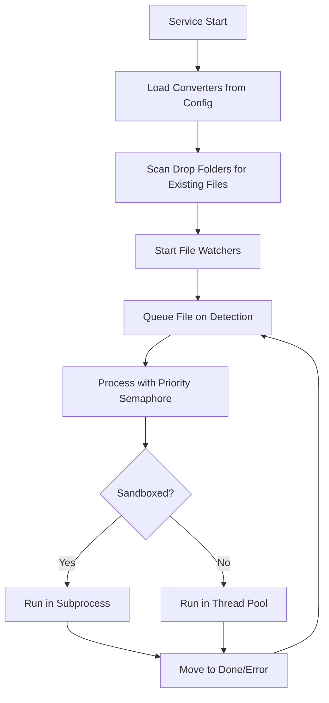

# Client/Service Infrastructure - Complete Analysis

**Created:** February 19, 2026  
**Purpose:** Consolidated analysis of multi-instance client/service architecture, configuration management, startup mechanisms, and converters

---

## 🎯 Executive Summary

### Current State
The pyWATS client/service infrastructure has **undergone massive recent changes** without full consolidation. Multiple parallel improvements to multi-instance support, configuration management, and startup mechanisms have created **potential gaps and inconsistencies**.

### Critical Findings
1. **TWO DIFFERENT CONFIG PATHS** - System-wide (ProgramData) vs User-level (AppData) paths exist in code
2. **UNCLEAR SERVICE REGISTRATION** - Multiple startup mechanisms (Task Scheduler, NSSM, native service) with unclear default
3. **CONVERTER FILE WATCHING MAY NOT BE ACTIVE** - AsyncConverterPool has sophisticated logic but unclear if it's running
4. **QUEUE PERSISTENCE** - Queue directory structure defined but unclear if queues survive restarts
5. **INCOMPLETE TOKEN MIGRATION** - Encryption/decryption logic exists but may not be fully applied

### Recommendation
**STOP and consolidate before adding more features.** Create a single source of truth for:
- Where configs live
- How services start
- Which startup mechanism to use
- How converters activate
- How to verify everything is running

---

## 📁 Configuration Management

### 1.1 Configuration File Locations

#### **ISSUE: Two Different Path Standards in Code**

**Path A: System-Wide (Launcher & Service)**
```
Windows: C:\ProgramData\Virinco\pyWATS\instances\{instance_id}\
Linux:   /var/lib/pywats/instances/{instance_id}/
```
Files:
- `client_config.json` - Full client configuration
- `queue/` - Pending reports queue
- `logs/` - Per-instance logs
- `reports/` - Processed reports
- `converters/` - Converter configs
- `service.lock` - Service PID tracking

**Used by:**
- `src/pywats_client/launcher.py` - `get_instance_base_path()`
- `run_service.py` - Service lock files
- Multi-instance setups (Client A/B model)

**Path B: User-Level (ConfigManager)**
```
Windows: C:\Users\{user}\AppData\Roaming\pyWATS\
Linux:   ~/.config/pywats/
```
Files:
- `api_settings.json` - API client settings (ConfigManager)

**Used by:**
- `src/pywats_client/core/config_manager.py` - APISettings storage
- Old/legacy code paths?

#### **LEGACY Path (Being Migrated Away)**
```
~/.pywats/config.json` - Old single-instance config
```
Migration logic exists in `launcher.py:migrate_old_config()` but unclear if complete.

### 1.2 Configuration Structure

#### **ClientConfig** (`src/pywats_client/core/config.py`)

**Core Fields:**
```python
instance_id: str = "default"            # Instance identifier
instance_name: str = "WATS Client"      # Human-readable name
service_address: str = ""               # WATS server URL
api_token: str = ""                     # Authentication token (encrypted)
username: str = ""                      # Username for display
station_name: str = ""                  # Station identity in reports
```

**Multi-Instance Fields:**
```python
station_presets: Dict[str, StationInfo]  # Multiple stations per client (hub mode)
```

**Converter Configuration:**
```python
converters: List[ConverterConfig]        # List of enabled converters
```

**Schema Version:** 2.0 (for future migrations)

#### **Token Security**
- Tokens **should be** encrypted using `src/pywats_client/core/encryption.py`
- Uses machine-specific keys (MachineGuid on Windows)
- **UNCLEAR:** Are tokens encrypted in practice? Mixed references in code

#### **Environment Variable Fallbacks**
```python
# Runtime-only overrides (not saved to config)
PYWATS_SERVER_URL   # Server URL override
PYWATS_API_TOKEN    # Token override
```
Used via `config.get_runtime_credentials()` for debugging/testing.

### 1.3 Token Sharing Between Instances

**Feature:** New instances can inherit tokens from "default" instance
```python
# From launcher.py
share_token_from_instance(config, source_instance_id="default")
```

**Purpose:** Avoid re-authentication when setting up Client B
**Status:** Implemented in launcher, unclear if used by all entry points

---

## 🚀 Service Startup Mechanisms

### 2.1 Available Startup Methods

pyWATS supports **FOUR different startup mechanisms** but there's no clear "default" or priority:

#### **Method 1: Windows Task Scheduler** (Currently Used for Client A)
**Script:** `scripts/setup_client_a_autostart.ps1`

**Pros:**
- User-level (doesn't require admin)
- Auto-restart on failure (3 retries, 1-minute interval)
- Runs at user logon
- Easy to debug (logs visible in Task Scheduler)

**Cons:**
- Requires user logon (not true background service)
- User-specific (each user gets own task)
- GUI-focused (launches `run_client_a.py` which includes UI)

**Current State:**
- Only configured for Client A (`run_client_a.py`)
- No equivalent for `run_service.py` (headless service)
- Manual setup required (`setup_client_a_autostart.ps1`)

#### **Method 2: NSSM (Non-Sucking Service Manager)**
**Implementation:** `src/pywats_client/control/windows_service.py`

**Pros:**
- True Windows Service (runs without user logon)
- Machine-level (all users)
- Can run as SYSTEM account
- Clean uninstall

**Cons:**
- Requires NSSM binary bundled
- Admin privileges required
- More complex setup

**Status:** 
- Code present in `install_with_nssm()` / `uninstall_with_nssm()`
- **UNCLEAR:** Is NSSM bundled? Where is the binary?
- **UNCLEAR:** Default method if `--use-nssm` specified?

#### **Method 3: Native Windows Service (sc.exe/pywin32)**
**Implementation:** `src/pywats_client/control/windows_native_service.py`

**Pros:**
- No external dependencies (uses Windows built-ins)
- Most "correct" Windows approach

**Cons:**
- Requires pywin32 (optional dependency)
- More complex debugging
- Admin privileges required
- Marked as "not recommended" in CLI help

**Status:**
- Flagged as `--use-native` in CLI (with warning)
- Less tested than NSSM approach

#### **Method 4: systemd (Linux) / launchd (macOS)**
**Implementation:** 
- `src/pywats_client/control/unix_service.py` - systemd
- `src/pywats_client/control/unix_service.py` - launchd

**Status:** Implemented but untested on target platforms

### 2.2 Service Startup Entry Points

#### **Entry Point 1: `run_service.py`** (Headless Service)
**Purpose:** Standalone service without GUI
**Launch:** `python run_service.py [instance_id]`

**Features:**
- Creates lock file at `{instance_dir}/service.lock` with PID, start time
- Loads config from `{instance_dir}/client_config.json`
- Starts `AsyncClientService`
- Handles SIGTERM/SIGINT for graceful shutdown

**Issues:**
- No autostart configured (must be registered manually with Task Scheduler/NSSM/systemd)
- Lock file created but not checked for existing processes (possible duplicate service instances)

#### **Entry Point 2: `run_client_a.py` / `run_client_b.py`** (GUI + Service)
**Purpose:** Launch GUI with embedded service
**Launch:** `python run_client_a.py` or `python run_client_b.py`

**Features:**
- Loads instance config (client_a or client_b)
- Starts `AsyncClientService` 
- Launches Qt GUI (Configurator MainWindow)
- System tray icon

**Current State:**
- Client A: Configured with Task Scheduler autostart
- Client B: Manual launch only
- **ISSUE:** GUI failures can crash the service (tight coupling)

#### **Entry Point 3: `python -m pywats_client service install`** (CLI Service Installer)
**Purpose:** Register service with OS service manager

**Command:**
```bash
python -m pywats_client service install [instance_id] [--use-nssm|--use-native]
```

**Status:**
- Code exists in `src/pywats_client/__main__.py`
- **UNCLEAR:** Default behavior without flags?
- **UNCLEAR:** Does it create Task Scheduler task or NSSM service?

### 2.3 Service Registration Gaps

| **Scenario** | **Expected** | **Current State** | **Gap** |
|--------------|--------------|-------------------|---------|
| Fresh install (no GUI) | Service autostarts on boot | Must manually run `service install` | ❌ No default installer |
| Fresh install (with GUI) | GUI autostarts, service embedded | Client A has Task Scheduler setup | ⚠️ Only Client A, only if script run |
| Service crash | Auto-restart | Task Scheduler: 3 retries; NSSM: configurable | ⚠️ Depends on method |
| Multi-instance | Each instance has own service | Each instance must be registered separately | ✅ Supported but manual |
| Uninstall | Clean removal | Depends on install method | ⚠️ No unified uninstaller |

---

## 🔄 Converter System

### 3.1 Converter Architecture

**Implementation:** `src/pywats_client/service/async_converter_pool.py`

**Core Components:**
1. **ConverterPool** - Manages all converters
2. **File Watchers** - Monitors drop folders (watchdog library)
3. **Priority Queue** - Processes files by priority (1=highest, 10=lowest)
4. **Sandbox Execution** - Isolates untrusted converters in subprocesses
5. **Archive Processing** - Handles batch uploads from archives

### 3.2 Converter Lifecycle



### 3.3 Converter Configuration

**From ClientConfig.converters:**
```python
{
    "name": "GenericJSON",
    "enabled": True,
    "module_path": "pywats_client.converters.generic_json.GenericJSONConverter",
    "watch_folder": "C:/ProgramData/Virinco/pyWATS/instances/default/drop/json/",
    "done_folder": "C:/ProgramData/Virinco/pyWATS/instances/default/done/json/",
    "error_folder": "C:/ProgramData/Virinco/pyWATS/instances/default/error/json/",
    "pending_folder": "C:/ProgramData/Virinco/pyWATS/instances/default/pending/json/",
    "file_patterns": ["*.json"],
    "priority": 5,
    "watch_recursive": False
}
```

### 3.4 Converter Issues

| **Issue** | **Impact** | **Evidence** |
|-----------|------------|--------------|
| **Is ConverterPool Started?** | Files may not be processed | Code exists but unclear if `pool.run()` is called on service start |
| **Are Watchers Running?** | New files not detected | Watchdog observers created but unclear if started in all scenarios |
| **Archive Processing** | Batch uploads ignored | `_process_archive_queues()` exists but unclear when/if called |
| **Converter Registration** | Custom converters not loaded | Dynamic import logic exists but no registry of installed converters |
| **Sandbox Execution** | Security risk | Sandboxing implemented but `source_path` may not be set on converters |

### 3.5 Converter Directories

**Expected Structure:**
```
C:\ProgramData\Virinco\pyWATS\instances\{instance_id}\
├── drop/          ← Watch folders (monitored by watchdog)
│   ├── json/
│   ├── xml/
│   └── custom/
├── pending/       ← .queued markers (prevents reprocessing)
├── done/          ← Successfully processed
└── error/         ← Failed conversions
```

**Current State:**
- Directories created by `launcher.py:load_or_create_config()`
- **UNCLEAR:** Are subdirectories (json/, xml/, etc.) created automatically?
- **UNCLEAR:** Do converters find their folders if not in config?

---

## 📬 Queue Management

### 4.1 Queue Architecture

**Implementation:** `src/pywats_client/service/async_pending_queue.py`

**Purpose:** Persist failed report submissions for retry

**Features:**
- Persistent queue backed by `MemoryQueue` (from `pywats.queue`)
- Auto-retry with exponential backoff
- Saves unsent reports to disk on shutdown
- Loads queued reports on startup

### 4.2 Queue Storage

**Location:**
```
C:\ProgramData\Virinco\pyWATS\instances\{instance_id}\queue\
```

**File Format:** JSON (one entry per report)

**Current State:**
- Directory created by launcher
- **UNCLEAR:** Is queue persisted on service shutdown?
- **UNCLEAR:** Are queued reports loaded on service startup?
- **UNCLEAR:** Queue size limits enforced? (H5 from architecture fixes says "pre-implemented")

### 4.3 Queue Integration

**Service Startup Sequence** (from `async_client_service.py`):
```python
1. Load config
2. Initialize API client (AsyncWATS)
3. Start health server (port 8080)
4. Configure logging
5. Initialize AsyncPendingQueue  ← QUEUE STARTS HERE
6. Initialize AsyncConverterPool  ← CONVERTERS START HERE
7. Start IPC server (if GUI present)
8. Start watchdog loop (monitors server connectivity)
```

**Issues:**
- Queue saves on shutdown via `two_phase_shutdown()` (architecture fix C1)
- **UNCLEAR:** Does `run_service.py` call `two_phase_shutdown()` on SIGTERM?
- **UNCLEAR:** Are converter queue and pending queue the same?

---

## 🏗️ Multi-Instance Support

### 5.1 Instance Model

**Design:** Multiple independent client instances on same machine

**Use Case:** 
- Client A (Master): Main production client
- Client B (Secondary): Testing/failover client
- Custom instances: Specialized configurations

**Current Implementation:**
- Each instance has own directory: `instances/{instance_id}/`
- Each instance has own config: `client_config.json`
- Each instance has own queues, logs, converters
- Instances can share tokens (see §1.3)

### 5.2 Instance Coordination

**Current State:**
- **No coordination** - Instances are fully independent
- Each instance connects to same/different WATS server
- Each instance has own report queue
- No shared state between instances

**Notes from Projects:**
- `gui-cleanup-beta-prep.project` mentions "inter-client DB coordination logic" to remove
- **ACTION ITEM:** Verify no SQLite/shared file coordination remains

### 5.3 Instance Entry Points

| **Entry Point** | **Instance ID** | **Autostart** | **Status** |
|-----------------|-----------------|---------------|------------|
| `run_service.py` | `default` (or CLI arg) | Manual | ✅ Works |
| `run_service.py client_b` | `client_b` | Manual | ✅ Works |
| `run_client_a.py` | `client_a` | Task Scheduler | ⚠️ GUI + Service coupling |
| `run_client_b.py` | `client_b` | Manual | ⚠️ GUI + Service coupling |
| `python -m pywats_client service install default` | `default` | NSSM/systemd | ❓ Untested |

---

## 📋 Active Projects Analysis

### 6.1 Related Active Projects

From `projects/active/README.md`:

#### **Project 1: Architecture Reliability Fixes** ✅ COMPLETE
**Status:** 100% (All 8 issues resolved)
**Relevance:** 
- C1: Two-phase shutdown (saves queue on exit)
- C2: Exception handlers & task monitoring
- H4: Config validation in dict-like interface
- H6: IPC communication timeouts

**Outcome:** Service crash recovery improved, but startup robustness not addressed

#### **Project 2: GUI Cleanup & Beta Prep** ✅ COMPLETE
**Status:** 100%
**Relevance:**
- Client A persistent installation requirement
- Task Scheduler autostart for Client A
- Two-client (A/B) model enforcement
- Service → Client → UI startup sequence

**Gaps Identified:**
1. Client A autostart works, but **Service autostart not implemented**
2. Task Scheduler used for GUI launch, not standalone service
3. No `run_service.py` autostart configuration

#### **Project 3: API-Client-UI Communication Analysis** ✅ COMPLETE
**Status:** Documented architecture
**Relevance:**
- Three-layer design (API, Client, UI)
- Event systems (API vs Qt events)
- Exception propagation patterns

**Outcome:** Architecture is well-documented but doesn't address startup/lifecycle

### 6.2 Potential Missing Projects

Based on findings, these projects may be needed:

1. **Service Registration & Autostart Consolidation**
   - Define single default startup method per platform
   - Create unified installer (cross-platform)
   - Document when to use Task Scheduler vs NSSM vs systemd
   
2. **Configuration Path Consolidation**
   - Migrate all code to use `instances/{instance_id}/` structure
   - Remove legacy `~/.pywats/` and AppData paths
   - Update ConfigManager to use system-wide paths

3. **Converter Activation Audit**
   - Verify ConverterPool starts on service startup
   - Verify file watchers activate
   - Add health checks for converter status
   - Create example custom converter with documentation

4. **Queue Persistence Verification**
   - Test queue survives service restart
   - Verify `two_phase_shutdown()` called by `run_service.py`
   - Add queue recovery logging

5. **Multi-Instance Testing & Documentation**
   - End-to-end test of two instances running concurrently
   - Document multi-server setup (one instance per server)
   - Verify no resource conflicts (ports, file locks, etc.)

---

## 🐛 Critical Gaps & Issues

### 7.1 High Priority Issues

#### **Issue 1: No Standalone Service Autostart**
**Problem:** `run_service.py` has no autostart mechanism
**Impact:** Service doesn't start on boot unless manually configured
**Evidence:**
- Task Scheduler script exists for `run_client_a.py` (GUI launcher)
- No equivalent for `run_service.py` (headless service)
- NSSM/systemd installers exist but not documented/tested

**Fix:**
- Create `setup_service_autostart.ps1` for Windows
- Test NSSM installer: `python -m pywats_client service install`
- Document default startup method per platform

#### **Issue 2: Unclear Converter Activation**
**Problem:** Converter pool code exists but unclear if/when it runs
**Impact:** Files may pile up in drop folders without processing
**Evidence:**
- `AsyncConverterPool` has sophisticated logic
- Service creates pool in `__init__` but **unclear if `pool.run()` called**
- No logs indicating "Converter pool started" in typical runs

**Fix:**
- Audit `AsyncClientService._start()` - verify `self._converter_pool.run()` called
- Add startup logs: "ConverterPool started with X converters"
- Add health check endpoint: `GET /health/converters` showing active watchers

#### **Issue 3: Two Configuration Path Standards**
**Problem:** System-wide (ProgramData) vs User-level (AppData) paths coexist
**Impact:** Confusion about where configs are, potential for stale configs
**Evidence:**
- `launcher.py` uses `C:\ProgramData\Virinco\pyWATS\instances\`
- `config_manager.py` uses `C:\Users\{user}\AppData\Roaming\pyWATS\`
- Documentation doesn't clarify which is canonical

**Fix:**
- Deprecate user-level paths (AppData, ~/.config)
- Migrate ConfigManager to use system-wide paths
- Add migration warning if old paths detected

#### **Issue 4: Lock File Not Checked on Startup**
**Problem:** `run_service.py` creates lock file but doesn't check for existing instance
**Impact:** Possible to launch duplicate services for same instance
**Evidence:**
```python
# In run_service.py - only writes lock, never checks
lock_file.write(instance_id, config_data)
```

**Fix:**
```python
# Check lock file first
existing = ServiceLockFile.read(instance_dir)
if existing and ServiceLockFile.is_process_running(existing['pid']):
    logger.error(f"Service already running (PID {existing['pid']})")
    return 1
```

#### **Issue 5: Queue Persistence Uncertain**
**Problem:** Queue save/load logic exists but unclear if executed
**Impact:** Queued reports may be lost on service restart
**Evidence:**
- `two_phase_shutdown()` saves queue (architecture fix C1)
- `run_service.py` handles SIGTERM but **does it call two-phase shutdown?**
- No logs indicating "Queue loaded: X items" on service start

**Fix:**
- Verify signal handlers in `run_service.py` call `service.stop()` (which triggers two-phase shutdown)
- Add queue recovery logs on startup
- Test: Kill service with reports in queue, restart, verify reports retained

### 7.2 Medium Priority Issues

#### **Issue 6: No Health Check for Converters**
**Problem:** No way to verify converters are watching for files
**Impact:** Silent failures - files not processed, no alert

**Fix:**
- Add `GET /health/converters` endpoint showing:
  - Number of active converters
  - Number of active file watchers
  - Queue depth
  - Last processed file timestamp

#### **Issue 7: Token Encryption Unclear**
**Problem:** Encryption logic exists but mixed references to plain/encrypted tokens
**Impact:** Tokens may be stored in plaintext

**Fix:**
- Audit all config saves - verify `encrypt_token()` called before save
- Add config validator: Check if token looks encrypted (base64, long)
- Force re-encryption on next config save if plain token detected

#### **Issue 8: No Converter Registry/Discovery**
**Problem:** Converters loaded from config but no way to discover installed converters
**Impact:** Users must manually edit config to add converters

**Fix:**
- Create converter plugin directory: `converters/plugins/`
- Auto-discover converters with naming convention: `*_converter.py`
- Add CLI command: `python -m pywats_client converters list`

### 7.3 Low Priority Issues

#### **Issue 9: No Multi-Instance Management UI**
**Problem:** Each instance must be configured separately via GUI or CLI
**Impact:** Complex multi-instance setups require manual config editing

**Fix (Future):**
- Add "Instances" page to Configurator
- Show all instances, their status (running/stopped), configs
- Allow start/stop/configure per instance

#### **Issue 10: No Unified Uninstaller**
**Problem:** Uninstall process varies by install method
**Impact:** Incomplete uninstalls leave registry entries, services, files

**Fix:**
- Create uninstall script that checks all methods (Task Scheduler, NSSM, systemd)
- Remove all instances, configs, logs
- Add `python -m pywats_client uninstall --all` command

---

## 🎬 Recommended Action Plan

### Phase 1: Audit & Verification (1-2 days)
**Goal:** Understand current state with certainty

1. **Service Startup Test**
   - Launch `run_service.py default`
   - Check logs for "ConverterPool started"
   - Check logs for "AsyncPendingQueue started"
   - Verify health endpoint responds: `curl http://localhost:8080/health`

2. **Converter Activation Test**
   - Drop test file in converter watch folder
   - Verify file is processed within 1 minute
   - Check done/error folder for result
   - Check logs for conversion events

3. **Queue Persistence Test**
   - Queue a report (server offline or invalid token)
   - Kill service forcefully (`Kill-Process` or `kill -9`)
   - Restart service
   - Verify queued report reappears in logs

4. **Multi-Instance Test**
   - Launch Client A: `python run_client_a.py`
   - Launch Client B: `python run_client_b.py`
   - Verify both services active (different ports? shared?)
   - Verify no file/lock conflicts

5. **Configuration Path Audit**
   - Search codebase for `AppData`, `~/.pywats`, `~/.config/pywats`
   - Document all code still using old paths
   - Check if ConfigManager creates files in AppData

### Phase 2: Critical Fixes (2-3 days)

1. **Fix Issue 1: Service Autostart**
   ```powershell
   # Create scripts/setup_service_autostart.ps1
   # Register run_service.py with Task Scheduler (user logon)
   # OR: Install as NSSM service (system startup)
   # Document: When to use which?
   ```

2. **Fix Issue 2: Verify Converter Activation**
   ```python
   # In AsyncClientService._start()
   # Ensure self._converter_pool.run() is called
   # Add log: "ConverterPool started with X converters, Y watchers"
   ```

3. **Fix Issue 4: Lock File Check**
   ```python
   # In run_service.py:run_service()
   # Before lock_file.write(), check existing lock
   # Exit if process already running
   ```

4. **Fix Issue 5: Verify Queue Persistence**
   ```python
   # In run_service.py signal handlers
   # Ensure service.stop() called (triggers two-phase shutdown)
   # Add log on startup: "Queue loaded: X items from disk"
   ```

### Phase 3: Path Consolidation (2-3 days)

1. **Migrate ConfigManager to System-Wide Paths**
   ```python
   # Update config_manager.py:_get_default_config_path()
   # Use: C:\ProgramData\Virinco\pyWATS\instances\{instance_id}\
   # Instead of: C:\Users\{user}\AppData\Roaming\pyWATS\
   ```

2. **Remove Legacy Path References**
   - Search for `~/.pywats`, `AppData/pyWATS`
   - Update or remove
   - Add migration warning if old paths exist

3. **Update Documentation**
   - Document canonical path structure
   - Explain multi-instance directory layout
   - Show example setups (single, dual, multi-server)

### Phase 4: Health Checks & Monitoring (1-2 days)

1. **Add Converter Health Endpoint**
   ```python
   # In async_health_server.py or equivalent
   GET /health/converters
   Response: {
       "converter_count": 3,
       "active_watchers": 3,
       "queue_depth": 5,
       "last_conversion": "2026-02-19T14:30:00Z"
   }
   ```

2. **Add Startup Diagnostics**
   - Log all activated components on service start
   - Log any components that failed to start
   - Log file paths (config, queue, logs) for debugging

3. **Add Service Status Command**
   ```bash
   python -m pywats_client service status [instance_id]
   ```
   Shows:
   - Running / Stopped
   - PID, uptime
   - Server connection status
   - Converter status
   - Queue depth

### Phase 5: Documentation (1 day)

1. **Create Installation Guide**
   - How to install service autostart (per platform)
   - How to configure multi-instance
   - How to verify service is running

2. **Create Troubleshooting Guide**
   - Service not starting → Check logs
   - Converters not processing → Check watchers
   - Reports not submitted → Check queue

3. **Update README with Quick Start**
   ```markdown
   ## Quick Start (Single Instance)
   1. Install: pip install -e .
   2. Configure: python run_configurator.py
   3. Install Service: .\scripts\setup_service_autostart.ps1
   4. Verify: curl http://localhost:8080/health
   ```

---

## 📚 Reference: Key Files

### Configuration
- `src/pywats_client/core/config.py` - ClientConfig class
- `src/pywats_client/core/config_manager.py` - ConfigManager (API settings)
- `src/pywats_client/launcher.py` - Instance setup, token sharing
- `src/pywats_client/core/encryption.py` - Token encryption

### Service Lifecycle
- `run_service.py` - Headless service entry point
- `run_client_a.py` / `run_client_b.py` - GUI + service launchers
- `src/pywats_client/service/async_client_service.py` - Main service class
- `src/pywats_client/service/async_health_server.py` - Health check HTTP server

### Service Registration
- `src/pywats_client/control/windows_service.py` - NSSM installer
- `src/pywats_client/control/windows_native_service.py` - Native Windows service
- `src/pywats_client/control/unix_service.py` - systemd/launchd
- `scripts/setup_client_a_autostart.ps1` - Task Scheduler (GUI only)

### Converters
- `src/pywats_client/service/async_converter_pool.py` - Converter pool & file watching
- `src/pywats_client/converters/base.py` - Base converter class
- `src/pywats_client/converters/sandbox.py` - Sandboxed execution

### Queue
- `src/pywats_client/service/async_pending_queue.py` - Report retry queue
- `src/pywats_client/queue/persistent_queue.py` - Disk-backed queue

### Projects
- `projects/active/gui-cleanup-beta-prep.project/` - Client A autostart context
- `projects/active/architecture-reliability-fixes.project/` - Shutdown & queue persistence
- `projects/active/api-client-ui-communication-analysis.project/` - Architecture docs

---

## ✅ Next Steps

1. **Review this document** with team - validate findings
2. **Run Phase 1 tests** - determine actual current state vs assumptions
3. **Prioritize fixes** based on test results
4. **Create project** for consolidation work (not individual fixes)
5. **Update this doc** with test outcomes and corrected information

**This document is a living analysis.** Update as you discover new information or complete fixes.
