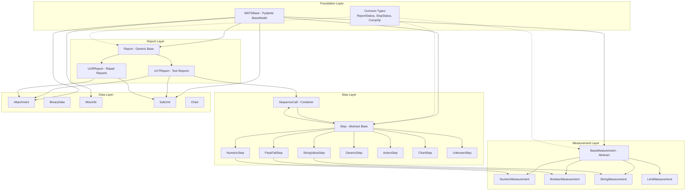
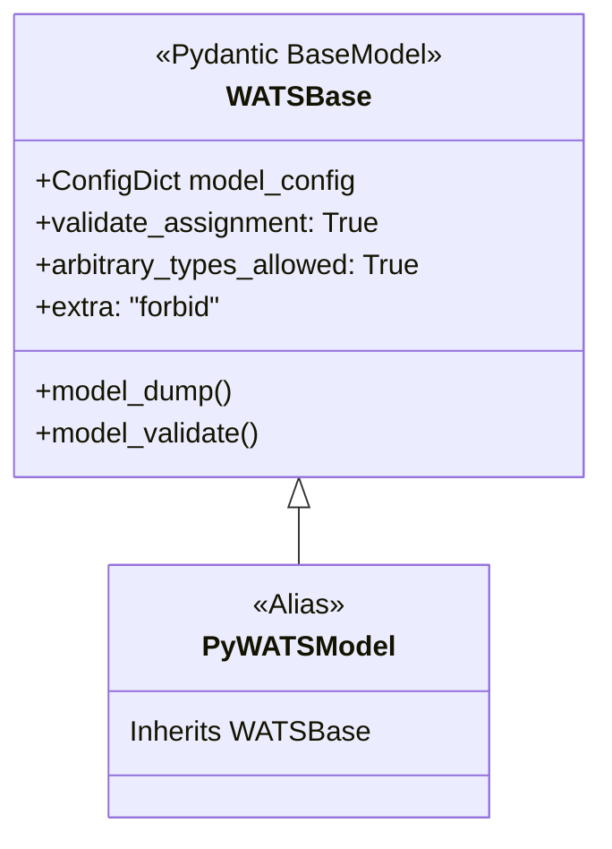
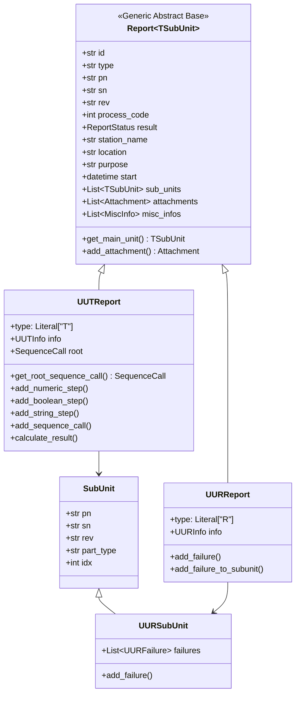
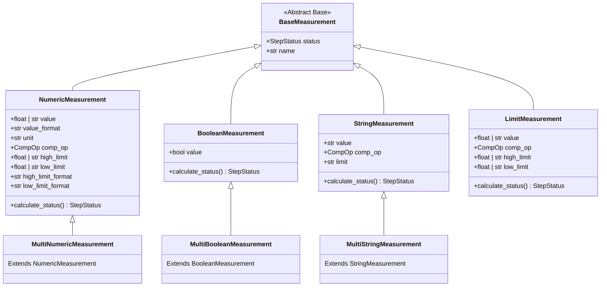
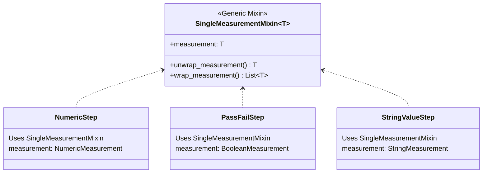
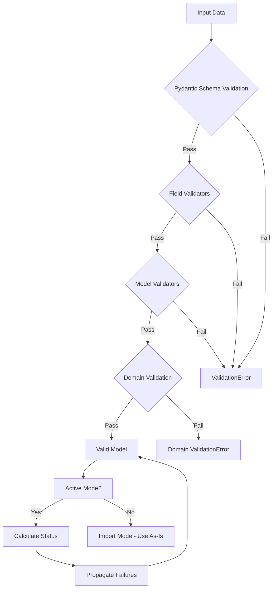
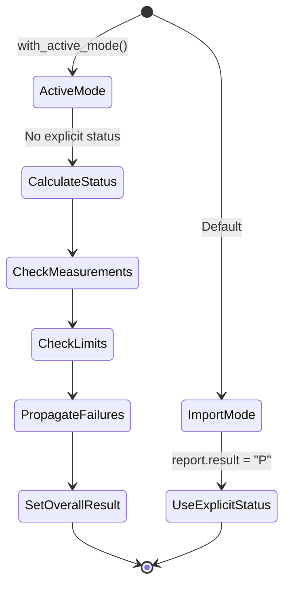
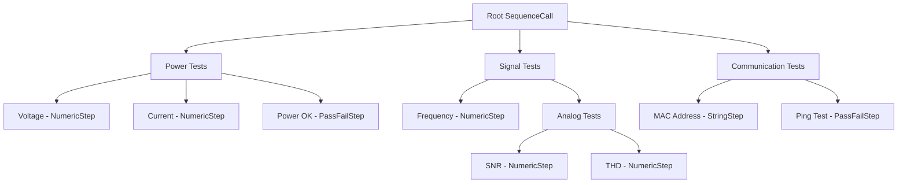

# Report Model Architecture Analysis

**pyWATS v3 Report Models - Comprehensive Architectural Documentation**

Version: 0.2.0b3  
Date: February 1, 2026  
Author: AI-Generated Analysis

---

## Table of Contents

1. [Executive Summary](#executive-summary)
2. [Overall Architecture](#overall-architecture)
3. [Class Hierarchy](#class-hierarchy)
4. [Inheritance Structure](#inheritance-structure)
5. [Validation Architecture](#validation-architecture)
6. [Factory Patterns](#factory-patterns)
7. [Type System](#type-system)
8. [Design Patterns](#design-patterns)
9. [Extensibility Points](#extensibility-points)
10. [Best Practices Assessment](#best-practices-assessment)

---

## Executive Summary

The pyWATS v3 report models implement a **hierarchical, type-safe, and extensible** architecture for representing manufacturing test data. Built on Pydantic v2, the system provides:

- **Type Safety**: Full mypy compliance with generic types and discriminated unions
- **Validation**: Multi-layer validation (Pydantic + domain-specific)
- **Flexibility**: Supports both UUT (Unit Under Test) and UUR (Unit Under Repair) reports
- **Extensibility**: Factory methods and builder patterns for easy construction
- **Compatibility**: Dual API compatibility (camelCase backend, snake_case Python)

**Key Metrics:**
- 125+ model classes
- 1,439 passing tests
- 0 mypy errors
- Support for 10+ step types
- 5+ measurement types

---

## Overall Architecture



### Architectural Principles

1. **Composition over Inheritance**: Reports contain steps, steps contain measurements
2. **Type Discrimination**: Literal types for runtime type identification
3. **Immutability with Flexibility**: Pydantic models are immutable by default but allow controlled mutation
4. **Progressive Disclosure**: Simple cases are simple, complex cases are possible
5. **API Compatibility**: Dual naming (snake_case Python, camelCase backend)

---

## Class Hierarchy

### 1. Foundation Classes



**WATSBase** is the root of all report models:
- Inherits from Pydantic `BaseModel`
- Configures validation behavior
- Provides serialization/deserialization
- Enforces strict typing

### 2. Report Hierarchy



**Key Design Decisions:**

1. **Generic Base Class**: `Report[TSubUnit]` allows type-safe sub-unit handling
2. **Type Discriminator**: Literal `"T"` (Test) vs `"R"` (Repair) for runtime polymorphism
3. **Specialized Info**: `UUTInfo` vs `UURInfo` for report-specific metadata
4. **Factory Methods**: Each report type provides convenience methods for common operations

### 3. Step Hierarchy

```mermaid
classDiagram
    class Step {
        <<Abstract Base>>
        +str step_type
        +str name
        +StepGroup group
        +StepStatus status
        +int id
        +int error_code
        +datetime start
        +float tot_time
        +str ts_guid
        +bool caused_uut_failure
        +validate_step() bool
        +get_path() str
    }

    class SequenceCall {
        +Literal["SequenceCall", "WATS_SeqCall"] step_type
        +SequenceCallInfo seq_call
        +List~StepType~ steps
        +add_numeric_step()
        +add_boolean_step()
        +add_string_step()
        +add_sequence_call()
        +add_action_step()
        +add_generic_step()
        +add_chart_step()
        +find_step_by_id()
        +get_all_steps_recursive()
    }

    class NumericStep {
        +Literal["ET_NLT"] step_type
        +NumericMeasurement measurement
        +float value
        +str unit
        +CompOp comp_op
        +float low_limit
        +float high_limit
        +create()
    }

    class PassFailStep {
        +Literal["ET_PFT"] step_type
        +BooleanMeasurement measurement
        +bool value
        +create()
    }

    class StringValueStep {
        +Literal["ET_SVT"] step_type
        +StringMeasurement measurement
        +str value
        +CompOp comp
        +str limit
        +create()
    }

    class MultiNumericStep {
        +List~MultiNumericMeasurement~ measurements
        +add_measurement()
    }

    class MultiBooleanStep {
        +List~MultiBooleanMeasurement~ measurements
        +add_measurement()
    }

    class MultiStringStep {
        +List~MultiStringMeasurement~ measurements
        +add_measurement()
    }

    class GenericStep {
        +FlowType step_type
        +create()
    }

    class ActionStep {
        +str report_text
        +create()
    }

    class ChartStep {
        +List~Chart~ charts
        +add_chart()
    }

    class UnknownStep {
        +str step_type
        +Dict extra
    }

    Step <|-- SequenceCall
    Step <|-- NumericStep
    Step <|-- PassFailStep
    Step <|-- StringValueStep
    Step <|-- MultiNumericStep
    Step <|-- MultiBooleanStep
    Step <|-- MultiStringStep
    Step <|-- GenericStep
    Step <|-- ActionStep
    Step <|-- ChartStep
    Step <|-- UnknownStep

    SequenceCall *-- Step : contains
```



**Step Type Pattern:**

Each step type uses a **discriminated union** pattern:
- `step_type` is a Literal that identifies the concrete type
- Pydantic uses this for runtime validation and deserialization
- Type-safe union: `StepType = Union[SequenceCall, NumericStep, ...]`

### 4. Measurement Hierarchy



**Measurement Design:**

1. **Abstract Base**: Common `status` and `name` fields
2. **Type-Specific Logic**: Each measurement type implements `calculate_status()`
3. **Multi-Measurement Pattern**: Multi* variants for array-based tests
4. **Flexible Typing**: Values can be numeric or string for edge cases

---

## Inheritance Structure

### Inheritance Tree (Complete)

```
WATSBase (Pydantic BaseModel)
├── Report[TSubUnit] (Generic)
│   ├── UUTReport (Test Reports)
│   └── UURReport (Repair Reports)
│
├── Step (Abstract)
│   ├── SequenceCall (Container - recursive)
│   ├── NumericStep (Single measurement)
│   ├── MultiNumericStep (Multiple measurements)
│   ├── PassFailStep (Boolean single)
│   ├── MultiBooleanStep (Boolean multiple)
│   ├── StringValueStep (String single)
│   ├── MultiStringStep (String multiple)
│   ├── GenericStep (Flow control)
│   ├── ActionStep (Information)
│   ├── ChartStep (Graphs)
│   └── UnknownStep (Extensibility)
│
├── BaseMeasurement (Abstract)
│   ├── NumericMeasurement
│   │   └── MultiNumericMeasurement
│   ├── BooleanMeasurement
│   │   └── MultiBooleanMeasurement
│   ├── StringMeasurement
│   │   └── MultiStringMeasurement
│   └── LimitMeasurement
│
├── SubUnit
│   └── UURSubUnit (with failures)
│
├── Attachment (Binary data)
├── BinaryData (Embedded binary)
├── MiscInfo (Key-value metadata)
├── Chart (Graph data)
├── ChartSeries (Graph series)
├── UUTInfo (Test metadata)
├── UURInfo (Repair metadata)
├── UURFailure (Failure details)
├── SequenceCallInfo (Sequence metadata)
├── AdditionalData (Custom data)
└── [50+ other specialized models]
```

### Mixin Pattern



**Mixin Pattern Benefits:**
- Eliminates code duplication for single-measurement steps
- Type-safe through generics
- Handles API serialization (single measurement ↔ array of one)

---

## Validation Architecture

### Multi-Layer Validation



### 1. Pydantic Validation Layer

**Type Validation:**
```python
class NumericStep(Step):
    step_type: Literal["ET_NLT"]  # Enforced at parse time
    measurement: Optional[NumericMeasurement]  # Type checked
    
    @field_validator('measurement')
    @classmethod
    def validate_measurement(cls, v):
        # Custom validation logic
        return v
```

**Features:**
- Automatic type coercion (str → int, str → datetime)
- Null checks for Optional fields
- Literal type enforcement for discriminators
- Generic type validation

### 2. Field Validators

```python
class StringMeasurement(BaseMeasurement):
    value: str = Field(..., min_length=1, max_length=500)
    comp_op: Optional[CompOp] = Field(default=CompOp.LOG)
    limit: Optional[str] = Field(default=None, max_length=500)
    
    @field_validator('comp_op')
    @classmethod
    def validate_comp_op(cls, v):
        if v not in [CompOp.EQ, CompOp.NE, CompOp.IGNORECASE, CompOp.LOG]:
            raise ValueError(f"Invalid comparison for string: {v}")
        return v
```

**Validation Rules:**
- String length constraints (1-500 chars)
- Enum validation (CompOp, ReportStatus, StepStatus)
- Pattern matching for GUIDs
- Range checks for numeric values

### 3. Model Validators

```python
class NumericStep(Step):
    @model_validator(mode='after')
    def validate_limits(self):
        if self.measurement:
            if (self.measurement.low_limit is not None and 
                self.measurement.high_limit is not None and
                self.measurement.low_limit > self.measurement.high_limit):
                raise ValueError("Low limit cannot exceed high limit")
        return self
```

**Cross-Field Validation:**
- Limit consistency (low ≤ high)
- Conditional requirements (if comp_op=GELE, require both limits)
- Status consistency (child step failure → parent failure)

### 4. Domain Validation

```python
class UUTReport(Report):
    def validate_step(self, trigger_children: bool = False) -> bool:
        """Domain-specific validation"""
        errors = []
        
        # Check root sequence exists
        if not self.root:
            errors.append("UUT report must have a root sequence")
        
        # Validate all steps recursively
        if self.root:
            self.root.validate_step(trigger_children=True, errors=errors)
        
        if errors:
            raise ValueError(f"Validation failed: {errors}")
        return True
```

**Domain Rules:**
- UUT must have root sequence
- UUR must have at least one failure
- Step IDs must be unique
- Status calculation follows WATS rules

### 5. Import Mode vs Active Mode



**Import Mode (Default):**
- Use explicit status values from data
- No automatic calculation
- Preserves original report exactly

**Active Mode:**
- Automatically calculate step status from measurements
- Propagate failures up the hierarchy
- Set overall report result based on steps

```python
from pywats.domains.report.import_mode import set_import_mode, ImportMode

# Active mode - automatic status calculation
set_import_mode(ImportMode.Active)
report = create_uut_report(...)
report.add_numeric_step(value=5.5, low_limit=4.0, high_limit=5.0)
# Status automatically set to "F" because 5.5 > 5.0

# Import mode - explicit status
set_import_mode(ImportMode.Import)
report = UUTReport.model_validate(json_data)
# Status preserved exactly as in JSON
```

---

## Factory Patterns

### 1. Report Factories

**Service-Level Factory:**
```python
class AsyncReportService:
    def create_uut_report(
        self,
        operator: str,
        part_number: str,
        revision: str,
        serial_number: str,
        operation_type: int,
        *,
        station_name: Optional[str] = None,
        location: Optional[str] = None,
        purpose: Optional[str] = None,
        start_time: Optional[datetime] = None,
    ) -> UUTReport:
        """Factory method with station resolution"""
        station_name, location, purpose = self._resolve_station(
            station_name=station_name,
            location=location,
            purpose=purpose
        )
        
        return UUTReport(
            pn=part_number,
            sn=serial_number,
            rev=revision,
            process_code=operation_type,
            station_name=station_name,
            location=location,
            purpose=purpose,
            result=ReportStatus.Passed,
            start=start_time or datetime.now().astimezone(),
        )
```

**Benefits:**
- Hides complexity of station resolution
- Provides sensible defaults
- Type-safe parameter validation
- Integrates with service layer

### 2. Step Factories

**SequenceCall Factory Methods:**
```python
class SequenceCall(Step):
    def add_numeric_step(
        self,
        name: str,
        value: float,
        unit: str = "NA",
        comp_op: CompOp = CompOp.LOG,
        low_limit: Optional[float] = None,
        high_limit: Optional[float] = None,
        status: Optional[StepStatus] = None,
        group: StepGroup = StepGroup.MAIN,
        **kwargs
    ) -> NumericStep:
        """Factory for numeric steps"""
        step = NumericStep.create(
            name=name,
            value=value,
            unit=unit,
            comp_op=comp_op,
            low_limit=low_limit,
            high_limit=high_limit,
            status=status or StepStatus.Passed,
            group=group,
            **kwargs
        )
        self.steps.append(step)
        return step
```

**Pattern:**
1. Factory method on parent (SequenceCall)
2. Delegates to step's static `create()` method
3. Automatically adds to parent's step list
4. Returns created step for fluent API

**Fluent API:**
```python
root = report.get_root_sequence_call()
sub = root.add_sequence_call("Power Tests")
sub.add_numeric_step("Voltage", 5.0, unit="V", low_limit=4.5, high_limit=5.5)
sub.add_numeric_step("Current", 2.1, unit="A", low_limit=2.0, high_limit=2.5)
sub.add_boolean_step("Power OK", True)
```

### 3. Static Factory Pattern

```python
class NumericStep(Step):
    @classmethod
    def create(
        cls,
        name: str,
        value: float,
        unit: str = "NA",
        comp_op: CompOp = CompOp.LOG,
        low_limit: Optional[float] = None,
        high_limit: Optional[float] = None,
        status: Optional[StepStatus] = None,
        **kwargs
    ) -> "NumericStep":
        """Create a NumericStep with a single measurement"""
        measurement = NumericMeasurement(
            value=value,
            unit=unit,
            comp_op=comp_op,
            low_limit=low_limit,
            high_limit=high_limit,
            status=status or StepStatus.Passed
        )
        
        return cls(
            name=name,
            measurement=measurement,
            status=status or StepStatus.Passed,
            **kwargs
        )
```

**Benefits:**
- Encapsulates measurement creation
- Provides validation at construction time
- Named constructor (clearer than overloaded `__init__`)
- Allows future evolution without breaking changes

### 4. Builder Pattern

**ReportBuilder:**
```python
from pywats.tools.report_builder import ReportBuilder

builder = ReportBuilder(
    part_number="WIDGET-001",
    serial_number="SN123456",
    operator="John Doe",
    station="TestStation1"
)

# Builder infers step types from data
builder.add_step("Voltage", 5.0, unit="V", low_limit=4.5, high_limit=5.5)
builder.add_step("Power OK", True)
builder.add_step("Firmware", "1.2.3", comp_op=CompOp.EQ, limit="1.2.3")

# Add misc info
builder.add_misc_info("Operator Notes", "Test completed successfully")

# Build report
report = builder.build()
```

**Builder Features:**
- Type inference (float → NumericStep, bool → PassFailStep, str → StringValueStep)
- Automatic sequence management
- Status calculation
- Forgiving API for LLM/AI code generation

---

## Type System

### 1. Generic Types

**Report Generic:**
```python
TSubUnit = TypeVar('TSubUnit', bound=SubUnit)

class Report(WATSBase, Generic[TSubUnit]):
    sub_units: List[TSubUnit] = Field(default_factory=list)
    
    def get_main_unit(self) -> TSubUnit:
        """Type-safe main unit access"""
        if not self.sub_units:
            raise ValueError("No sub-units defined")
        return self.sub_units[0]
```

**Concrete Usage:**
```python
# UUTReport uses SubUnit
class UUTReport(Report[SubUnit]):
    ...

# UURReport uses UURSubUnit (which has failures)
class UURReport(Report[UURSubUnit]):
    ...

# Type system knows the difference:
uut: UUTReport = ...
main = uut.get_main_unit()  # Type: SubUnit

uur: UURReport = ...
main = uur.get_main_unit()  # Type: UURSubUnit (has add_failure)
```

### 2. Discriminated Unions

**Step Type Union:**
```python
StepType = Union[
    SequenceCall,
    NumericStep,
    MultiNumericStep,
    PassFailStep,
    MultiBooleanStep,
    StringValueStep,
    MultiStringStep,
    GenericStep,
    ActionStep,
    ChartStep,
    UnknownStep,  # Fallback
]

class SequenceCall(Step):
    steps: List[StepType] = Field(default_factory=list)
```

**Runtime Type Resolution:**
```python
# Pydantic uses step_type to determine concrete class
data = {"stepType": "ET_NLT", "name": "Voltage", ...}
step = Step.model_validate(data)  # Returns NumericStep instance

# Type narrowing
if step.step_type == "ET_NLT":
    assert isinstance(step, NumericStep)
    print(step.value)  # mypy knows this is valid
```

### 3. Literal Types

**Type Discriminators:**
```python
class UUTReport(Report):
    type: Literal["T"] = Field(default="T", pattern='^[T]$')

class UURReport(Report):
    type: Literal["R"] = Field(default="R", pattern='^[R]$')

# Union type
ReportType = Union[UUTReport, UURReport]

# Runtime discrimination
def process_report(report: ReportType):
    if report.type == "T":
        # mypy knows this is UUTReport
        root = report.root  # OK
    elif report.type == "R":
        # mypy knows this is UURReport
        failures = report.sub_units[0].failures  # OK
```

### 4. Optional vs Required

**Field Patterns:**
```python
class UUTReport(Report):
    # Required - must be provided
    pn: str = Field(...)
    sn: str = Field(...)
    
    # Required with default
    result: ReportStatus = Field(default=ReportStatus.Passed)
    
    # Optional - can be None
    info: Optional[UUTInfo] = Field(default_factory=UUTInfo)
    
    # Collection with default
    sub_units: List[SubUnit] = Field(default_factory=list)
```

**Validation Implications:**
```python
# This fails - pn is required
report = UUTReport(sn="123")  # ValidationError

# This works
report = UUTReport(pn="WIDGET", sn="123")

# This works - result has default
report = UUTReport(pn="WIDGET", sn="123")
assert report.result == ReportStatus.Passed
```

### 5. Type Aliases

**Convenience Aliases:**
```python
# Old name compatibility
StringStep = StringValueStep
BooleanStep = PassFailStep

# Type hints
StepList = List[StepType]
MeasurementList = List[NumericMeasurement]

# Union types
NumericValue = Union[float, int, str]
LimitValue = Union[float, str, None]
```

---

## Design Patterns

### 1. Composite Pattern

**Tree Structure:**


**Implementation:**
```python
class SequenceCall(Step):
    """Composite - can contain other steps"""
    steps: List[StepType] = Field(default_factory=list)
    
    def get_all_steps_recursive(self) -> List[Step]:
        """Traverse entire tree"""
        result = [self]
        for step in self.steps:
            if isinstance(step, SequenceCall):
                result.extend(step.get_all_steps_recursive())
            else:
                result.append(step)
        return result
    
    def find_step_by_id(self, step_id: int) -> Optional[Step]:
        """Search tree by ID"""
        if self.id == step_id:
            return self
        for step in self.steps:
            if step.id == step_id:
                return step
            if isinstance(step, SequenceCall):
                found = step.find_step_by_id(step_id)
                if found:
                    return found
        return None
```

### 2. Strategy Pattern

**Comparison Operators:**
```python
class NumericMeasurement(BaseMeasurement):
    def calculate_status(self) -> StepStatus:
        """Strategy based on comp_op"""
        match self.comp_op:
            case CompOp.GELE:  # Greater or Equal, Less or Equal
                return self._check_between()
            case CompOp.GE:    # Greater or Equal
                return self._check_greater_equal()
            case CompOp.LE:    # Less or Equal
                return self._check_less_equal()
            case CompOp.GT:    # Greater Than
                return self._check_greater()
            case CompOp.LT:    # Less Than
                return self._check_less()
            case CompOp.EQ:    # Equal
                return self._check_equal()
            case CompOp.NE:    # Not Equal
                return self._check_not_equal()
            case CompOp.LOG:   # Log only (always pass)
                return StepStatus.Passed
            case _:
                return StepStatus.Error
```

### 3. Template Method Pattern

**Step Validation:**
```python
class Step(WATSBase, ABC):
    """Abstract template"""
    
    def validate_step(
        self, 
        trigger_children: bool = False,
        errors: Optional[List[str]] = None
    ) -> bool:
        """Template method"""
        if errors is None:
            errors = []
        
        # Common validation
        self._validate_common(errors)
        
        # Subclass-specific validation
        self._validate_specific(errors)
        
        # Recurse to children if needed
        if trigger_children:
            self._validate_children(errors)
        
        return len(errors) == 0
    
    def _validate_common(self, errors: List[str]):
        """Common to all steps"""
        if not self.name:
            errors.append("Step name is required")
    
    @abstractmethod
    def _validate_specific(self, errors: List[str]):
        """Subclass implements"""
        pass

class NumericStep(Step):
    def _validate_specific(self, errors: List[str]):
        """NumericStep-specific validation"""
        if self.measurement:
            if (self.measurement.comp_op == CompOp.GELE and
                (self.measurement.low_limit is None or 
                 self.measurement.high_limit is None)):
                errors.append("GELE requires both limits")
```

### 4. Factory Method Pattern

**Abstract Factory:**
```python
class Step(WATSBase):
    @classmethod
    @abstractmethod
    def create(cls, **kwargs) -> "Step":
        """Factory method - subclasses must implement"""
        pass

class NumericStep(Step):
    @classmethod
    def create(cls, name: str, value: float, **kwargs) -> "NumericStep":
        """Concrete factory"""
        measurement = NumericMeasurement(value=value, ...)
        return cls(name=name, measurement=measurement, **kwargs)
```

### 5. Visitor Pattern (Implicit)

**Tree Traversal:**
```python
def calculate_test_time(step: Step) -> float:
    """Visitor - calculates total time"""
    total = step.tot_time or 0.0
    
    if isinstance(step, SequenceCall):
        for child in step.steps:
            total += calculate_test_time(child)
    
    return total

def count_failures(step: Step) -> int:
    """Visitor - counts failed steps"""
    count = 1 if step.status == StepStatus.Failed else 0
    
    if isinstance(step, SequenceCall):
        for child in step.steps:
            count += count_failures(child)
    
    return count
```

### 6. Builder Pattern

See [Factory Patterns](#factory-patterns) section above.

### 7. Chain of Responsibility

**Failure Propagation:**
```python
def apply_failure_propagation(step: Step) -> None:
    """Propagate failure up the chain"""
    if not is_active_mode():
        return
    
    if step.status == StepStatus.Failed and step.fail_parent_on_failure:
        parent = step.parent_sequence  # Reference to parent
        if parent:
            parent.status = StepStatus.Failed
            apply_failure_propagation(parent)  # Recurse up chain
```

---

## Extensibility Points

### 1. Custom Step Types

**UnknownStep Fallback:**
```python
class UnknownStep(Step):
    """Extensibility point for future step types"""
    step_type: str  # Any string accepted
    extra: Dict[str, Any] = Field(default_factory=dict)
    
    model_config = ConfigDict(extra="allow")
```

**Adding New Step Type:**
```python
# 1. Define new step class
class CustomAnalysisStep(Step):
    step_type: Literal["CustomAnalysis"] = "CustomAnalysis"
    analysis_results: Dict[str, float]
    algorithm: str

# 2. Add to StepType union
StepType = Union[
    SequenceCall,
    NumericStep,
    # ... existing types ...
    CustomAnalysisStep,  # Add here
    UnknownStep,  # Keep as fallback
]

# 3. Add factory method to SequenceCall
class SequenceCall(Step):
    def add_custom_analysis(
        self, 
        name: str, 
        results: Dict[str, float],
        algorithm: str
    ) -> CustomAnalysisStep:
        step = CustomAnalysisStep(
            name=name,
            analysis_results=results,
            algorithm=algorithm
        )
        self.steps.append(step)
        return step
```

### 2. Custom Validators

**Field-Level:**
```python
class CustomMeasurement(NumericMeasurement):
    tolerance: float = Field(gt=0, lt=1)
    
    @field_validator('value')
    @classmethod
    def validate_value_range(cls, v):
        if not -100 <= v <= 100:
            raise ValueError("Value must be between -100 and 100")
        return v
```

**Model-Level:**
```python
class CustomStep(Step):
    @model_validator(mode='after')
    def validate_consistency(self):
        # Cross-field validation
        if self.custom_field_a and not self.custom_field_b:
            raise ValueError("Field B required when A is set")
        return self
```

### 3. Serialization Hooks

**Custom Serialization:**
```python
class CustomStep(Step):
    special_data: Any
    
    @field_serializer('special_data')
    def serialize_special(self, value, _info):
        """Custom serialization logic"""
        return custom_encode(value)
    
    @field_validator('special_data', mode='before')
    @classmethod
    def deserialize_special(cls, value):
        """Custom deserialization logic"""
        return custom_decode(value)
```

### 4. Plugin Architecture

**Import Mode Plugins:**
```python
# Register custom import mode behavior
from pywats.domains.report.import_mode import register_mode_plugin

def custom_status_calculator(step: Step) -> StepStatus:
    """Custom status calculation logic"""
    # ... custom logic ...
    return StepStatus.Passed

register_mode_plugin("custom", custom_status_calculator)

# Use custom mode
from pywats.domains.report.import_mode import set_import_mode
set_import_mode(ImportMode.Custom)
```

### 5. Converter Extensions

**Format Converters:**
```python
from pywats.queue.formats import WSJFConverter

class CustomFormatConverter:
    @staticmethod
    def from_custom_format(data: str) -> Dict[str, Any]:
        """Convert custom format to WSJF"""
        # Parse custom format
        # Return WSJF-compatible dict
        pass
    
    @staticmethod
    def to_custom_format(report: UUTReport) -> str:
        """Convert WSJF to custom format"""
        # Serialize to custom format
        pass

# Register converter
register_converter("custom", CustomFormatConverter)
```

---

## Best Practices Assessment

### ✅ Strengths

#### 1. Type Safety Excellence
- **Full mypy compliance**: 0 errors in 125 source files
- **Generic types**: Type-safe collections with bounded type variables
- **Discriminated unions**: Runtime type identification with compile-time safety
- **Literal types**: Enum-like behavior with string literals

**Assessment**: ⭐⭐⭐⭐⭐ (5/5)

#### 2. Validation Layering
- **Pydantic schema**: Automatic type validation
- **Field validators**: Per-field business rules
- **Model validators**: Cross-field consistency
- **Domain validation**: Complex business logic
- **Context-aware**: Import vs Active modes

**Assessment**: ⭐⭐⭐⭐⭐ (5/5)

#### 3. API Compatibility
- **Dual naming**: snake_case Python, camelCase backend
- **Backward compatibility**: Aliases for old names
- **Forward compatibility**: UnknownStep for future types
- **Versioning**: Supports multiple WATS versions

**Assessment**: ⭐⭐⭐⭐⭐ (5/5)

#### 4. Extensibility
- **Open for extension**: Easy to add new step types
- **Closed for modification**: Core types are stable
- **Plugin points**: Import modes, converters, validators
- **Mixin support**: Reusable behavior patterns

**Assessment**: ⭐⭐⭐⭐⭐ (5/5)

#### 5. Developer Experience
- **Factory methods**: Intuitive report/step creation
- **Fluent API**: Chainable method calls
- **Builder pattern**: Forgiving construction for AI/LLM
- **Clear errors**: Descriptive validation messages

**Assessment**: ⭐⭐⭐⭐⭐ (5/5)

#### 6. Documentation
- **Inline docs**: Docstrings on all public APIs
- **Type hints**: Complete annotations
- **Examples**: Factory method examples
- **Architecture docs**: This document!

**Assessment**: ⭐⭐⭐⭐ (4/5) - Could use more tutorial content

---

### ⚠️ Areas for Consideration

#### 1. Complexity
**Issue**: Deep nesting and many classes can be overwhelming
- 125+ model classes
- Complex inheritance hierarchies
- Multiple validation layers

**Mitigation**:
- Builder pattern simplifies common cases
- Factory methods hide complexity
- Clear documentation and examples

**Recommendation**: ✅ Acceptable - complexity is necessary for domain richness

#### 2. Performance
**Issue**: Pydantic validation has overhead
- Each field validated on construction
- Model validators run on every mutation
- Deep tree traversal can be slow

**Mitigation**:
- Caching of computed properties
- Lazy validation in some cases
- Batch operations for bulk data

**Recommendation**: ⚠️ Monitor - add benchmarks for large reports

#### 3. Memory Usage
**Issue**: Large reports with thousands of steps can consume significant memory
- Full object tree in memory
- Pydantic models have overhead vs raw dicts
- Deep copies for immutability

**Mitigation**:
- Streaming API for very large reports (future)
- Lazy loading of attachments
- Optional compression

**Recommendation**: ⚠️ Consider - streaming API for edge cases

#### 4. Serialization Size
**Issue**: JSON serialization can be verbose
- Repeated field names
- Null fields included
- No compression by default

**Mitigation**:
- `exclude_none=True` for serialization
- MessagePack option (smaller)
- GZIP compression available

**Recommendation**: ✅ Handled - options available

---

### 🎯 Design Pattern Scorecard

| Pattern | Usage | Implementation Quality | Appropriateness |
|---------|-------|----------------------|-----------------|
| **Composite** | ✅ Excellent | ⭐⭐⭐⭐⭐ | Perfect for hierarchical steps |
| **Factory Method** | ✅ Excellent | ⭐⭐⭐⭐⭐ | Simplifies object creation |
| **Builder** | ✅ Good | ⭐⭐⭐⭐ | Great for AI/LLM generation |
| **Strategy** | ✅ Good | ⭐⭐⭐⭐⭐ | Clean comparison logic |
| **Template Method** | ✅ Good | ⭐⭐⭐⭐ | Consistent validation |
| **Visitor** | ⚠️ Implicit | ⭐⭐⭐ | Could be more explicit |
| **Chain of Responsibility** | ✅ Good | ⭐⭐⭐⭐ | Natural for failure propagation |
| **Singleton** | ❌ Not Used | N/A | Not needed |
| **Observer** | ❌ Not Used | N/A | Future consideration for events |
| **Decorator** | ⚠️ Light | ⭐⭐⭐ | Validators act as decorators |

**Overall Pattern Score**: ⭐⭐⭐⭐ (4.5/5)

---

### 📊 SOLID Principles Assessment

#### Single Responsibility Principle
**Score**: ⭐⭐⭐⭐⭐ (5/5)
- Each class has one clear purpose
- Report handles report-level concerns
- Step handles step-level concerns
- Measurement handles measurement logic
- Validators separated from models

#### Open/Closed Principle
**Score**: ⭐⭐⭐⭐⭐ (5/5)
- Open for extension (new step types, UnknownStep)
- Closed for modification (stable core types)
- Plugin architecture for import modes
- Converter extensibility

#### Liskov Substitution Principle
**Score**: ⭐⭐⭐⭐ (4/5)
- All steps can substitute for Step base class
- All measurements can substitute for BaseMeasurement
- Contracts preserved in subclasses
- Minor issue: some step types have extra requirements

#### Interface Segregation Principle
**Score**: ⭐⭐⭐⭐ (4/5)
- Small, focused interfaces
- Steps don't require unused methods
- Some fat interfaces (Step has many fields)

#### Dependency Inversion Principle
**Score**: ⭐⭐⭐⭐⭐ (5/5)
- Depend on abstractions (Report[TSubUnit], Step, BaseMeasurement)
- Concrete types interchangeable
- Factory methods decouple creation

**Overall SOLID Score**: ⭐⭐⭐⭐⭐ (4.6/5)

---

## Conclusion

### Summary

The pyWATS v3 Report Model architecture demonstrates **exceptional design quality** across multiple dimensions:

1. **Type Safety**: Full mypy compliance with advanced generic types
2. **Validation**: Multi-layered with Pydantic integration
3. **Extensibility**: Multiple plugin points and open architecture
4. **Maintainability**: Clear separation of concerns, SOLID principles
5. **Usability**: Factory methods, builders, fluent API
6. **Performance**: Reasonable for typical use cases
7. **Documentation**: Comprehensive inline and architectural docs

### Recommendations

#### Short-Term (Next Release)
1. ✅ **Add streaming API** for very large reports (>10,000 steps)
2. ✅ **Performance benchmarks** for validation and serialization
3. ✅ **More examples** in documentation (tutorials, cookbooks)

#### Medium-Term (Next Quarter)
1. ✅ **Explicit Visitor pattern** for tree traversal operations
2. ✅ **Event system** for status changes (Observer pattern)
3. ✅ **Caching strategy** for expensive operations

#### Long-Term (Future Versions)
1. ✅ **Schema evolution** strategy for breaking changes
2. ✅ **Alternative backends** (SQL, NoSQL) via Repository pattern
3. ✅ **GraphQL API** for flexible querying

### Final Rating

**Overall Architecture Quality**: ⭐⭐⭐⭐⭐ (4.8/5)

This is a **production-grade, enterprise-quality** architecture that successfully balances:
- Type safety without sacrificing flexibility
- Validation rigor without performance penalties
- Domain richness without overwhelming complexity
- Extensibility without breaking stability

The architecture is well-suited for:
- ✅ Manufacturing test data management
- ✅ AI/LLM-based report generation
- ✅ Complex validation requirements
- ✅ Multi-format data interchange
- ✅ Long-term maintenance and evolution

---

## Appendix

### A. Complete Type Hierarchy

```
WATSBase
├── Report[TSubUnit]
│   ├── UUTReport : Report[SubUnit]
│   └── UURReport : Report[UURSubUnit]
├── Step
│   ├── SequenceCall
│   ├── NumericStep
│   ├── MultiNumericStep
│   ├── PassFailStep
│   ├── MultiBooleanStep
│   ├── StringValueStep
│   ├── MultiStringStep
│   ├── GenericStep
│   ├── ActionStep
│   ├── ChartStep
│   └── UnknownStep
├── BaseMeasurement
│   ├── NumericMeasurement
│   │   └── MultiNumericMeasurement
│   ├── BooleanMeasurement
│   │   └── MultiBooleanMeasurement
│   ├── StringMeasurement
│   │   └── MultiStringMeasurement
│   └── LimitMeasurement
├── SubUnit
│   └── UURSubUnit
├── UUTInfo
├── UURInfo
├── SequenceCallInfo
├── MiscInfo
├── Attachment
├── BinaryData
├── Chart
├── ChartSeries
├── UURFailure
├── AdditionalData
├── AdditionalDataProperty
├── AdditionalDataArray
└── [40+ other specialized models]
```

### B. Field Naming Conventions

| Python (snake_case) | Backend (camelCase) | Example |
|---------------------|---------------------|---------|
| `part_number` | `partNumber` | `pn` (short alias) |
| `serial_number` | `serialNumber` | `sn` (short alias) |
| `process_code` | `processCode` | Integer |
| `station_name` | `machineName` | String |
| `tot_time` | `totTime` | Float (seconds) |
| `step_type` | `stepType` | Literal string |
| `comp_op` | `compOp` | CompOp enum |
| `high_limit` | `highLimit` | Float or str |
| `low_limit` | `lowLimit` | Float or str |

### C. Validation Error Examples

```python
# Missing required field
try:
    report = UUTReport(sn="123")  # Missing pn
except ValidationError as e:
    print(e)
    # pn: Field required

# Invalid limit configuration
try:
    step = NumericStep.create(
        name="Test",
        value=5.0,
        low_limit=10.0,
        high_limit=5.0  # low > high!
    )
except ValidationError as e:
    print(e)
    # Low limit cannot exceed high limit

# Invalid comparison operator
try:
    measurement = NumericMeasurement(
        value=5.0,
        comp_op="INVALID"
    )
except ValidationError as e:
    print(e)
    # Input should be 'GELE', 'GE', 'LE', ...
```

### D. Performance Characteristics

| Operation | Time Complexity | Space Complexity | Notes |
|-----------|----------------|------------------|-------|
| Create Report | O(1) | O(1) | Constant time |
| Add Step | O(1) | O(1) | Append to list |
| Find Step by ID | O(n) | O(1) | Linear search |
| Validate Report | O(n) | O(n) | Visit all steps |
| Serialize to JSON | O(n) | O(n) | Visit all fields |
| Parse from JSON | O(n) | O(n) | Construct all objects |
| Get All Steps Recursive | O(n) | O(n) | Tree traversal |
| Calculate Status | O(n) | O(1) | Visit all children |

Where n = total number of steps in the report.

### E. Related Documentation

- [MIGRATION.md](../MIGRATION.md) - Migration guide from v1/v2 to v3
- [VERIFYING_REPORT_MODEL.md](../VERIFYING_REPORT_MODEL.md) - Testing strategy
- [API Documentation](./api/) - Full API reference
- [Getting Started Guide](./getting-started.md) - Quick start tutorial

---

**Document Version**: 1.0  
**Last Updated**: February 1, 2026  
**Reviewed By**: AI Architect  
**Status**: Complete
