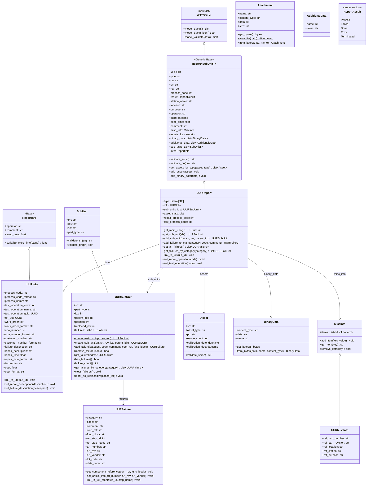
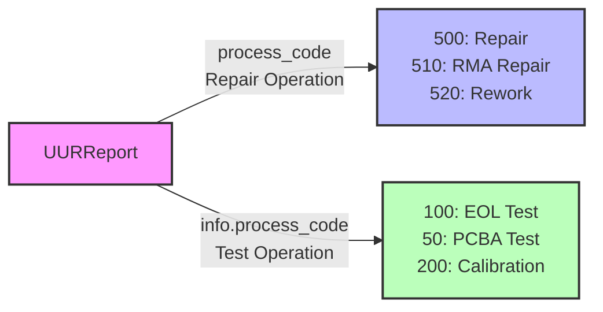
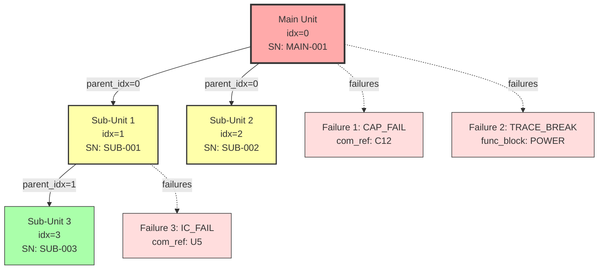

# UURReport Object Model - Class Diagram

**Comprehensive class diagram for UUR (Unit Under Repair) report structure**

**Generated:** February 8, 2026  
**Scope:** All classes involved in UURReport with public members and methods

---

## UURReport Class Hierarchy



---

## Dual Process Code Architecture

UURReport has a unique dual process code design:



**Report.process_code** (top-level) = **What KIND of repair** was performed
- Example: 500 = "Repair", 510 = "RMA Repair", 520 = "Rework"

**UURInfo.process_code** (uur object) = **What TEST was running** when failure occurred
- Example: 100 = "End of Line Test", 50 = "PCBA Test"

---

## Sub-Unit Hierarchy with Failures



**Key Concepts:**
- **idx=0** is always the main unit being repaired
- **parent_idx** creates hierarchy (which unit contains which)
- **failures** are attached to the specific unit where they were found
- **replaced_idx** tracks component replacements

---

## Linking to Original UUT Report

```mermaid
sequenceDiagram
    participant Test as UUTReport
    participant Fail as Failed Test
    participant Repair as UURReport
    participant Link as UURInfo.ref_uut
    
    Test->>Fail: Test fails
    Note over Fail: result=Failed<br/>step causes failure
    Fail->>Repair: Create repair report
    Repair->>Link: Set ref_uut = UUT.id
    Note over Link: Links repair to<br/>original test
    Repair->>Repair: Add failures found
    Note over Repair: failures reference<br/>UUT step IDs
```

---

## Key Relationships

### Composition
- **UURReport** contains:
  - `info: UURInfo` - Repair/test information with UUT reference
  - `sub_units: List[UURSubUnit]` - Units with failures (idx=0 is main)
  - `assets: List[Asset]` - Equipment used during repair
  - `binary_data: List[BinaryData]` - Photos, documents
  - `misc_info: MiscInfo` - Key-value metadata

### Hierarchy
- **UURSubUnit** extends SubUnit with:
  - `idx` - Unit index (0 = main unit)
  - `parent_idx` - Parent in hierarchy
  - `failures` - List of failures on this unit
  - `replaced_idx` - Index of unit this replaced

### Failure Tracking
- **UURFailure** captures:
  - Category and code (failure taxonomy)
  - Component reference (C12, R5, U3)
  - Article info (part number of failed component)
  - Link to UUT step that found the failure

---

## Usage Example

```python
from pywats.domains.report import UURReport, UURSubUnit, UURFailure

# Create UUR report
uur = UURReport(
    pn="WIDGET-001",
    sn="SN123456",
    rev="A",
    process_code=500,  # Repair operation
    station_name="RepairStation",
    location="Lab",
    purpose="Repair"
)

# Set test operation that was running when failure occurred
uur.info.process_code = 100  # EOL Test
uur.info.process_name = "End of Line Test"

# Link to failed UUT report
uur.info.ref_uut = uut_report_id

# Get main unit (automatically created, idx=0)
main = uur.get_main_unit()

# Add failure to main unit
failure1 = main.add_failure(
    category="Component",
    code="CAP_FAIL",
    comment="Electrolytic capacitor failed",
    com_ref="C12",
    func_block="POWER_SUPPLY"
)

# Set article info for failed component
failure1.art_number = "CAP-100uF-25V"
failure1.art_vendor = "Vendor-A"

# Link failure to UUT step
failure1.ref_step_id = 42
failure1.ref_step_name = "Measure Supply Voltage"

# Add sub-unit with failure
sub1 = uur.add_sub_unit(
    pn="MODULE-001",
    sn="MOD-789",
    rev="B",
    parent_idx=0  # Child of main unit
)
sub1.idx = 1

sub1.add_failure(
    category="Assembly",
    code="SOLDER_DEFECT",
    comment="Cold solder joint",
    com_ref="J3"
)

# Set repair description
uur.info.repair_description = "Replaced C12 and reworked solder joint on J3"
uur.info.technician = "John Doe"
uur.info.repair_time = 1800.0  # 30 minutes in seconds

# Submit repair report
await api.report.submit_uur(uur)
```

---

## Comparison: UUT vs UUR

| Feature | UUTReport | UURReport |
|---------|-----------|-----------|
| **Purpose** | Test execution | Repair documentation |
| **Type** | "T" | "R" |
| **Steps** | ✅ Root SequenceCall with hierarchy | ❌ No test steps |
| **Failures** | ❌ Inferred from failed steps | ✅ Explicit UURFailure records |
| **Process Code** | Single (test operation) | Dual (repair + test) |
| **Sub-Units** | UUTSubUnit (with optional root) | UURSubUnit (with idx, failures) |
| **Info Object** | UUTInfo | UURInfo (with ref_uut link) |
| **Hierarchy** | Step tree | Sub-unit parent/child |

---

**Related Documentation:**
- [UUTReport Object Model](UUT_OBJECT_MODEL.md)
- [Report Domain Guide](../../../docs/guides/report-domain.md)
- [Repair Workflow Guide](../../../docs/guides/repair-workflow.md)
