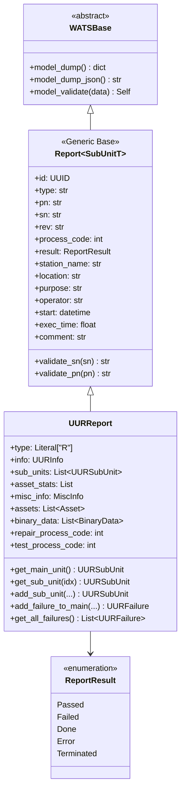
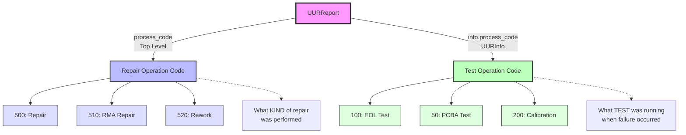
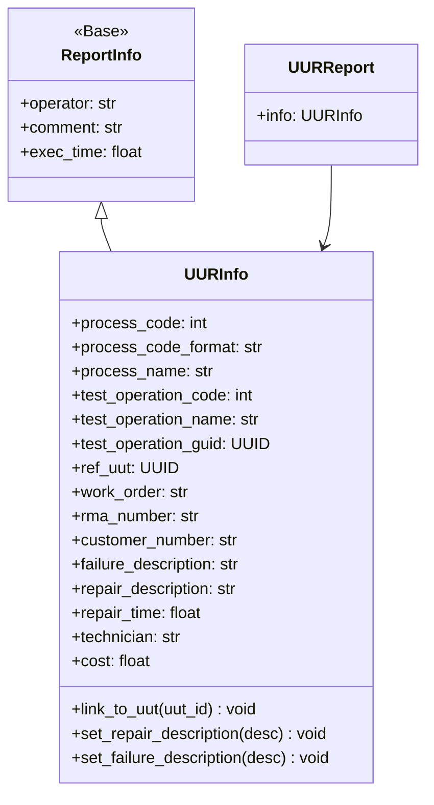
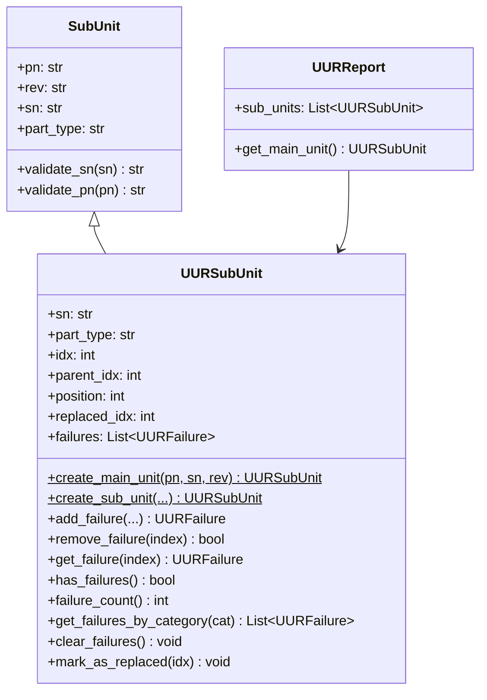
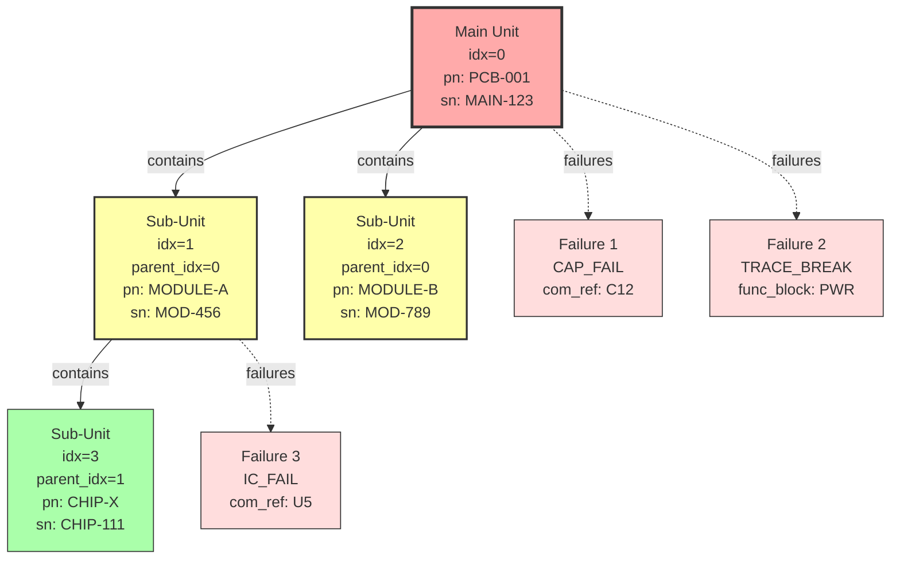
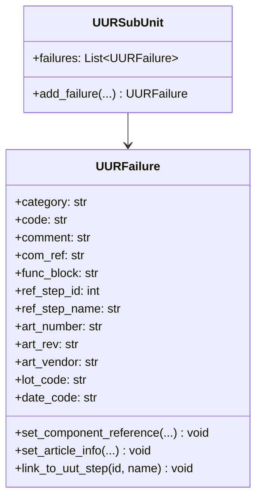
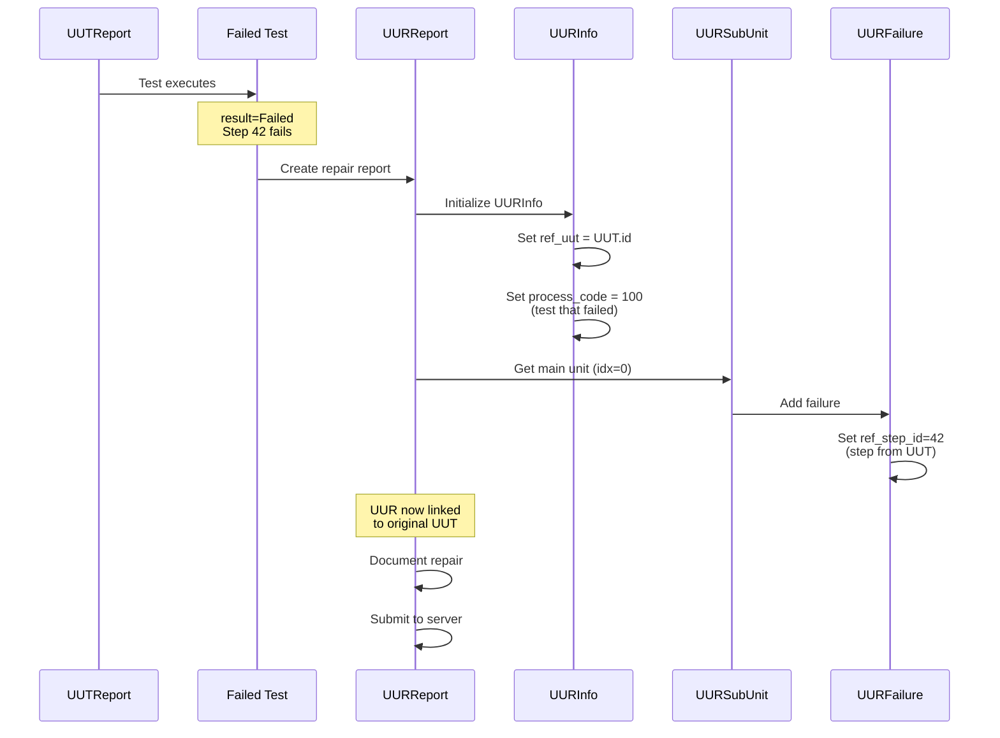
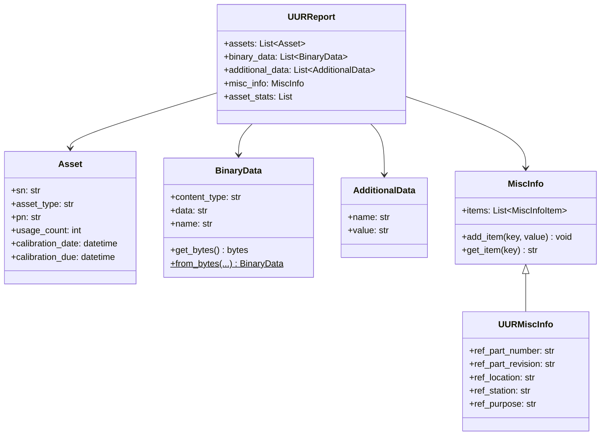

# UURReport Object Model - Printable Diagrams

**Broken down into separate diagrams for printing (one per page)**

**Generated:** February 8, 2026  
**Format:** Individual Mermaid diagrams optimized for single-page printing

---

## Export Options for Mermaid Diagrams

### Option 1: Mermaid Live Editor (Recommended for Printing) ⭐
1. Visit https://mermaid.live/
2. Paste diagram code
3. Click **Actions** → Export as:
   - **PNG** (high resolution, recommended)
   - **SVG** (vector, scales perfectly)
   - **PDF** (direct to printable format)

### Option 2: VS Code Extensions
**Install:** "Markdown Preview Mermaid Support" or "Mermaid Preview"
1. Open .md file in VS Code
2. Right-click diagram → "Export as PNG/SVG"
3. Or use Command Palette → "Mermaid: Export Diagram"

### Option 3: Command Line (Batch Export)
```bash
# Install mermaid-cli
npm install -g @mermaid-js/mermaid-cli

# Export to PNG
mmdc -i diagram.mmd -o output.png -w 2400 -H 1800

# Export to PDF
mmdc -i diagram.mmd -o output.pdf
```

---

## Diagram 1: UURReport - Core Structure

**Top-level repair report structure**



---

## Diagram 2: UURReport - Dual Process Codes

**Process code architecture explanation**



---

## Diagram 3: UURInfo Structure

**UUR-specific information**



---

## Diagram 4: UURSubUnit Hierarchy

**Sub-unit structure with index-based hierarchy**



---

## Diagram 5: Sub-Unit Hierarchy Example

**Visual representation of idx/parent_idx relationships**



---

## Diagram 6: UURFailure Structure

**Failure record details**



---

## Diagram 7: UUT-UUR Linking Flow

**How repair reports link to test reports**



---

## Diagram 8: Assets and Supporting Data

**Assets, binary data, and misc info**



---

## Printing Instructions

### For Best Print Quality:

1. **Export each diagram separately** using Mermaid Live Editor:
   - Copy diagram code
   - Paste into https://mermaid.live/
   - Export as PNG (2400x1800 or higher)
   - Or export as PDF for vector quality

2. **Page Setup Recommendations:**
   - Orientation: **Landscape**
   - Paper: **Letter or A4**
   - Margins: **0.5 inch all sides**
   - Scale: **Fit to page width**

3. **Alternative: Screenshot from VS Code:**
   - Install "Markdown Preview Mermaid Support"
   - Open preview (Ctrl+Shift+V)
   - Screenshot each diagram
   - Paste into Word/PowerPoint

4. **Batch Export Script:**
   ```bash
   # Save each diagram block to separate .mmd files
   # Then export all:
   for file in uur_diagram_*.mmd; do
       mmdc -i "$file" -o "${file%.mmd}.png" -w 2400 -H 1800
   done
   ```

---

## Quick Reference: Diagram Purpose

| Diagram | Content | Use For |
|---------|---------|---------|
| **Diagram 1** | Core repair report | Understanding UUR structure |
| **Diagram 2** | Dual process codes | Process code architecture |
| **Diagram 3** | UURInfo details | Repair-specific information |
| **Diagram 4** | UURSubUnit class | Sub-unit with failure methods |
| **Diagram 5** | Hierarchy example | Visual idx/parent_idx relationships |
| **Diagram 6** | UURFailure class | Failure record structure |
| **Diagram 7** | UUT-UUR linking | How repairs link to tests |
| **Diagram 8** | Assets & data | Supporting structures |

---

## Key Concepts Reference

### Main Unit (idx=0)
- Always the primary unit being repaired
- Created automatically when UURReport is instantiated
- Access via `uur.get_main_unit()`

### Parent-Child Hierarchy
- `idx` - Unique identifier for each unit
- `parent_idx` - Index of containing unit
- `position` - Position within parent
- Enables multi-level assembly tracking

### Failure Attribution
- Failures attached to specific sub-units
- `ref_step_id` links to original UUT test step
- Component reference (`com_ref`) for traceability
- Article info tracks replaced components

### Dual Process Codes
- **Report.process_code** - Repair operation (500, 510, 520)
- **UURInfo.process_code** - Test operation that failed (100, 50, 200)
- Enables analysis: "Which tests have most repairs?"

---

**Related:** [UUT Printable Diagrams](UUT_OBJECT_MODEL_PRINTABLE.md)
