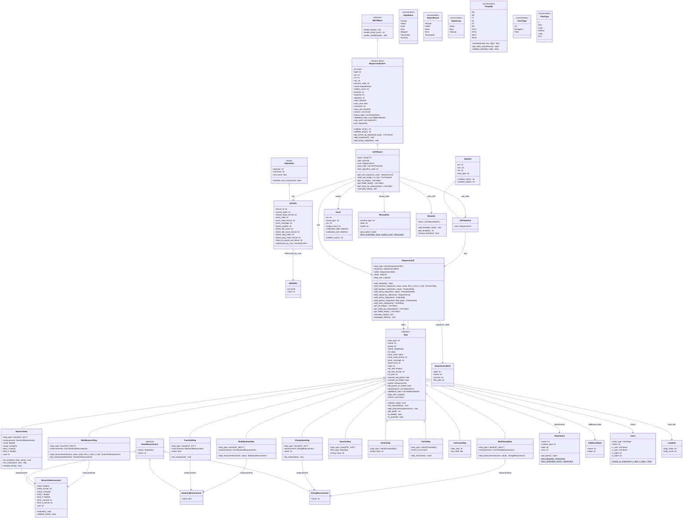

```mermaid
classDiagram
    %% Core Report Hierarchy
    class WATSBase {
        <<abstract>>
        +model_dump() dict
        +model_dump_json() str
        +model_validate(data) Self
    }
    
    class Report~SubUnitT~ {
        <<Generic Base>>
        +id: UUID
        +type: str
        +pn: str
        +sn: str
        +rev: str
        +process_code: int
        +result: ReportResult
        +station_name: str
        +location: str
        +purpose: str
        +operator: str
        +start: datetime
        +exec_time: float
        +comment: str
        +misc_info: MiscInfo
        +assets: List~Asset~
        +binary_data: List~BinaryData~
        +additional_data: List~AdditionalData~
        +sub_units: List~SubUnitT~
        +info: ReportInfo
        +validate_sn(sn) str
        +validate_pn(pn) str
        +get_assets_by_type(asset_type) List~Asset~
        +add_asset(asset) void
        +add_binary_data(data) void
    }
    
    class UUTReport {
        +type: Literal["T"]
        +info: UUTInfo
        +root: SequenceCall
        +sub_units: List~UUTSubUnit~
        +test_operation_code: int
        +get_root_sequence_call() SequenceCall
        +add_sub_unit(pn, sn, rev) UUTSubUnit
        +get_all_steps() List~Step~
        +get_failed_steps() List~Step~
        +get_steps_by_status(status) List~Step~
        +calculate_totals() dict
    }
    
    WATSBase <|-- Report
    Report <|-- UUTReport
    
    %% UUT Info
    class ReportInfo {
        <<Base>>
        +operator: str
        +comment: str
        +exec_time: float
        +serialize_exec_time(value) float
    }
    
    class UUTInfo {
        +fixture_id: str
        +socket_index: int
        +socket_index_format: str
        +error_code: int
        +error_code_format: str
        +error_message: str
        +batch_number: str
        +batch_fail_count: int
        +batch_fail_count_format: str
        +batch_loop_index: int
        +batch_loop_index_format: str
        +step_id_caused_uut_failure: int
        +referenced_by_uurs: List~RefUURs~
    }
    
    ReportInfo <|-- UUTInfo
    UUTReport --> UUTInfo : info
    
    class RefUURs {
        +id: UUID
        +start: str
    }
    
    UUTInfo --> RefUURs : referenced_by_uurs
    
    %% Sub Units
    class SubUnit {
        +pn: str
        +rev: str
        +sn: str
        +part_type: str
        +validate_sn(sn) str
        +validate_pn(pn) str
    }
    
    class UUTSubUnit {
        +root: SequenceCall
    }
    
    SubUnit <|-- UUTSubUnit
    UUTReport --> UUTSubUnit : sub_units
    
    %% Step Hierarchy
    class Step {
        <<abstract>>
        +step_type: str
        +name: str
        +group: str
        +status: StepStatus
        +id: int|str
        +error_code: int|str
        +error_code_format: str
        +error_message: str
        +report_text: str
        +start: str
        +tot_time: float|str
        +tot_time_format: str
        +ts_guid: str
        +caused_seq_failure: bool
        +caused_uut_failure: bool
        +parent: SequenceCall
        +fail_parent_on_failure: bool
        +attachments: List~Attachment~
        +additional_data: List~AdditionalData~
        +loop_info: LoopInfo
        +charts: List~Chart~
        +validate_step()* bool
        +set_status(status) void
        +add_attachment(attachment) void
        +get_path() str
        +is_failed() bool
        +is_passed() bool
    }
    
    class SequenceCall {
        +step_type: Literal["SequenceCall"]
        +sequence: SequenceCallInfo
        +caller: SequenceCallInfo
        +steps: StepList
        +loop_info: LoopInfo
        +add_step(step) Step
        +add_numeric_step(name, value, comp, limit_l, limit_h, unit) NumericStep
        +add_boolean_step(name, value) PassFailStep
        +add_string_step(name, value) StringValueStep
        +add_sequence_call(name) SequenceCall
        +add_action_step(name) ActionStep
        +add_generic_step(name, flow_type) GenericStep
        +add_chart_step(name) ChartStep
        +get_all_steps() List~Step~
        +get_steps_by_status(status) List~Step~
        +get_failed_steps() List~Step~
        +calculate_totals() dict
        +propagate_failure() void
    }
    
    class NumericStep {
        +step_type: Literal["ET_NLT"]
        +measurement: NumericMeasurement
        +value: float|str
        +comp: CompOp
        +limit_l: float|str
        +limit_h: float|str
        +unit: str
        +set_limits(low, high, comp) void
        +set_value(value, unit) void
        +validate_limits() bool
    }
    
    class MultiNumericStep {
        +step_type: Literal["ET_MNLT"]
        +measurements: List~NumericMeasurement~
        +add_measurement(name, value, comp, limit_l, limit_h, unit) NumericMeasurement
        +get_measurement(name) NumericMeasurement
    }
    
    class PassFailStep {
        +step_type: Literal["ET_PLT"]
        +measurement: BooleanMeasurement
        +value: bool
        +set_value(value) void
    }
    
    class MultiBooleanStep {
        +step_type: Literal["ET_MPLT"]
        +measurements: List~BooleanMeasurement~
        +add_measurement(name, value) BooleanMeasurement
    }
    
    class StringValueStep {
        +step_type: Literal["ET_SLT"]
        +measurement: StringMeasurement
        +value: str
        +set_value(value) void
    }
    
    class MultiStringStep {
        +step_type: Literal["ET_MSLT"]
        +measurements: List~StringMeasurement~
        +add_measurement(name, value) StringMeasurement
    }
    
    class GenericStep {
        +step_type: Literal["ET_STR"]
        +flow_type: FlowType
        +string_value: str
    }
    
    class ActionStep {
        +step_type: Literal["ActionStep"]
        +action_type: str
    }
    
    class ChartStep {
        +step_type: Literal["ChartStep"]
        +charts: List~Chart~
        +add_chart(chart) Chart
    }
    
    class UnknownStep {
        +step_type: str
        +raw_data: dict
    }
    
    Step <|-- SequenceCall
    Step <|-- NumericStep
    Step <|-- MultiNumericStep
    Step <|-- PassFailStep
    Step <|-- MultiBooleanStep
    Step <|-- StringValueStep
    Step <|-- MultiStringStep
    Step <|-- GenericStep
    Step <|-- ActionStep
    Step <|-- ChartStep
    Step <|-- UnknownStep
    
    UUTReport --> SequenceCall : root
    UUTSubUnit --> SequenceCall : root
    SequenceCall --> Step : steps
    
    %% Measurement Classes
    class BaseMeasurement {
        <<abstract>>
        +status: StepStatus
        +name: str
    }
    
    class NumericMeasurement {
        +value: float|str
        +value_format: str
        +comp: CompOp
        +limit_l: float|str
        +limit_h: float|str
        +limit_l_format: str
        +limit_h_format: str
        +unit: str
        +evaluate() bool
        +validate_limits() bool
    }
    
    class BooleanMeasurement {
        +value: bool
    }
    
    class StringMeasurement {
        +value: str
    }
    
    BaseMeasurement <|-- NumericMeasurement
    BaseMeasurement <|-- BooleanMeasurement
    BaseMeasurement <|-- StringMeasurement
    
    NumericStep --> NumericMeasurement : measurement
    MultiNumericStep --> NumericMeasurement : measurements
    PassFailStep --> BooleanMeasurement : measurement
    MultiBooleanStep --> BooleanMeasurement : measurements
    StringValueStep --> StringMeasurement : measurement
    MultiStringStep --> StringMeasurement : measurements
    
    %% Supporting Classes
    class Asset {
        +sn: str
        +asset_type: str
        +pn: str
        +usage_count: int
        +calibration_date: datetime
        +calibration_due: datetime
        +validate_sn(sn) str
    }
    
    class BinaryData {
        +content_type: str
        +data: str
        +name: str
        +get_bytes() bytes
        +from_bytes(data, name, content_type)$ BinaryData
    }
    
    class Attachment {
        +name: str
        +content_type: str
        +data: str
        +size: int
        +get_bytes() bytes
        +from_file(path)$ Attachment
        +from_bytes(data, name)$ Attachment
    }
    
    class AdditionalData {
        +name: str
        +value: str
    }
    
    class Chart {
        +chart_type: ChartType
        +name: str
        +x_axis: List~float~
        +y_axis: List~float~
        +x_label: str
        +y_label: str
        +create_xy_chart(name, x_data, y_data)$ Chart
    }
    
    class LoopInfo {
        +loop_index: int
        +loop_count: int
    }
    
    class SequenceCallInfo {
        +path: str
        +name: str
        +version: str
        +file_path: str
    }
    
    class MiscInfo {
        +items: List~MiscInfoItem~
        +add_item(key, value) void
        +get_item(key) str
        +remove_item(key) bool
    }
    
    UUTReport --> Asset : assets
    UUTReport --> BinaryData : binary_data
    UUTReport --> MiscInfo : misc_info
    Step --> Attachment : attachments
    Step --> AdditionalData : additional_data
    Step --> Chart : charts
    Step --> LoopInfo : loop_info
    SequenceCall --> SequenceCallInfo : sequence, caller
    
    %% Enums
    class StepStatus {
        <<enumeration>>
        Passed
        Failed
        Done
        Error
        Skipped
        Terminated
        Running
    }
    
    class ReportResult {
        <<enumeration>>
        Passed
        Failed
        Done
        Error
        Terminated
    }
    
    class StepGroup {
        <<enumeration>>
        Setup
        Main
        Cleanup
    }
    
    class CompOp {
        <<enumeration>>
        EQ
        NE
        LT
        LE
        GT
        GE
        GTLT
        GTLE
        GELT
        GELE
        +evaluate(value, low, high) bool
        +get_limits_requirement() tuple
        +validate_limits(low, high) bool
    }
    
    class ChartType {
        <<enumeration>>
        XY
        Histogram
        Polar
    }
    
    class FlowType {
        <<enumeration>>
        If
        Else
        Case
        Default
        Loop
        End
    }
```