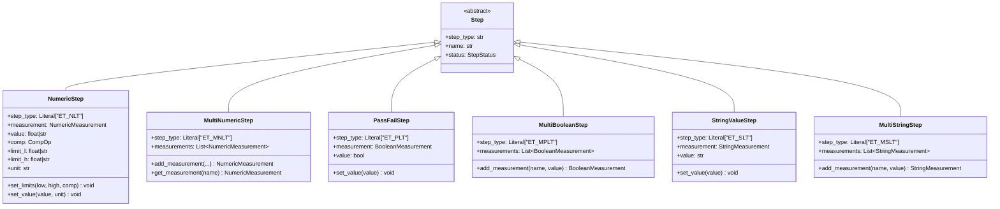

# UUTReport Object Model - Printable Diagrams

**Broken down into separate diagrams for printing (one per page)**

**Generated:** February 8, 2026  
**Format:** Individual Mermaid diagrams optimized for single-page printing

---

## Export Options for Mermaid Diagrams

### Option 1: Mermaid Live Editor (Recommended for Printing) ⭐
1. Visit https://mermaid.live/
2. Paste diagram code
3. Click **Actions** → Export as:
   - **PNG** (high resolution, recommended)
   - **SVG** (vector, scales perfectly)
   - **PDF** (direct to printable format)

### Option 2: VS Code Extensions
**Install:** "Markdown Preview Mermaid Support" or "Mermaid Preview"
1. Open .md file in VS Code
2. Right-click diagram → "Export as PNG/SVG"
3. Or use Command Palette → "Mermaid: Export Diagram"

### Option 3: Command Line (Batch Export)
```bash
# Install mermaid-cli
npm install -g @mermaid-js/mermaid-cli

# Export to PNG
mmdc -i diagram.mmd -o output.png -w 2400 -H 1800

# Export to PDF
mmdc -i diagram.mmd -o output.pdf
```

### Option 4: GitHub/Browser
1. View .md file on GitHub
2. Right-click rendered diagram → "Save image as..."
3. Or use browser dev tools to export SVG

---

## Diagram 1: UUTReport - Core Structure

**Top-level report structure with header information**


---

## Diagram 2: UUTReport - Info and Sub-Units

**UUTInfo and SubUnit structure**


---

## Diagram 3: UUTReport - Assets and Binary Data

**Supporting data structures**


---

## Diagram 4: Step Hierarchy - Base and Container

**Step base class and SequenceCall container**


---

## Diagram 5: Step Types - Measurement Steps

**Numeric, Boolean, and String test steps**



---

## Diagram 6: Step Types - Other Steps

**Generic, Action, Chart, and Unknown steps**


---

## Diagram 7: Measurement Classes

**Measurement data structures with limits**


---

## Printing Instructions

### For Best Print Quality:

1. **Export each diagram separately** using Mermaid Live Editor:
   - Copy diagram code
   - Paste into https://mermaid.live/
   - Export as PNG (2400x1800 or higher)
   - Or export as PDF for vector quality

2. **Page Setup Recommendations:**
   - Orientation: **Landscape**
   - Paper: **Letter or A4**
   - Margins: **0.5 inch all sides**
   - Scale: **Fit to page width**

3. **Alternative: Create PDF from Images:**
   ```bash
   # Export all diagrams as PNG
   # Then combine with ImageMagick:
   convert diagram*.png combined.pdf
   
   # Or use online tools like:
   # - Smallpdf.com
   # - ilovepdf.com
   ```

4. **Print from VS Code Preview:**
   - Install "Markdown Preview Mermaid Support"
   - Open this file
   - Ctrl+Shift+V (preview)
   - Print preview → each diagram should fit on one page

---

## Quick Reference: Diagram Purpose

| Diagram | Content | Use For |
|---------|---------|---------|
| **Diagram 1** | Core report structure | Understanding report hierarchy |
| **Diagram 2** | UUTInfo & sub-units | Test information and components |
| **Diagram 3** | Assets & binary data | Supporting data structures |
| **Diagram 4** | Step base & SequenceCall | Test hierarchy foundation |
| **Diagram 5** | Measurement steps | Numeric/boolean/string tests |
| **Diagram 6** | Other step types | Generic/action/chart steps |
| **Diagram 7** | Measurement classes | Limit definitions and evaluations |

---

**Related:** [UUR Printable Diagrams](UUR_OBJECT_MODEL_PRINTABLE.md)
