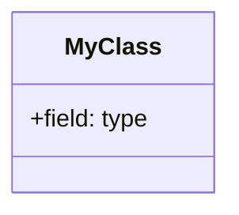
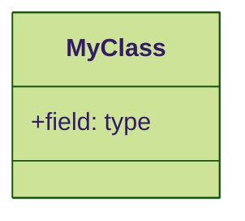
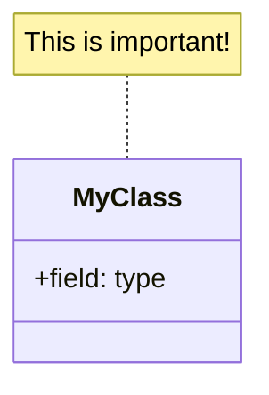

# Mermaid Diagram Export Guide

**Complete guide for exporting Mermaid diagrams to printable formats**

**Last Updated:** February 8, 2026

---

## 🎯 Quick Start (Recommended)

### Option 1: Mermaid Live Editor ⭐ EASIEST

**Best for:** One-off exports, high-quality images

1. Visit **https://mermaid.live/**
2. Paste your Mermaid diagram code
3. Click **Actions** button (top right)
4. Choose export format:
   - **PNG** - High resolution image (recommended)
   - **SVG** - Vector graphics (scales perfectly)
   - **PDF** - Direct to print
   - **Markdown** - For documentation

**Settings for Print Quality:**
- Click ⚙️ Settings
- Set Theme: **Default** or **Forest**
- Enable: **Use Max Width**

---

## 🖥️ Option 2: VS Code Extensions

### Method A: Markdown Preview Mermaid Support

**Install:**
```
Name: Markdown Preview Mermaid Support
ID: bierner.markdown-mermaid
```

**Usage:**
1. Open `.md` file with Mermaid diagrams
2. Press `Ctrl+Shift+V` (preview)
3. Right-click diagram → **Copy Image** or **Save Image**

### Method B: Mermaid Preview

**Install:**
```
Name: Mermaid Preview
ID: vstirbu.vscode-mermaid-preview
```

**Usage:**
1. Create `.mmd` file with just diagram code
2. Press `Ctrl+Shift+P` → "Mermaid: Preview"
3. Export via preview toolbar

### Method C: Mermaid Editor

**Install:**
```
Name: Mermaid Editor
ID: tomoyukim.vscode-mermaid-editor
```

**Features:**
- Live preview
- Export to PNG/SVG
- Multiple diagrams per file

---

## 💻 Option 3: Command Line (Batch Processing)

### Install Mermaid CLI

```bash
# Install globally
npm install -g @mermaid-js/mermaid-cli

# Verify installation
mmdc --version
```

### Export Single Diagram

```bash
# Create .mmd file with Mermaid code
# Export to PNG (high resolution)
mmdc -i diagram.mmd -o diagram.png -w 2400 -H 1800

# Export to SVG (vector)
mmdc -i diagram.mmd -o diagram.svg

# Export to PDF
mmdc -i diagram.mmd -o diagram.pdf

# With custom theme
mmdc -i diagram.mmd -o diagram.png -t forest
```

### Batch Export All Diagrams

**PowerShell:**
```powershell
# Export all .mmd files in directory
Get-ChildItem -Filter *.mmd | ForEach-Object {
    $output = $_.BaseName + ".png"
    mmdc -i $_.Name -o $output -w 2400 -H 1800
}
```

**Bash/Linux:**
```bash
# Export all .mmd files
for file in *.mmd; do
    mmdc -i "$file" -o "${file%.mmd}.png" -w 2400 -H 1800
done
```

### Advanced Options

```bash
# Custom background color
mmdc -i diagram.mmd -o diagram.png -b white

# Custom CSS
mmdc -i diagram.mmd -o diagram.png -c custom.css

# Scale/zoom
mmdc -i diagram.mmd -o diagram.png -s 2

# Puppeteer config (for rendering)
mmdc -i diagram.mmd -o diagram.png -p puppeteer-config.json
```

---

## 🌐 Option 4: Browser-Based Tools

### GitHub/GitLab Rendering

1. Push `.md` file to GitHub/GitLab
2. View file in browser (automatically renders)
3. Right-click diagram → **Save image as...**
4. Or use browser DevTools to export SVG

**Limitations:** 
- Lower resolution than Mermaid Live
- No control over export settings

### Online Converters

**Mermaid Chart:**
- Visit: https://www.mermaidchart.com/
- More features than mermaid.live
- Team collaboration
- Export to multiple formats

---

## 📄 Preparing Diagrams for Printing

### Extracting Diagrams from Markdown

**From UUT_OBJECT_MODEL_PRINTABLE.md:**

Each diagram is in a code block like:
````markdown

````

**To extract:**
1. Copy everything between ` ```mermaid ` and ` ``` `
2. Paste into Mermaid Live Editor or save as `.mmd` file

### Recommended Export Settings

**For Printing:**
- **Format:** PNG or PDF
- **Resolution:** 2400x1800 minimum
- **Background:** White
- **Theme:** Default (black on white)

**For Presentations:**
- **Format:** SVG or PNG
- **Background:** Transparent
- **Theme:** Forest or Dark (for dark slides)

**For Web:**
- **Format:** SVG
- **Optimization:** Enable
- **Fallback:** PNG for older browsers

---

## 🖨️ Print Setup Recommendations

### Page Orientation
- **Landscape** for most diagrams (recommended)
- Portrait only for very vertical diagrams

### Paper Size
- **Letter (8.5" × 11")** - US standard
- **A4 (210mm × 297mm)** - International standard
- **Ledger/Tabloid (11" × 17")** - For complex diagrams

### Margins
- **0.5 inch** all sides (tight margins)
- **1 inch** for binding
- **Auto** if diagram doesn't fit

### Scaling
- **Fit to page width** (recommended)
- **Actual size** if diagram is small
- **Scale to fit** as last resort

---

## 🔧 Troubleshooting

### Diagram Won't Render

**Solution 1:** Validate syntax
- Use Mermaid Live Editor to check for errors
- Common issues: missing quotes, wrong arrow types

**Solution 2:** Update Mermaid version
```bash
npm update -g @mermaid-js/mermaid-cli
```

### Export is Blurry

**Solution:** Increase resolution
```bash
mmdc -i diagram.mmd -o diagram.png -w 3600 -H 2700
```

### Text is Cut Off

**Solution:** Increase padding
```bash
mmdc -i diagram.mmd -o diagram.png -c config.json
```

**config.json:**
```json
{
  "theme": "default",
  "themeVariables": {
    "fontSize": "16px"
  },
  "flowchart": {
    "padding": 20
  }
}
```

### Background is Transparent (unwanted)

**Solution:** Force white background
```bash
mmdc -i diagram.mmd -o diagram.png -b white
```

---

## 📦 Workflow: From Markdown to Print

### Step-by-Step Process

1. **Open printable diagram file**
   - `UUT_OBJECT_MODEL_PRINTABLE.md` or
   - `UUR_OBJECT_MODEL_PRINTABLE.md`

2. **Extract diagram code**
   - Copy code between ` ```mermaid ` markers
   - Include everything (classDiagram, graph, etc.)

3. **Export via Mermaid Live**
   - Go to https://mermaid.live/
   - Paste diagram code
   - Actions → Export PNG (2400x1800)

4. **Organize files**
   ```
   exports/
   ├── uut_diagram_01_core.png
   ├── uut_diagram_02_info.png
   ├── uut_diagram_03_assets.png
   └── ...
   ```

5. **Create print document**
   - Open Word/PowerPoint
   - Insert images (one per page)
   - Set to landscape orientation
   - Print or export to PDF

---

## 🎨 Customization Tips

### Change Color Scheme

**Add to diagram code:**


**Available themes:**
- `default` - Black on white
- `forest` - Green tones
- `dark` - Dark background
- `neutral` - Gray tones

### Adjust Font Size

**In Mermaid Live settings:**
- Click ⚙️
- Adjust **Font Size** slider
- Re-export

### Add Notes/Labels



---

## 📚 Quick Reference Commands

```bash
# Basic PNG export
mmdc -i input.mmd -o output.png

# High-res PNG
mmdc -i input.mmd -o output.png -w 2400 -H 1800

# SVG (vector)
mmdc -i input.mmd -o output.svg

# PDF
mmdc -i input.mmd -o output.pdf

# With white background
mmdc -i input.mmd -o output.png -b white

# Batch convert all
for file in *.mmd; do mmdc -i "$file" -o "${file%.mmd}.png"; done
```

---

## 🔗 Related Resources

- **Mermaid Live Editor:** https://mermaid.live/
- **Mermaid Documentation:** https://mermaid.js.org/
- **Mermaid CLI Docs:** https://github.com/mermaid-js/mermaid-cli
- **VS Code Extensions:** Search "Mermaid" in Extensions marketplace

---

**Need help?** See the examples in:
- [UUT Printable Diagrams](UUT_OBJECT_MODEL_PRINTABLE.md)
- [UUR Printable Diagrams](UUR_OBJECT_MODEL_PRINTABLE.md)
