# pyWATS System Architecture - Comprehensive Guide

**Version:** 1.4.0  
**Last Updated:** February 2026  
**Audience:** Developers, integrators, contributors, architects

---

## Table of Contents

1. [Overview](#1-overview)
2. [Three-Layer Design](#2-three-layer-design)
3. [API Layer Architecture](#3-api-layer-architecture)
4. [Client Layer Architecture](#4-client-layer-architecture)
5. [Component Details](#5-component-details)
6. [Integration Patterns](#6-integration-patterns)
7. [Deployment Architectures](#7-deployment-architectures)
8. [Architecture Diagrams](#8-architecture-diagrams)

---

## 1. Overview

pyWATS is a **three-layer Python system** for connecting manufacturing test stations to WATS (Web-based Automatic Test System) servers. It provides both a programmatic API for test automation and a client application for test station deployment.

### 1.1 System Architecture

```mermaid
flowchart TB
    GUI["pyWATS Client GUI
    PySide6/Qt - Optional Desktop Application
    • User interface for configuration
    • System tray integration
    • Multi-page navigation"]
    
    Service["pyWATS Client Service
    pywats_client - Headless-capable
    • File monitoring Watchdog
    • Converter processing
    • Offline queue with retry
    • Multi-instance support"]
    
    API["pyWATS API
    pywats - Core library
    • Async & sync HTTP client
    • 8 domain services
    • Pydantic models
    • Rate limiting, retry"]
    
    WATS["WATS Server
    Cloud or On-Premise"]
    
    GUI <-->|IPC LocalSocket| Service
    Service -->|Uses| API
    API -->|HTTPS/REST| WATS
```



### 1.2 Key Features

- **Dual API modes:** Async (`AsyncWATS`) for high-performance concurrent operations, Sync (`pyWATS`) for simple scripting
- **Headless operation:** Client runs without GUI on servers, Raspberry Pi, embedded systems
- **Offline resilience:** Queue and retry reports when network is unavailable
- **Multi-instance:** Run multiple clients on same machine with separate configurations
- **Extensible:** Custom converters, custom domains, plugin architecture
- **Async-first:** Non-blocking I/O with asyncio, concurrent uploads/conversions (v1.4+)

### 1.3 Current Package Structure

```
pywats-api (single package)
├── pywats/              # Core API library (sync + async)
├── pywats_client/       # Client application
│   ├── core/            # Configuration, auth
│   ├── service/         # Background service (headless-capable)
│   ├── gui/             # Qt GUI (requires PySide6)
│   ├── converters/      # File converters
│   ├── queue/           # Persistent queue
│   ├── control/         # CLI interface
│   └── io.py            # File I/O utilities
├── pywats_cfx/          # CFX integration (optional)
└── pywats_events/       # Event system (optional)
```

---

## 2. Three-Layer Design

### 2.1 Layer 1: pyWATS API (`src/pywats/`)

**Purpose:** Foundation library for REST API communication with WATS servers

**Responsibility:**
- HTTP/HTTPS communication with authentication
- Domain-specific business logic (8 domains)
- Pydantic model validation
- Rate limiting and retry logic
- Error handling and responses

**Used by:** Test automation scripts, client service, custom integrations

**Entry point:** `pyWATS` (sync) or `AsyncWATS` (async)

**Dependencies:** httpx, pydantic, python-dateutil, attrs  
**Coupling:** LOW - Pure API library, no dependencies on other internal packages

### 2.2 Layer 2: pyWATS Client Service (`src/pywats_client/`)

**Purpose:** Background service for test station automation

**Responsibility:**
- File system monitoring (Watchdog)
- Converter execution (file → report transformation)
- Offline queue management with persistence
- Connection health monitoring
- Process/product data synchronization
- Multi-instance coordination

**Modes:** Headless daemon, Windows/Linux/macOS service, foreground process

**Entry point:** `python -m pywats_client service`

**Dependencies:** pywats (AsyncWATS), watchdog, aiofiles  
**Qt Dependencies:** NONE (after IPC refactoring)  
**Coupling:** MEDIUM - Depends on pywats, but no GUI coupling

### 2.3 Layer 3: pyWATS GUI (`src/pywats_client/gui/`)

**Purpose:** Optional desktop application for client configuration

**Responsibility:**
- User-friendly configuration interface
- Visual status monitoring
- Log viewing and troubleshooting
- System tray integration

**Technology:** PySide6 (Qt6 for Python)

**Entry point:** `python -m pywats_client gui`

**Dependencies:** PySide6, qasync, pywats_client.service  
**Coupling:** HIGH - Tightly coupled to service layer

---

## 3. API Layer Architecture

### 3.1 Architecture Pattern

Each domain follows a **three-layer pattern**:


### 3.2 Core Components

#### 3.2.1 HttpClient (`core/client.py`)

**Both sync and async implementations:**
- `HttpClient` - Synchronous (uses `requests`)
- `AsyncHttpClient` - Asynchronous (uses `httpx`)

**Features:**
- Basic authentication (username + API token)
- Automatic response wrapping with `Response` model
- JSON serialization/deserialization
- No exception raising for HTTP errors (repositories handle errors)
- Built-in rate limiting integration
- Automatic retry for transient failures

**Response Model:**
```python
class Response:
    status_code: int
    data: Any              # Parsed JSON
    headers: Dict[str, str]
    raw: bytes
    
    # Computed properties
    is_success: bool       # 2xx
    is_client_error: bool  # 4xx
    is_server_error: bool  # 5xx
    is_not_found: bool     # 404
    error_message: Optional[str]
```

#### 3.2.2 Rate Limiting (`core/throttle.py`)

**Thread-safe sliding window rate limiter:**
- Default: 500 requests per 60 seconds
- Configurable via `configure_throttling()`
- Automatic wait when limit reached
- Statistics tracking (total requests, throttle count, wait time)

**Configuration:**
```python
from pywats.core.throttle import configure_throttling

configure_throttling(
    max_requests=500,
    window_seconds=60,
    enabled=True
)
```

#### 3.2.3 Retry Logic (`core/retry.py`)

**Automatic retry with exponential backoff:**
- Default: 3 attempts, 1s base delay, 30s max delay
- Retries on: `ConnectionError`, `TimeoutError`, HTTP 429/5xx
- Respects `Retry-After` header for HTTP 429
- Does NOT retry: POST (not idempotent), HTTP 4xx errors
- Configurable per client instance

**Configuration:**
```python
from pywats import pyWATS, RetryConfig

config = RetryConfig(
    max_attempts=5,
    base_delay=2.0,
    max_delay=60.0,
    jitter=True
)
api = pyWATS(..., retry_config=config)
```

#### 3.2.5 Circuit Breaker (`core/circuit_breaker.py`)

**Prevent cascading failures and retry storms** (Added v0.3.0b1)

**State Machine:**
- **CLOSED** (normal) - Requests pass through, failures tracked
- **OPEN** (failing fast) - All requests fail immediately without network call
- **HALF_OPEN** (testing recovery) - Limited requests allowed to test service health

**Configuration:**
```python
from pywats.core.circuit_breaker import CircuitBreaker, CircuitBreakerConfig

config = CircuitBreakerConfig(
    failure_threshold=5,    # Open after 5 consecutive failures
    success_threshold=2,    # Close after 2 consecutive successes in half-open
    timeout=60.0,          # Stay open for 60 seconds before half-open
    excluded_exceptions=(ValidationError, NotFoundError)  # Don't count as failures
)

breaker = CircuitBreaker(config)
```

**Integration with HTTP Client:**
```python
# AsyncHttpClient wraps all requests with circuit breaker
async def get(self, url: str) -> Response:
    try:
        return await self._circuit_breaker.call(self._http_get, url)
    except CircuitOpenError:
        # Fail-fast: service is degraded
        logger.warning("Circuit breaker OPEN - skipping request")
        return Response(status_code=503, data={}, error="Circuit breaker open")
```

**Metrics:**
- `state`: Current state (CLOSED/OPEN/HALF_OPEN)
- `failure_count`: Consecutive failures
- `success_count`: Consecutive successes in half-open
- `last_failure_time`: Timestamp of last failure
- Manual reset: `breaker.reset()`

**Performance:**
- Fail-fast overhead: <0.001ms (nearly instant)
- Success overhead: <0.0001ms (negligible)

#### 3.2.6 Event Loop Pooling (`core/event_loop_pool.py`)

**Thread-local event loop reuse for sync API performance** (Added v0.3.0b1)

**Problem Solved:**
- Previous: Creating new event loop per sync API call = 10-100ms overhead
- Now: Reuse thread-local event loop = <0.01ms overhead
- **Result: 10-100x speedup for synchronous API calls**

**Architecture:**
```python
class EventLoopPool:
    _thread_local = threading.local()  # Thread-local storage
    
    @staticmethod
    def get_loop() -> asyncio.AbstractEventLoop:
        """Get or create thread-local event loop"""
        if not hasattr(EventLoopPool._thread_local, 'loop'):
            loop = asyncio.new_event_loop()
            EventLoopPool._thread_local.loop = loop
        return EventLoopPool._thread_local.loop
    
    @staticmethod
    def run_coroutine(coro):
        """Run coroutine in thread-local loop"""
        loop = EventLoopPool.get_loop()
        return loop.run_until_complete(coro)
```

**Integration with sync_runner:**
```python
def run_sync(coroutine):
    """Run async code synchronously (used by pyWATS)"""
    return EventLoopPool.run_coroutine(coroutine)
```

**Thread Safety:**
- Each thread gets its own event loop (no conflicts)
- Loops reused within same thread
- Automatic cleanup on thread exit

**Performance Impact:**
- **Micro-benchmarks:** Performance parity (validates no regression)
- **Real-world:** 10-100x faster in client applications
- **Overhead:** <0.01ms (essentially free)

**Usage (Automatic):**
```python
from pywats import pyWATS

# EventLoopPool automatically used internally
api = pyWATS(base_url="...", token="...")
product = api.product.get_product("ABC123")  # 10-100x faster than v0.2.0
```

#### 3.2.7 Error Handling (`core/exceptions.py`, `shared/result.py`)

**Two error handling modes:**

1. **ErrorMode.STRICT** (default) - Raises exceptions
   - `NotFoundError` for HTTP 404
   - `ValidationError` for HTTP 400
   - `AuthenticationError` for HTTP 401
   - `AuthorizationError` for HTTP 403
   - `ServerError` for HTTP 5xx

2. **ErrorMode.LENIENT** - Returns `None` for errors
   - No exceptions raised
   - Repository methods return `None` on 404
   - Suitable for optional data fetching

**Result Pattern (advanced):**
```python
from pywats.shared.result import Result

result = await api.product.get_product_async("PRODUCT-123")
if result.is_success:
    print(result.value)  # Product object
else:
    print(result.error)  # ErrorCode.NOT_FOUND
```

### 3.3 Domain Services

**8 domains available:**

| Domain | Service | Purpose |
|--------|---------|---------|
| **Report** | `ReportService` | Submit test reports (UUT/UUR), query results |
| **Product** | `ProductService` | Manage products, revisions, BOMs |
| **Asset** | `AssetService` | Track equipment, calibration, maintenance |
| **Production** | `ProductionService` | Unit lifecycle, serial numbers, assembly |
| **Analytics** | `AnalyticsService` | Yield analysis, measurements, Cpk |
| **Software** | `SoftwareService` | Package management, distribution |
| **RootCause** | `RootCauseService` | Issue tracking, defect management |
| **Process** | `ProcessService` | Test/repair operations, caching |

**Access pattern:**
```python
from pywats import pyWATS

api = pyWATS(
    base_url="https://company.wats.com",
    token="your-api-token"
)

# Access services
api.report.submit_report(report_data)
api.product.get_product("PRODUCT-123")
api.production.allocate_serial_numbers(...)
```

### 3.4 Station Identity (`core/station.py`)

**Station concept for report attribution:**
```python
from pywats.core.station import Station

station = Station(
    name="STATION-ICT-01",      # machineName in reports
    location="Building A",
    purpose="Production"         # or "Development"
)

api = pyWATS(..., station=station)
```

**Multi-station support (hub mode):**
```python
from pywats.core.station import StationRegistry

registry = StationRegistry()
registry.add("ict", Station("ICT-01", ...))
registry.add("fct", Station("FCT-01", ...))

registry.set_active("ict")
current = registry.get_active()  # Station("ICT-01", ...)
```

### 3.5 Async vs Sync Usage

#### Sync API (`pyWATS`)

**Best for:**
- Simple scripts
- Sequential operations
- Learning/prototyping
- Single-threaded applications

**Example:**
```python
from pywats import pyWATS

api = pyWATS(
    base_url="https://company.wats.com",
    token="your-token"
)

# Blocking calls
product = api.product.get_product("PRODUCT-123")
reports = api.report.get_reports(limit=10)
```

#### Async API (`AsyncWATS`)

**Best for:**
- High-performance applications
- Concurrent operations
- Batch processing
- Server applications

**Example:**
```python
import asyncio
from pywats import AsyncWATS

async def main():
    api = AsyncWATS(
        base_url="https://company.wats.com",
        token="your-token"
    )
    
    # Concurrent requests
    products = await asyncio.gather(
        api.product.get_product_async("PROD-1"),
        api.product.get_product_async("PROD-2"),
        api.product.get_product_async("PROD-3")
    )

asyncio.run(main())
```

**Performance benefit:** 5-100x speedup for batch operations

#### When to Use Each

| Scenario | Recommendation |
|----------|----------------|
| CLI tool | Sync (`pyWATS`) |
| Test automation script | Sync (`pyWATS`) |
| Web server integration | Async (`AsyncWATS`) |
| Batch data migration | Async (`AsyncWATS`) |
| Processing 1000s of reports | Async (`AsyncWATS`) |
| Simple report submission | Sync (`pyWATS`) |

---

## 4. Client Layer Architecture

### 4.1 Async-First Architecture (v1.4+)

Starting with v1.4.0, the client uses an **async-first architecture** with asyncio for efficient concurrent I/O:

```mermaid
flowchart TB
    subgraph ServiceProcess["AsyncClientService - Background process"]
        direction TB
        
        subgraph CoreComponents["Core Components"]
            direction LR
            AsyncClientSvc["AsyncClientSvc
            • Lifecycle
            • Status
            • AsyncWATS"]
            
            AsyncPendingQueue["AsyncPendingQueue
            • 5 concurrent
            • File watching
            • Retry logic"]
            
            AsyncConverterPool["AsyncConverter Pool
            • 10 concurrent
            • Semaphore
            • Converters"]
        end
        
        PersistentQueue["PersistentQueue
        • SQLite-backed queue
        • Crash recovery
        • Retry logic"]
        
        AsyncIPCServer["AsyncIPCServer
        • Pure asyncio TCP
        • JSON protocol
        • Commands API"]
        
        EventLoop["asyncio event loop
        single thread concurrent I/O"]
        
        CoreComponents --> PersistentQueue
        CoreComponents --> AsyncIPCServer
        PersistentQueue --> EventLoop
        AsyncIPCServer --> EventLoop
    end
    
    subgraph GUIProcess["GUI Process - Optional"]
        direction TB
        AsyncIPCClient["AsyncIPCClient
        • Connects via TCP
        • Pure asyncio
        • Sends commands"]
        
        AsyncAPIRunner["AsyncAPIRunner
        • Non-blocking API calls
        • Auto sync/async
        • Composition-based"]
    end
    
    ServiceProcess <-->|IPC| GUIProcess
```



#### Benefits of Async Architecture

| Aspect | Threading (Traditional) | Asyncio (New) |
|--------|------------------------|---------------|
| Concurrency | Thread pool (1-50 workers) | Single thread, async tasks |
| API Calls | Blocking, one per thread | Non-blocking, multiplexed |
| Resource Usage | Higher (thread overhead) | Lower (coroutines are lightweight) |
| Complexity | Race conditions, locks | Event loop, no locks |
| GUI Integration | QThread signals | qasync event loop |

### 4.2 Core Service Components

#### 4.2.1 AsyncClientService

**Purpose:** Main async service controller and lifecycle manager

**Location:** `src/pywats_client/service/async_client_service.py`

**ServiceStatus States:**
- `STOPPED` - Not running
- `START_PENDING` - Initializing
- `RUNNING` - Active and operational
- `STOP_PENDING` - Shutting down
- `PAUSED` - Temporarily paused (reserved for future use)
- `ERROR` - Error state

**Key Responsibilities:**
1. Initialize and coordinate all components using asyncio
2. Manage service lifecycle with async context managers
3. Provide AsyncWATS API client access (non-blocking)
4. Track connection status
5. Handle start/stop/pause commands

**Code Structure:**
```python
class AsyncClientService:
    def __init__(self, config: ClientConfig):
        self.config = config
        self.status = ServiceStatus.STOPPED
        self._api: Optional[AsyncWATS] = None
        self._pending_queue: Optional[AsyncPendingQueue] = None
        self._converter_pool: Optional[AsyncConverterPool] = None
        self._tasks: List[asyncio.Task] = []
    
    async def run(self):
        """Run the service (blocks until shutdown)"""
        self.status = ServiceStatus.START_PENDING
        
        # Initialize async API client
        self._api = AsyncWATS(
            url=self.config.wats_url,
            token=self.config.token
        )
        
        # Start concurrent components
        self._pending_queue = AsyncPendingQueue(api=self._api, ...)
        self._converter_pool = AsyncConverterPool(api=self._api, ...)
        
        self._tasks = [
            asyncio.create_task(self._pending_queue.run()),
            asyncio.create_task(self._converter_pool.run()),
            asyncio.create_task(self._api_status_loop()),
        ]
        
        self.status = ServiceStatus.RUNNING
        
        # Wait until stopped
        await asyncio.gather(*self._tasks, return_exceptions=True)
    
    async def stop(self):
        """Stop the service gracefully"""
        self.status = ServiceStatus.STOP_PENDING
        
        # Cancel all tasks
        for task in self._tasks:
            task.cancel()
        
        self.status = ServiceStatus.STOPPED
```

**API Status Tracking:**
```python
async def _api_status_loop(self):
    """Periodically check API connection"""
    while True:
        try:
            version = await self._api.app.get_version()
            self._api_status = "Online"
        except Exception:
            self._api_status = "Offline"
        await asyncio.sleep(60)
```

**Reliability Features (Added v1.4 - Feb 2026):**

1. **Two-Phase Graceful Shutdown** - Prevents data loss during service termination
   - **Phase 1 (60s):** Stop accepting new work, wait for in-flight operations to complete
   - **Phase 2 (120s total):** Force cancel remaining tasks with logging
   - **Phase 3:** Hard cleanup and verification

```python
async def stop(self):
    """Graceful shutdown with data loss prevention"""
    self._stopping = True
    
    # Phase 1: Pause components, wait for completion
    if self._pending_queue:
        await self._pending_queue.pause()  # Stop new uploads
    if self._converter_pool:
        await self._converter_pool.stop_accepting()  # Finish current jobs
    
    try:
        await asyncio.wait_for(
            self._wait_for_completion(),  # Wait for 0 active ops
            timeout=60.0
        )
    except asyncio.TimeoutError:
        # Phase 2: Force cancel
        await self._force_cancel_tasks()
```

2. **Background Task Safety** - All async tasks wrapped with exception handlers
   ```python
   async def _safe_task(self, coro, task_name: str):
       """Execute task with exception handling"""
       try:
           await coro
       except asyncio.CancelledError:
           logger.debug(f"{task_name} cancelled (normal shutdown)")
           raise  # Always propagate cancellation
       except Exception as e:
           logger.error(f"{task_name} failed: {e}", exc_info=True)
           self._mark_task_failed(task_name)
   ```

3. **Task Health Monitoring** - Monitors critical background tasks every 30s
   ```python
   async def _monitor_tasks(self):
       """Check if any critical tasks have died"""
       while not self._shutdown_event.is_set():
           for name, task in self._critical_tasks.items():
               if task.done() and not task.cancelled():
                   logger.error(f"Critical task {name} unexpectedly terminated")
                   self._status = AsyncServiceStatus.ERROR
           await asyncio.sleep(30)
   ```

**Service Status Indicators:**
- **RUNNING** - All critical tasks healthy
- **ERROR** - One or more critical tasks failed (service continues but degraded)
- **STOP_PENDING** - Graceful shutdown in progress

#### 4.2.2 AsyncPendingQueue

**Purpose:** Monitor and submit queued reports with concurrent uploads

**Location:** `src/pywats_client/service/async_pending_queue.py`

**Key Features:**
1. **File system monitoring:** Watches pending reports directory
2. **Concurrent uploads:** Up to 5 simultaneous uploads via semaphore
3. **Periodic checking:** Timer-based check every 60 seconds
4. **Non-blocking:** All I/O operations are async

**Workflow:**


**Code Structure:**
```python
class AsyncPendingQueue:
    def __init__(self, api: AsyncWATS, reports_dir: Path, max_concurrent: int = 5):
        self._api = api
        self._reports_dir = reports_dir
        self._semaphore = asyncio.Semaphore(max_concurrent)
        self._stopped = False
    
    async def run(self):
        """Main run loop"""
        tasks = [
            asyncio.create_task(self._watch_directory()),
            asyncio.create_task(self._periodic_scan()),
        ]
        await asyncio.gather(*tasks)
    
    async def _submit_report(self, report_path: Path):
        """Submit a single report (respects semaphore)"""
        async with self._semaphore:  # Limits to max_concurrent
            async with aiofiles.open(report_path) as f:
                data = json.loads(await f.read())
            
            await self._api.report.create_report(data)
            
            # Move to completed
            report_path.rename(self._reports_dir / "completed" / report_path.name)
    
    async def stop(self):
        """Signal shutdown"""
        self._stopped = True
```

**Graceful Shutdown Support (Added v1.4):**

```python
class AsyncPendingQueue:
    def pause(self):
        """Stop accepting new work (for graceful shutdown)"""
        self._paused = True
    
    def get_active_count(self) -> int:
        """Number of currently uploading reports"""
        return self._max_concurrent - self._semaphore._value
    
    def get_pending_count(self) -> int:
        """Number of reports waiting in queue"""
        return len(list(self._reports_dir.glob("*.json")))
    
    async def wait_for_completion(self, timeout: float = 60.0) -> bool:
        """Wait for all active uploads to finish"""
        start = asyncio.get_event_loop().time()
        while self.get_active_count() > 0:
            if asyncio.get_event_loop().time() - start > timeout:
                return False  # Timeout
            await asyncio.sleep(0.1)
        return True  # All complete
```

**Usage in Shutdown:**
```python
# Phase 1: Stop accepting new work
queue.pause()

# Wait for active uploads to complete
if await queue.wait_for_completion(timeout=60.0):
    logger.info("All uploads completed gracefully")
else:
    logger.warning(f"{queue.get_active_count()} uploads still active after timeout")
```

#### 4.2.3 AsyncConverterPool

**Purpose:** Manage concurrent file conversions with bounded parallelism

**Location:** `src/pywats_client/service/async_converter_pool.py`

**Configuration:**
- `max_concurrent`: 1-50 (default: 10)
- Concurrency bounded via `asyncio.Semaphore` to prevent resource exhaustion

**Responsibilities:**
1. Watch input directories for new files
2. Execute converters concurrently (up to max_concurrent)
3. Move converted files to pending queue
4. Handle converter errors and retries

**Code Structure:**
```python
class AsyncConverterPool:
    def __init__(self, config: ClientConfig, api: AsyncWATS, max_concurrent: int = 10):
        self._config = config
        self._api = api
        self._semaphore = asyncio.Semaphore(max_concurrent)
        self._converters: List[Converter] = []
        self._stopped = False
    
    def add_converter(self, converter: Converter):
        """Register a converter"""
        self._converters.append(converter)
    
    async def run(self):
        """Main run loop - watch and convert files"""
        tasks = [
            asyncio.create_task(self._watch_input()),
            asyncio.create_task(self._periodic_scan()),
        ]
        await asyncio.gather(*tasks)
    
    async def _convert_file(self, file_path: Path, converter: Converter):
        """Execute conversion (respects semaphore)"""
        async with self._semaphore:  # Limits concurrent conversions
            try:
                # Run converter (may be sync, use run_in_executor)
                loop = asyncio.get_event_loop()
                result = await loop.run_in_executor(
                    None,
                    lambda: converter.convert(ConverterSource(file_path), {})
                )
                
                if result.success:
                    # Move to pending queue
                    await self._move_to_pending(result.report)
                return result
            except Exception as e:
                return ConverterResult.failure(str(e))
    
    async def stop(self):
        """Signal shutdown"""
        self._stopped = True
```

**Graceful Shutdown Support (Added v1.4):**

```python
class AsyncConverterPool:
    def stop_accepting(self):
        """Stop accepting new conversions (for graceful shutdown)"""
        self._accepting = False
    
    def get_active_count(self) -> int:
        """Number of currently running conversions"""
        return self._max_concurrent - self._semaphore._value
    
    async def wait_for_completion(self, timeout: float = 60.0) -> bool:
        """Wait for all active conversions to finish"""
        start = asyncio.get_event_loop().time()
        while self.get_active_count() > 0:
            if asyncio.get_event_loop().time() - start > timeout:
                return False  # Timeout
            await asyncio.sleep(0.1)
        return True  # All complete
```

**Usage in Shutdown:**
```python
# Phase 1: Stop accepting new files
converter_pool.stop_accepting()

# Wait for active conversions to complete
if await converter_pool.wait_for_completion(timeout=60.0):
    logger.info("All conversions completed gracefully")
else:
    logger.warning(f"{converter_pool.get_active_count()} conversions still active")
```

**Concurrency Model:**


#### 4.2.4 PersistentQueue

**Purpose:** SQLite-backed report queue with crash recovery

**Location:** `src/pywats_client/queue/persistent_queue.py`

**Database Schema:**
```sql
CREATE TABLE reports (
    id TEXT PRIMARY KEY,
    report_data TEXT NOT NULL,
    status TEXT NOT NULL,
    created_at TIMESTAMP,
    updated_at TIMESTAMP,
    attempts INTEGER DEFAULT 0,
    error TEXT,
    CHECK(status IN ('pending', 'processing', 'completed', 'failed'))
);

CREATE INDEX idx_status ON reports(status);
CREATE INDEX idx_created_at ON reports(created_at);
```

**Queue States:**


**Crash Recovery Implementation:**
```python
class PersistentQueue:
    def __init__(self, queue_dir: Path):
        self.queue_dir = queue_dir
        self.db_path = queue_dir / "queue.db"
        self._init_database()
        self._recover_crashed_reports()
    
    def _recover_crashed_reports(self):
        """Reset processing reports to pending on startup"""
        conn = sqlite3.connect(self.db_path)
        cursor = conn.cursor()
        
        cursor.execute("""
            UPDATE reports 
            SET status = 'pending',
                attempts = attempts + 1,
                updated_at = ?
            WHERE status = 'processing'
        """, (datetime.now(),))
        
        recovered = cursor.rowcount
        conn.commit()
        conn.close()
        
        if recovered > 0:
            logger.info(f"Recovered {recovered} crashed reports")
```

#### 4.2.5 AsyncIPCServer

**Purpose:** Inter-process communication for GUI-service interaction

**Location:** `src/pywats_client/service/async_ipc_server.py`

**Features:**
- Pure asyncio (TCP on Windows, Unix sockets on Linux/macOS)
- Socket name: `pyWATS_Service_{instance_id}`
- JSON protocol for commands and responses
- No Qt dependency - enables true headless mode

**Protocol Overview:**

**Transport:** TCP on Windows (localhost deterministic port), Unix socket on Linux/Mac

**Socket Name:** `pyWATS_Service_{instance_id}`
- Example: `pyWATS_Service_default`
- Example: `pyWATS_Service_production`

**Message Format:** JSON

**Request (GUI → Service):**
```json
{
  "command": "get_status",
  "request_id": "uuid-here",
  "args": {
    "param1": "value1"
  }
}
```

**Response (Service → GUI):**
```json
{
  "success": true,
  "data": {
    "status": "RUNNING",
    "api_status": "Online",
    "pending_count": 5
  },
  "error": null,
  "request_id": "uuid-here"
}
```

**Supported Commands:**

| Command | Args | Response | Purpose |
|---------|------|----------|---------|
| `get_status` | None | ServiceStatus, API status | Check service state |
| `get_config` | None | ClientConfig | Get current configuration |
| `start` | None | Success/error | Start service |
| `stop` | None | Success/error | Stop service gracefully |
| `restart` | None | Success/error | Restart service |
| `ping` | None | "pong" | Health check |
| `get_queue_stats` | None | Pending/failed counts | Queue status |

**Reliability Features (Added v1.4 - Feb 2026):**

1. **Connection Timeouts** - Prevents hung clients from blocking server
   ```python
   CONNECTION_TIMEOUT = 30.0  # Max time to accept connection
   READ_TIMEOUT = 60.0        # Max time to read request
   WRITE_TIMEOUT = 30.0       # Max time to send response
   REQUEST_TIMEOUT = 120.0    # Max time to process request
   ```

2. **Graceful Timeout Handling** - Clean disconnection on timeout
   ```python
   async def _handle_client(self, reader, writer):
       try:
           # Read with timeout
           data = await asyncio.wait_for(
               reader.read(4096),
               timeout=self.READ_TIMEOUT
           )
       except asyncio.TimeoutError:
           logger.warning("Client read timeout - disconnecting")
           writer.close()
           await writer.wait_closed()
   ```

3. **Request Processing Timeout** - Prevents infinite command execution
   ```python
   async def _process_request(self, request):
       try:
           response = await asyncio.wait_for(
               self._execute_command(request["command"]),
               timeout=self.REQUEST_TIMEOUT
           )
       except asyncio.TimeoutError:
           return {"success": False, "error": "Command timeout"}
   ```

#### 4.2.6 Configuration Validation

**Purpose:** Prevent config corruption through strict validation

**Location:** `src/pywats_client/core/config.py`

**Dict-Like Interface with Validation** (Added v1.4):

```python
class ClientConfig:
    def __setitem__(self, key: str, value: Any):
        """Set config value with validation"""
        # 1. Check key exists
        if not hasattr(self, key):
            raise KeyError(f"Unknown config key: {key}")
        
        # 2. Validate type
        field_type = type(getattr(self, key))
        if not isinstance(value, field_type):
            raise TypeError(f"{key} must be {field_type.__name__}")
        
        # 3. Validate range/format
        if key == "ipc_port":
            if not (1024 <= value <= 65535):
                raise ValueError("ipc_port must be 1024-65535")
        elif key == "max_concurrent_uploads":
            if value < 1:
                raise ValueError("max_concurrent_uploads must be positive")
        elif key == "heartbeat_interval":
            if value < 1:
                raise ValueError("heartbeat_interval must be >= 1")
        
        # 4. Validate enums
        if key == "sn_mode":
            if value not in ["disabled", "enabled", "required"]:
                raise ValueError(f"Invalid sn_mode: {value}")
        
        setattr(self, key, value)
```

**Validation Categories:**
- **Port ranges:** 1024-65535 for IPC/health ports
- **Positive integers:** Concurrent limits, intervals, queue sizes
- **Enum values:** Serial number mode, station name source
- **Path existence:** Converter directories, queue paths (optional)

### 4.3 GUI Integration

#### 4.3.1 qasync Event Loop

The GUI uses `qasync` to integrate Python's asyncio event loop with Qt's event loop,
enabling non-blocking async operations directly in the GUI without freezing the UI.

**Application Startup (`gui/app.py`):**

```python
import qasync
from PySide6.QtWidgets import QApplication

def run_gui(config):
    qt_app = QApplication(sys.argv)
    
    # Setup window, config, etc.
    window = MainWindow(config)
    window.show()
    
    # Use qasync for asyncio integration
    loop = qasync.QEventLoop(qt_app)
    asyncio.set_event_loop(loop)
    
    with loop:
        return loop.run_forever()
```

**GUI Pages with Async Operations:**

GUI pages can use `asyncio.create_task()` directly for non-blocking operations:

```python
class ConnectionPage(BasePage):
    def _on_test_connection(self) -> None:
        """Handle test button click"""
        self._test_btn.setEnabled(False)
        self._test_btn.setText("Testing...")
        
        # Run async test - doesn't block UI
        asyncio.create_task(self._run_connection_test())
    
    async def _run_connection_test(self) -> None:
        """Test connection asynchronously"""
        async with httpx.AsyncClient(follow_redirects=True) as client:
            response = await client.get(f"{url}/api/Report/wats/info")
            # Update UI based on response
            self._show_test_result(response.status_code == 200)
```

#### 4.3.2 AsyncAPIRunner

**Purpose:** Helper class for GUI pages to make async API calls without blocking the UI (composition pattern)

**Location:** `src/pywats_client/gui/async_api_mixin.py`

**Usage:**
```python
# Example: a page using async API calls
class MyDomainPage(BasePage):
    def __init__(self, config, main_window=None, parent=None):
        super().__init__(config, parent, async_api_runner=getattr(main_window, 'async_api_runner', None))
    
    def _fetch_data(self, query: str):
        # Automatically handles async/sync detection
        if self.async_api:
            self.async_api.run(
                self,
                api_call=lambda api: api.some_domain.query(query),
                on_success=self._on_fetch_success,
                on_error=self._on_fetch_error
            )
```

### 4.4 Configuration System

#### 4.4.1 Configuration Hierarchy

```
1. Environment Variables (highest priority)
   PYWATS_SERVER_URL
   PYWATS_API_TOKEN
   PYWATS_INSTANCE_ID

2. Command-line Arguments
   --server-url
   --instance-id
   --config-file

3. Configuration File (config.json)
   All settings stored in JSON

4. Defaults (hardcoded in dataclasses)
```

#### 4.4.2 Configuration Locations

```
Windows: %APPDATA%\pyWATS_Client\
Linux:   ~/.config/pywats_client/
macOS:   ~/Library/Application Support/pywats_client/

Structure:
  config.json                 # Default instance
  config_{instance_id}.json   # Named instances
  client.log                  # Application log
  cache/
    processes_cache.json      # Synced reference data
  reports/
    pending/                  # Queued for upload
    processing/               # Currently uploading
    completed/                # Successfully uploaded
    failed/                   # Max retries exceeded
```

#### 4.4.3 Encryption

**API tokens encrypted with machine-specific key**
- Uses `cryptography.fernet` (symmetric encryption)
- Machine ID from system (Windows Registry, `/etc/machine-id`, IOPlatformUUID)
- Tokens cannot be moved between machines

#### 4.4.4 Dynamic Configuration

**Runtime credential override:**
```python
# In ClientConfig
def get_runtime_credentials(self):
    """Check environment variables for debug/override"""
    url = os.getenv('PYWATS_SERVER_URL') or self.service_address
    token = os.getenv('PYWATS_API_TOKEN') or self.api_token
    return url, token
```

**Use case:** Development/testing without modifying config files

### 4.5 Instance Management

#### 4.5.1 Multi-Instance Support

**Use Case:** Multiple test processes on same machine

**Example:**
- Instance "ict" - ICT testing
- Instance "fct" - Functional testing
- Instance "eol" - End-of-line testing

#### 4.5.2 Instance Isolation

**Separate per instance:**
- Configuration file: `config_{instance_id}.json`
- Queue directory: `reports_{instance_id}/`
- Log file: `client_{instance_id}.log`
- IPC socket: `pyWATS_Service_{instance_id}`
- Lock file: `instance_{instance_id}.lock`

#### 4.5.3 Lock File Mechanism

**Location:** `%TEMP%\pyWATS_Client\instance_{id}.lock`

**Content:**
```json
{
  "instance_id": "production",
  "instance_name": "Production Station",
  "pid": 12345,
  "started": "2026-01-26T10:30:00Z"
}
```

**Stale Lock Detection:**
```python
def _is_process_running(pid: int) -> bool:
    """Check if PID is still alive"""
    try:
        if sys.platform == "win32":
            # Windows: Check with tasklist
            output = subprocess.check_output(
                ["tasklist", "/FI", f"PID eq {pid}"],
                text=True
            )
            return str(pid) in output
        else:
            # Unix: Send signal 0
            os.kill(pid, 0)
            return True
    except (subprocess.CalledProcessError, OSError):
        return False
```

---

## 5. Component Details

### 5.1 Thread Models & Concurrency

#### 5.1.1 Async Architecture Concurrency Limits

| Component | Limit | Purpose |
|-----------|-------|---------|
| **PendingQueue** | 5-10 concurrent | Max simultaneous API submissions |
| **ConverterPool** | 10 concurrent | Max simultaneous file conversions |
| **IPC Clients** | Unlimited | No limit on GUI connections |
| **Watchdog Threads** | 1 per converter | File system monitoring |

#### 5.1.2 Timers & Background Tasks

| Component | Interval | Purpose | Location |
|-----------|----------|---------|----------|
| **Watchdog** | 60s | Health checks, stuck file detection | `AsyncClientService._watchdog_loop()` |
| **Ping** | 5min | Verify WATS connectivity | `AsyncClientService._ping_loop()` |
| **Registration** | 1hr | Update client status on server | `AsyncClientService._registration_loop()` |
| **Config Watch** | 5s | Hot-reload configuration | `AsyncClientService._config_watch_loop()` |
| **Queue Check** | 60s | Process pending/error files | `AsyncPendingQueue._run_loop()` |
| **Error Retry** | 5min × 2^(n-1) | Exponential backoff for failed reports | `AsyncPendingQueue._process_error_files()` |
| **GUI Status** | 5s | Update service status display | `MainWindow._status_timer` |
| **Service Discovery** | 5s | Find running service instances | `ServiceDiscoveryAsync` |

### 5.2 Queue Processing Details

#### 5.2.1 File State Machine


#### 5.2.2 Retry Logic Implementation

**Configuration:**
- `max_retry_attempts`: Default 3
- `retry_interval_seconds`: Default 60

**Exponential Backoff:**
```python
def calculate_retry_delay(attempt: int) -> int:
    """Calculate delay with exponential backoff"""
    base_delay = 60  # 1 minute
    max_delay = 3600  # 1 hour
    
    delay = min(base_delay * (2 ** attempt), max_delay)
    return delay
```

**Retry Sequence:**


### 5.3 File Monitoring Details

#### 5.3.1 Watchdog Integration

**Library:** `watchdog` (cross-platform file system events)

**Event Types:**
- `FileCreatedEvent` - New file appears
- `FileModifiedEvent` - File content changed
- `FileDeletedEvent` - File removed
- `FileMovedEvent` - File renamed/moved

#### 5.3.2 Debouncing

**Problem:** File system events fire multiple times during file write

**Solution:** Wait for write completion before processing

```python
class DebouncingEventHandler(FileSystemEventHandler):
    def __init__(self, callback, delay=0.5):
        self.callback = callback
        self.delay = delay  # 500ms
        self._timers = {}
    
    def on_created(self, event):
        if event.is_directory:
            return
        
        # Cancel previous timer
        if event.src_path in self._timers:
            self._timers[event.src_path].cancel()
        
        # Start new timer
        timer = Timer(self.delay, self._process_file, [event.src_path])
        self._timers[event.src_path] = timer
        timer.start()
    
    def _process_file(self, file_path):
        """Called after debounce delay"""
        self.callback(file_path)
        if file_path in self._timers:
            del self._timers[file_path]
```

### 5.4 Converter System Details

#### 5.4.1 Converter Lifecycle


#### 5.4.2 FileConverter Base Class

**Location:** `src/pywats_client/converters/file_converter.py`

**Abstract Methods:**
```python
class FileConverter(ABC):
    @property
    @abstractmethod
    def name(self) -> str:
        """Converter display name"""
        pass
    
    @property
    @abstractmethod
    def version(self) -> str:
        """Converter version"""
        return "1.0.0"
    
    @property
    @abstractmethod
    def file_patterns(self) -> List[str]:
        """File patterns to match (glob)"""
        pass
    
    @abstractmethod
    def convert(self, source: ConverterSource, context: dict) -> ConverterResult:
        """Convert file to report"""
        pass
```

#### 5.4.3 Converter Configuration

```json
{
  "converters": [{
    "name": "CSV Converter",
    "module_path": "converters.csv_converter.CSVConverter",
    "watch_folder": "C:\\TestData\\Incoming",
    "done_folder": "C:\\TestData\\Done",
    "error_folder": "C:\\TestData\\Error",
    "file_patterns": ["*.csv"],
    "post_action": "move",
    "enabled": true,
    "arguments": {
      "delimiter": ",",
      "encoding": "utf-8"
    }
  }]
}
```

#### 5.4.4 Dynamic Loading

```python
def load_converter(module_path: str, arguments: dict) -> Converter:
    """Dynamically load converter class"""
    # Parse module path
    module_name, class_name = module_path.rsplit('.', 1)
    
    # Import module
    module = importlib.import_module(module_name)
    
    # Get class
    converter_class = getattr(module, class_name)
    
    # Instantiate with arguments
    converter = converter_class(**arguments)
    
    return converter
```

#### 5.4.5 Custom Converter Example

**Create custom file format converter:**
```python
from pywats_client.converters import FileConverter
from pywats.tools import ReportBuilder

class MyCustomConverter(FileConverter):
    @property
    def name(self) -> str:
        return "Custom Format Converter"
    
    @property
    def file_patterns(self) -> List[str]:
        return ["*.custom"]
    
    def convert(self, source, context):
        data = self._parse_custom_format(source.read_text())
        builder = ReportBuilder(
            part_number=data["part"],
            serial_number=data["sn"]
        )
        # Add steps...
        return ConverterResult.success(builder.to_dict())
```

**Register in config:**
```json
{
  "converters": [{
    "name": "My Custom Converter",
    "module_path": "converters.my_custom_converter.MyCustomConverter",
    "watch_folder": "C:\\TestData\\Custom",
    "file_patterns": ["*.custom"]
  }]
}
```

---

## 6. Integration Patterns

### 6.1 How the Layers Work Together

#### 6.1.1 Complete Data Flow

```mermaid
flowchart TB
    subgraph External["🌍 External"]
        WATS["WATS Server"]
        TE["Test Equipment<br/>(creates files)"]
    end
    
    subgraph FileSystem["📁 File System"]
        WATCH["Watch Folders<br/>/results/*.csv"]
        QUEUE["Queue Folder<br/>/queue/*.queued"]
        CONFIG["Config<br/>/config/config.json"]
    end
    
    subgraph Service["🖥️ Service Process"]
        direction TB
        
        SVC["AsyncClientService"]
        
        subgraph Processing["Processing Pipeline"]
            CP["ConverterPool"]
            PQ["PendingQueue"]
        end
        
        subgraph Timers["Background Tasks"]
            T1["⏱️ Watchdog 60s"]
            T2["⏱️ Ping 5min"]
            T3["⏱️ Config 5s"]
        end
        
        API["AsyncWATS"]
        IPC["IPC Server"]
    end
    
    subgraph GUI["🖼️ GUI Process"]
        direction TB
        MW["MainWindow"]
        
        subgraph Pages["Pages"]
            DASH["Dashboard"]
            SETUP["Setup"]
            LOG["Log"]
            CONV_PAGE["Converters"]
        end
        
        CLIENT["IPC Client"]
        RUNNER["TaskRunner"]
    end
    
    %% File creation flow
    TE -->|"1. Create test file"| WATCH
    
    %% Converter flow
    WATCH -->|"2. Watchdog event"| CP
    CP -->|"3. Convert to JSON"| PQ
    
    %% Queue flow
    PQ -->|"4. Write .queued"| QUEUE
    QUEUE -->|"5. File event"| PQ
    PQ -->|"6. Submit"| API
    API -->|"7. HTTP POST"| WATS
    
    %% Config flow
    CONFIG -->|"Watch changes"| SVC
    SVC -->|"Hot reload"| Processing
    
    %% GUI flow
    MW --> CLIENT
    CLIENT <-->|"IPC"| IPC
    IPC --> SVC
    
    %% Timer flows
    T1 -->|"Health check"| API
    T2 -->|"Ping"| API
    T3 -->|"Reload"| CONFIG
    
    %% GUI page updates
    RUNNER --> Pages
    
    style External fill:#0f3460,stroke:#e94560,color:#fff
    style Service fill:#1a1a2e,stroke:#16213e,color:#fff
    style GUI fill:#16213e,stroke:#0f3460,color:#fff
    style FileSystem fill:#2d2d2d,stroke:#3c3c3c,color:#fff
```



#### 6.1.2 Service-GUI Interaction


#### 6.1.3 Converter Pipeline Flow


### 6.2 Extension Points

#### 6.2.1 Custom Domains

**Extend pyWATS API with custom domain:**
```python
from pywats.core.base_repository import BaseRepository

class CustomRepository(BaseRepository):
    def get_custom_data(self, id: str):
        response = self._http_client.get(f"/api/Custom/{id}")
        return self._error_handler.handle_response(
            response, operation="get_custom_data"
        )

class CustomService:
    def __init__(self, repository: CustomRepository):
        self._repo = repository
    
    def get_data(self, id: str):
        return self._repo.get_custom_data(id)

# Register with pyWATS
api.custom = CustomService(CustomRepository(...))
```

#### 6.2.2 Custom Report Steps

**Create domain-specific step types:**
```python
from pywats.tools import ReportBuilder

builder = ReportBuilder(...)

# Custom step with specialized validation
builder.add_custom_step(
    step_type="SpecializedTest",
    properties={
        "custom_field_1": value1,
        "custom_field_2": value2
    }
)
```

#### 6.2.3 Scheduled Tasks

**Implement periodic data sync:**
```python
from pywats_client.converters import ScheduledConverter

class DataSyncConverter(ScheduledConverter):
    schedule_interval_seconds = 300  # Every 5 minutes
    
    def execute(self, context):
        # Fetch data from external source
        # Build report
        # Return result
        pass
```

---

## 7. Deployment Architectures

### 7.1 Deployment Modes

#### 7.1.1 GUI Mode (Desktop)
```bash
python -m pywats_client gui
# or
pywats-client
```
**Use case:** Lab stations, operator-facing stations

#### 7.1.2 Headless Service Mode
```bash
python -m pywats_client service --daemon
```
**Use case:** Production servers, headless test stations

#### 7.1.3 Separate Service + GUI
```bash
# Terminal 1: Start service
python -m pywats_client service

# Terminal 2: Start GUI (connects to service)
python -m pywats_client gui --connect
```
- Service and GUI in separate processes
- GUI can crash without affecting service
- Best for: Reliability, debugging

#### 7.1.4 Docker Container
```bash
docker run -d \
  -v /path/to/config:/app/config \
  -v /path/to/data:/app/data \
  ghcr.io/olreppe/pywats:latest
```
**Use case:** Cloud deployments, Kubernetes, server racks

#### 7.1.5 Windows Service
```powershell
pywats-client install-service --instance-id production
Start-Service pyWATS-Client-production
```
**Use case:** Auto-start on boot, production environments

#### 7.1.6 Linux systemd
```bash
sudo systemctl enable pywats-client@production
sudo systemctl start pywats-client@production
```
**Use case:** Server deployments, Raspberry Pi, embedded Linux

#### 7.1.7 macOS launchd
```bash
launchctl load ~/Library/LaunchAgents/com.pywats.client.plist
```
**Use case:** Mac-based test stations

#### 7.1.8 Programmatic API
```python
from pywats import pyWATS

api = pyWATS(...)
api.report.submit_report(...)
```
**Use case:** Test automation scripts, custom applications

### 7.2 Deployment Trade-offs

| Mode | Reliability | Resource Usage | GUI Available | Auto-Start | Platform |
|------|-------------|----------------|---------------|------------|----------|
| GUI Mode | Low | High | ✅ | ❌ | Desktop |
| Headless Service | High | Low | ❌ | ❌ | All |
| Separate Processes | Highest | Medium | ✅ | ❌ | All |
| Windows Service | High | Low | ❌ | ✅ | Windows |
| systemd | High | Low | ❌ | ✅ | Linux |
| Docker | High | Low | ❌ | ✅ | All |
| Programmatic | N/A | Minimal | ❌ | N/A | All |

### 7.3 Dependency Management

#### Core Dependencies

**pyWATS API:**
- `httpx` (async HTTP client)
- `requests` (sync HTTP client)
- `pydantic` (data validation)
- `pydantic-settings` (configuration management)

**pyWATS Client:**
- All API dependencies
- `watchdog` (file system monitoring)
- `cryptography` (token encryption)
- `apscheduler` (scheduled tasks)

**pyWATS GUI:**
- All client dependencies
- `PySide6` (Qt6 for Python)

#### Optional Dependencies

**Performance:**
- `orjson` or `msgpack` (faster serialization)
- `uvloop` (faster async event loop on Linux/Mac)

**Packaging:**
- `PyInstaller` (standalone executables)
- `pyinstaller-versionfile` (Windows version info)

**Development:**
- `pytest` (testing)
- `pytest-asyncio` (async test support)
- `pytest-cov` (coverage reporting)

#### Installation Options

**Full GUI client:**
```bash
pip install pywats-api[client]
```

**Headless client only:**
```bash
pip install pywats-api[client-headless]
```

**API only:**
```bash
pip install pywats-api
```

---

## 8. Architecture Diagrams

### 8.1 High-Level Architecture


### 8.2 Service Process Components

```mermaid
flowchart TB
    subgraph AsyncClientService["AsyncClientService (Main Controller)"]
        direction TB
        
        subgraph State["Service State Machine"]
            STOPPED["STOPPED"]
            START_PENDING["START_PENDING"]
            RUNNING["RUNNING"]
            STOP_PENDING["STOP_PENDING"]
            
            STOPPED -->|"start()"| START_PENDING
            START_PENDING -->|"init complete"| RUNNING
            RUNNING -->|"stop()"| STOP_PENDING
            STOP_PENDING -->|"cleanup done"| STOPPED
        end
        
        subgraph Timers["Background Timers (asyncio Tasks)"]
            WD["🔄 Watchdog<br/>60s interval"]
            PING["📡 Ping<br/>5min interval"]
            REG["📋 Registration<br/>1hr interval"]
            CFW["📝 Config Watch<br/>5s interval"]
        end
        
        subgraph Components["Owned Components"]
            API["AsyncWATS API Client"]
            QUEUE["AsyncPendingQueue"]
            CONV["AsyncConverterPool"]
            IPC["AsyncIPCServer"]
            HEALTH["HealthServer :8080"]
        end
    end
    
    WD -->|"check health"| API
    WD -->|"check stuck files"| QUEUE
    PING -->|"verify connectivity"| API
    REG -->|"update status"| API
    CFW -->|"hot reload"| Components
    
    style AsyncClientService fill:#1a1a2e,stroke:#16213e,color:#fff
    style State fill:#16213e,stroke:#0f3460,color:#fff
    style Timers fill:#0f3460,stroke:#e94560,color:#fff
    style Components fill:#2d2d2d,stroke:#3c3c3c,color:#fff
```



### 8.3 Report Submission Flow


### 8.4 GUI-Service Communication (IPC)


### 8.5 Error Recovery & Retry Logic


### 8.6 Async Task System


---

## Design Principles

1. **Separation of Concerns**
   - API layer: communication only
   - Service layer: business logic
   - Repository layer: data access
   - GUI layer: presentation

2. **Offline-First**
   - Queue reports when network unavailable
   - Local caching of reference data
   - Persistent storage with crash recovery

3. **Configurability**
   - Everything configurable via JSON
   - Environment variable overrides
   - Command-line arguments

4. **Extensibility**
   - Custom converters via Python modules
   - Custom domains via inheritance
   - Plugin architecture for future enhancements

5. **Reliability**
   - Automatic retry with exponential backoff
   - Rate limiting to prevent server overload
   - Error handling with detailed diagnostics
   - Health monitoring and auto-reconnection

6. **Performance**
   - Async support for concurrent operations
   - Connection pooling
   - Optional MessagePack for faster serialization
   - Batch operations where possible

---

## See Also

- **[Getting Started Guide](getting-started.md)** - Installation and basic usage
- **[Integration Patterns](integration-patterns.md)** - Common scenarios and workflows
- **[Thread Safety Guide](thread-safety.md)** - Threading and concurrency patterns
- **[Error Catalog](error-catalog.md)** - Error codes and remediation
- **[Docker Deployment](installation/docker.md)** - Container deployment guide
- **[Troubleshooting Guide](../TROUBLESHOOTING.md)** - Common issues and solutions
- **Domain Guides:** [Report](../domains/report.md), [Product](../domains/product.md), [Asset](../domains/asset.md), etc.

---

**Last Updated:** February 1, 2026  
**Version:** 1.4.0 (Async-First Architecture)
