# pyWATS Client & Service Architecture Guide

**Last Updated:** February 14, 2026  
**Version:** 0.2.0+

---

## Overview

The pyWATS system uses a **decoupled architecture** where the **Service** (background worker) runs independently from the **Client** (configuration and management tools). This separation ensures reliability, scalability, and flexibility in manufacturing test environments.


---

## pyWATS Service

### Purpose

The **pyWATS Service** is a **background worker process** that handles the core mission-critical operations:

1. **Test Report Processing** - Monitors test stations for new reports
2. **File Format Conversion** - Runs converters on proprietary test formats
3. **Queue Management** - Manages report upload queues
4. **WATS Integration** - Uploads test data to Teradyne WATS server
5. **Automated Operation** - Runs 24/7 without user intervention

### Key Characteristics

- ✅ **Headless** - Runs without GUI (can run as Windows Service)
- ✅ **Independent** - Survives configurator/GUI crashes
- ✅ **Persistent** - Continues running until explicitly stopped
- ✅ **Instance-based** - Multiple services can run simultaneously (multi-instance)
- ✅ **Asynchronous** - Uses asyncio for concurrent operations
- ✅ **Resilient** - Auto-recovers from network failures

### Responsibilities

| Responsibility | Description |
|----------------|-------------|
| **Report Watching** | Monitors configured directories for new test reports |
| **File Conversion** | Executes converters to transform proprietary formats |
| **Upload Management** | Queues and uploads reports to WATS server |
| **Error Handling** | Retries failed uploads, logs errors |
| **Health Monitoring** | Tracks converter health, queue depth, success rates |
| **Lock File Management** | Maintains service.lock for process tracking |

### Implementation

**Core Class:** `AsyncClientService` ([src/pywats_client/service/async_client_service.py](../../src/pywats_client/service/async_client_service.py))

**Launcher:** `run_service.py` (standalone, no GUI)

**Instance Data:**
```
C:\ProgramData\pyWATS\instances\{instance_id}\
├── client_config.json     # Configuration
├── service.lock           # Process tracking (PID, uptime)
├── queue/                 # Upload queue
├── logs/                  # Service logs
├── reports/               # Local report archive
└── converters/            # Converter executables
```

### Service Lifecycle


---

## pyWATS Client

### Purpose

The **pyWATS Client** provides **management and monitoring tools** for pyWATS services:

1. **Configuration Management** - Edit service settings, converters, connections
2. **Service Control** - Start/stop/restart services
3. **Status Monitoring** - View service health, uptime, statistics
4. **Interactive Testing** - Manual report uploads, connection testing
5. **Setup & Deployment** - Initial configuration, multi-instance setup

### Key Characteristics

- ✅ **Interactive** - User-facing GUI and CLI tools
- ✅ **Optional** - Service runs independently (client not required for operation)
- ✅ **Controller** - Launches/stops services as subprocesses
- ✅ **Transient** - Can be started/stopped without affecting running services
- ✅ **Multi-Instance Aware** - Manages multiple service instances

### Responsibilities

| Responsibility | Description |
|----------------|-------------|
| **Configuration Editing** | Modify service settings (server URL, tokens, converters) |
| **Service Management** | Start/stop/restart service processes |
| **Status Display** | Show service health, uptime, queue depth, converter status |
| **Manual Operations** | Upload reports manually, test connections |
| **Initial Setup** | First-time configuration, instance creation |
| **Troubleshooting** | View logs, check errors, diagnose issues |

### Implementation

**GUI Application:** `Configurator` ([src/pywats_ui/apps/configurator/main_window.py](../../src/pywats_ui/apps/configurator/main_window.py))

**Launchers:**
- `run_configurator.py` - GUI launcher with instance selector
- `run_client_a.py` - GUI launcher for "default" instance (test fixture)
- `run_client_b.py` - GUI launcher for "client_b" instance (test fixture)

**Components:**
- **Dashboard** - Service status, converter health, statistics
- **Connection** - Server URL, API token, proxy settings
- **Setup** - Station info, location, purpose
- **Converters** - Add/edit/remove file converters
- **Queue** - View pending uploads, manual operations
- **Logs** - Real-time log viewer

### Client Lifecycle


---

## Relationship & Ownership

### Ownership Model

```mermaid
graph TB
    subgraph instance["Instance (Logical Unit)"]
        config["📄 Configuration<br/>client_config.json<br/><b>OWNED BY BOTH</b>"]
        service["⚙️ Service Process<br/>run_service.py<br/><b>OWNED BY SERVICE</b>"]
        client["🖥️ Client Tools<br/>Configurator<br/><b>OWNED BY CLIENT</b>"]
        
        subgraph datadirs["📁 Instance Data Directories (SHARED)"]
            queue["queue/<br/>Service writes, Client reads"]
            logs["logs/<br/>Service writes, Client reads"]
            reports["reports/<br/>Service writes, Client reads"]
            converters["converters/<br/>Client configures, Service executes"]
        end
    end
    
    service -->|"reads on startup"| config
    client -->|"reads/writes"| config
    
    service -->|"produces"| datadirs
    client -->|"consumes"| datadirs
    
    client -.->|"launches/stops<br/>(subprocess)"| service
    
    style config fill:#dcdcaa,stroke:#9d9d5c,color:#000
    style service fill:#4ec9b0,stroke:#2d7a66,color:#fff
    style client fill:#569cd6,stroke:#2d5f8d,color:#fff
    style datadirs fill:#808080,stroke:#4d4d4d,color:#fff
```



### Key Principles

1. **Service is Self-Contained**
   - Service owns its process lifecycle
   - Service executes all background operations
   - Service does NOT depend on client being running

2. **Client is a Controller**
   - Client launches service as subprocess
   - Client reads service status via lock files
   - Client terminates service via PID (OS-level stop)
   - Client does NOT contain service logic

3. **Configuration is Shared**
   - Both read from `client_config.json`
   - Client writes changes, service reads on startup
   - Service does NOT hot-reload config (restart required)

4. **Data Directories are Shared**
   - Service produces data (queue, logs, reports)
   - Client consumes data (display, monitoring)
   - File-based communication (no IPC/sockets required)

---

## How They Work Together

### Scenario 1: Normal Operation (GUI + Service)


### Scenario 2: Headless Operation (Service Only)

```mermaid
sequenceDiagram
    participant Admin as Administrator
    participant CLI as Command Line
    participant Service as Service Process
    participant Lock as service.lock
    participant Logs as logs/
    participant WATS as WATS Server
    
    Admin->>CLI: 1. python run_service.py default
    CLI->>Service: Launch process
    Service->>Lock: Write (PID, start time)
    Service-->>Admin: Service started ✅ (No GUI)
    
    Note over Service,WATS: Service operates 24/7
    loop Continuous Operation
        Service->>Service: Process reports
        Service->>WATS: Upload to WATS
        Service->>Logs: Write operation logs
    end
    
    Admin->>Lock: 3. Check status (cat service.lock)
    Lock-->>Admin: {pid: 12345, started_at: ...}
    
    alt Option A: GUI Stop
        Admin->>CLI: Launch configurator
        CLI->>Lock: Read PID
        CLI->>Service: Kill process
    else Option B: CLI Stop
        Admin->>Lock: Read PID
        Admin->>Service: Stop-Process -Id 12345
    else Option C: Terminal Stop
        Admin->>Service: Ctrl+C (SIGTERM)
    end
    
    Service->>Lock: Delete lock file
    destroy Service
```



### Scenario 3: GUI Crash Recovery

```mermaid
sequenceDiagram
    participant User
    participant GUI1 as Configurator (1st)
    participant Lock as service.lock
    participant Service as Service Process
    participant WATS as WATS Server
    participant GUI2 as Configurator (2nd)
    
    Note over Service,Lock: 1. Service running (PID: 12345)
    Service->>Lock: Lock exists
    User->>GUI1: Monitoring service
    GUI1->>Lock: Read status periodically
    
    loop Background Work
        Service->>WATS: Upload reports
    end
    
    Note over GUI1: 2. Configurator crashes! ❌
    destroy GUI1
    
    Note over Service,Lock: Service keeps running ✅
    Service->>Lock: Lock still exists
    Service->>WATS: Continue uploading
    
    User->>GUI2: 3. Relaunch configurator
    GUI2->>Lock: Read service.lock
    Lock-->>GUI2: {pid: 12345, started_at: 2h ago}
    Note over GUI2: Verify PID 12345 is running
    GUI2-->>User: Display "Running" (uptime: 2h) ✅
    
    Note over GUI2,Service: Full recovery! No data loss ✅
```

### Scenario 4: Multi-Instance Setup


**Configurator Workflow:**
1. **Launch** `run_configurator.py` → Scans `C:\ProgramData\pyWATS\instances\` → Finds: `default`, `client_b` → Shows dropdown: "Select Instance"
2. **User selects "default"** → Loads `default/client_config.json` → Reads `default/service.lock` → Displays dashboard (service running)
3. **Launch another Configurator** → Select "client_b" → Manages independently ✅ → **Two GUIs managing two services simultaneously**

---

## Communication Methods

### Client → Service Communication

| Method | Usage | Direction |
|--------|-------|-----------|
| **Subprocess Launch** | Start service | Client → Service |
| **OS Process Kill** | Stop service | Client → Service |
| **Config File Write** | Update settings | Client → Service (on restart) |

### Service → Client Communication

| Method | Usage | Direction |
|--------|-------|-----------|
| **Lock File** | PID, uptime, status | Service → Client |
| **Log Files** | Detailed operations | Service → Client |
| **Queue Directory** | Report status | Service → Client |
| **Reports Directory** | Processed reports | Service → Client |

**Note:** No IPC, sockets, or shared memory - communication is entirely file-based for simplicity and reliability.

---

## Configuration Management

### Who Edits Config?

**Client (Configurator GUI)** - Writes to `client_config.json`
- Server URL, API token
- Station name, location, purpose
- Converter definitions (watch folders, executables)
- Proxy settings
- Feature flags

**Service (AsyncClientService)** - Reads from `client_config.json`
- Loads config on startup (one-time read)
- Does NOT hot-reload (restart required for changes)
- Validates config before starting operations

### Config Change Workflow

```
1. User opens Configurator
2. User edits settings (e.g., changes server URL)
3. User clicks "Save" or navigates away
   → client_config.json updated
4. Service keeps using OLD config (no hot-reload)
5. User clicks "Stop Service"
6. User clicks "Start Service"
   → Service reads NEW config ✅
7. Service operates with updated settings
```

**Design Decision:** No hot-reload prevents mid-operation config changes that could corrupt in-flight uploads.

---

## Service Discovery & Management

### Lock File Format

**Location:** `C:\ProgramData\pyWATS\instances\{instance_id}\service.lock`

**Content:**
```json
{
  "pid": 12345,
  "instance_id": "default",
  "instance_name": "Client A (Master)",
  "started_at": "2026-02-14T10:30:00.123456",
  "service_url": "https://python.wats.com",
  "config_path": "C:/ProgramData/pyWATS/instances/default/client_config.json"
}
```

**Lifecycle:**
- Created: When service starts (before operations begin)
- Updated: Never (static metadata)
- Deleted: When service stops gracefully

**Stale Lock Detection:**
```python
from pywats_client.core import service_manager

# Check if PID is actually running
status = service_manager.get_service_status("default")
if status.is_running:
    print(f"Service running: PID {status.pid}")
else:
    print("Service stopped (stale lock cleaned up)")
```

---

## Service Management API

### Python API

```python
from pywats_client.core import service_manager

# Start service (background subprocess)
service_manager.start_service("default", wait=False)

# Stop service (graceful SIGTERM)
service_manager.stop_service("default", force=False)

# Restart service
service_manager.restart_service("default")

# Get status
status = service_manager.get_service_status("default")
print(f"Running: {status.is_running}")
print(f"PID: {status.pid}")
print(f"Uptime: {service_manager.get_uptime(status.started_at)}")

# List all instances
for service in service_manager.list_all_services():
    print(f"{service.instance_id}: {service.is_running}")
```

### Command Line

```powershell
# Start service directly
python run_service.py default

# Stop service (via PID from lock file)
$lock = Get-Content C:\ProgramData\pyWATS\instances\default\service.lock | ConvertFrom-Json
Stop-Process -Id $lock.pid

# Check status
Get-Content C:\ProgramData\pyWATS\instances\default\service.lock | ConvertFrom-Json | Format-List
```

---

## Deployment Scenarios

### Development Environment

**Setup:**
- Developer runs Configurator for config/testing
- Service runs when needed (manual start/stop)
- Both on same machine

**Usage:**
```powershell
# Interactive mode
python run_configurator.py
# Click "Start Service" when testing
# Click "Stop Service" when done
```

### Production Test Station (Single Instance)

**Setup:**
- Service runs as Windows Service (auto-start on boot)
- Configurator used for initial setup + troubleshooting only
- Service runs 24/7 unattended

**Usage:**
```powershell
# Initial setup (one-time)
python run_configurator.py
# Configure server URL, station name, converters
# Close configurator

# Install as Windows Service (via NSSM or pywin32)
nssm install pyWATS "C:\Python\python.exe" "C:\pyWATS\run_service.py" "default"
nssm start pyWATS

# Service runs forever (survives reboots)
```

### Production Test Station (Multi-Instance)

**Setup:**
- Multiple services running (e.g., default, client_b)
- Each instance uploads to different WATS server or process
- Services run as separate Windows Services

**Usage:**
```powershell
# Instance 1: ICT uploads to Production
nssm install pyWATS_ICT "C:\Python\python.exe" "C:\pyWATS\run_service.py" "default"

# Instance 2: FCT uploads to Staging  
nssm install pyWATS_FCT "C:\Python\python.exe" "C:\pyWATS\run_service.py" "client_b"

# Start both
nssm start pyWATS_ICT
nssm start pyWATS_FCT

# Configure each via Configurator (select instance from dropdown)
python run_configurator.py  # Select "default"
python run_configurator.py  # Select "client_b"
```

---

## Troubleshooting

### Service Won't Start

**Check:**
1. Config file exists: `C:\ProgramData\pyWATS\instances\{instance_id}\client_config.json`
2. Required directories exist: `queue/`, `logs/`, `reports/`, `converters/`
3. No stale lock file (or delete it)
4. Check logs: `C:\ProgramData\pyWATS\instances\{instance_id}\logs\`

**Fix:**
```powershell
# Delete stale lock file
Remove-Item C:\ProgramData\pyWATS\instances\default\service.lock -ErrorAction SilentlyContinue

# Recreate directories
python -c "from pathlib import Path; (Path('C:/ProgramData/pyWATS/instances/default/queue')).mkdir(parents=True, exist_ok=True)"
```

### Configurator Shows Wrong Status

**Issue:** Service is running but GUI shows "Stopped"

**Cause:** Stale UI state (not refreshed)

**Fix:** Click "Refresh" button on Dashboard

---

### Service Crashes After GUI Exit

**Issue:** Service dies when Configurator closes

**Cause:** Using old architecture (in-process service)

**Fix:** Update to latest version (0.2.0+) with subprocess-based service

**Verify:**
```powershell
# Start service via GUI
python run_configurator.py
# Click "Start Service"

# Check service is subprocess (not thread)
Get-Process python | Where-Object {$_.Id -eq $lock.pid}
# Should show separate process, not child of GUI
```

---

## Best Practices

### For Operators

1. **Use GUI for Setup** - Configure via Configurator, then close it
2. **Service Runs Unattended** - Don't keep GUI open 24/7
3. **Restart Service After Config Changes** - Changes require service restart
4. **Monitor via Dashboard** - Launch Configurator to check status anytime
5. **Check Logs for Errors** - Logs directory contains detailed diagnostics

### For Administrators

1. **Install as Windows Service** - For production reliability (auto-start)
2. **Use System-Wide Paths** - `C:\ProgramData\pyWATS` for multi-user access
3. **Separate Instances for Isolation** - Different test processes = different instances
4. **Back Up Config Files** - `client_config.json` contains all settings
5. **Monitor Lock Files** - Detect crashed services (stale locks)

### For Developers

1. **Never Run Service In-Process** - Always use subprocess (architecture rule)
2. **Service is Headless** - No GUI dependencies allowed
3. **Lock Files for IPC** - File-based communication only
4. **Config is Read-Only for Service** - No hot-reload design
5. **Test Service Independence** - Service must survive client exit

---

## Summary: Service vs Client

| Aspect | Service | Client |
|--------|---------|--------|
| **Purpose** | Process test reports, upload to WATS | Configure and monitor services |
| **Lifecycle** | Long-running (24/7) | Transient (start/stop as needed) |
| **User Interaction** | None (headless) | Full GUI (PySide6/Qt6) |
| **Dependencies** | Minimal (core libraries only) | GUI frameworks (PySide6) |
| **Process Model** | Independent subprocess | Parent/controller process |
| **Crash Behavior** | Auto-recovers, keeps running | Can crash without affecting service ✅ |
| **Configuration** | Read-only (load on start) | Read-write (edit and save) |
| **Data Production** | Produces (queue, logs, reports) | Consumes (displays data) |
| **Critical Path** | YES (core mission) | NO (management only) |
| **Deployment** | Install as Windows Service | Optional tool (not always installed) |

---

## Related Documentation

- [Installation Guide](installation-guide.md) - Initial setup
- [Configurator Guide](configurator-guide.md) - GUI walkthrough
- [Multi-Instance Setup](multi-instance-setup.md) - Running multiple services
- [Converter Development](converter-development-guide.md) - Creating custom converters
- [API Reference](../api/index.rst) - Python API documentation

---

**Key Takeaway:** The **Service** does the work (background processing), the **Client** manages the work (configuration and monitoring). They are **decoupled** for reliability - the service runs independently and survives client crashes.
