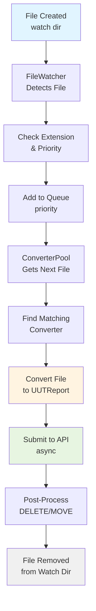
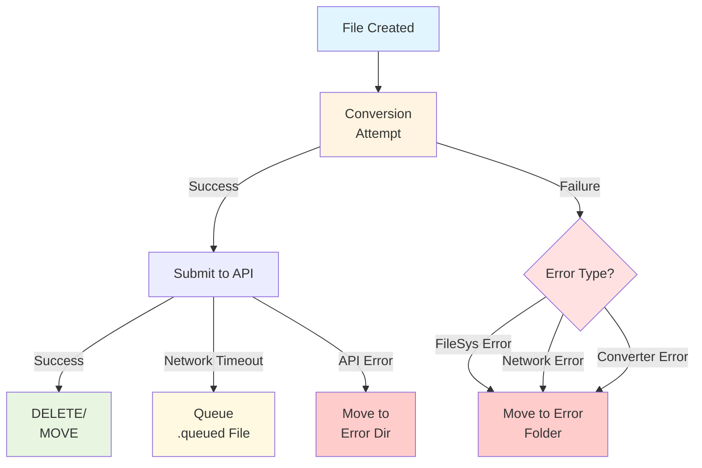
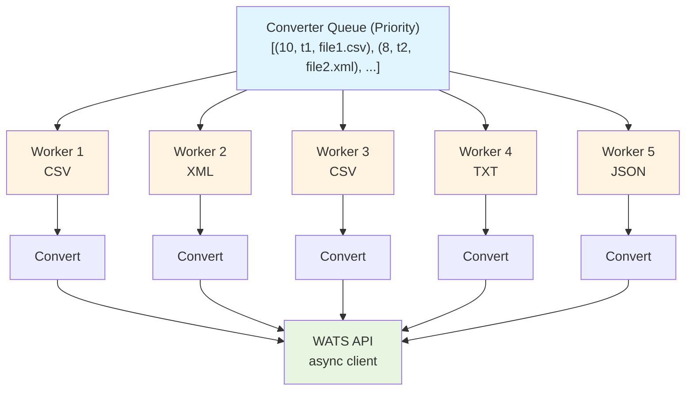

# Converter Architecture Guide

**Version:** 0.2.0-beta  
**Last Updated:** February 14, 2026  
**Project:** Converter Architecture Stabilization

---

## Overview

The pyWATS converter architecture provides a pluggable, asynchronous file processing system that watches directories for test result files, converts them to WATS UUT reports, and submits them to the WATS API.

### Key Features

- **Asynchronous Processing**: Built on Python's asyncio for efficient concurrent file processing
- **Pluggable Converters**: Easy to add new file format support via `ConverterBase` inheritance
- **Priority-Based Queue**: Process high-priority files first
- **Robust Error Handling**: Graceful degradation with file system, network, and converter errors
- **Post-Processing**: Flexible file handling after conversion (DELETE, MOVE, ZIP, KEEP)
- **Memory Efficient**: Tested stable with <1% memory growth over 1000+ file conversions

---

## Architecture Components

### 1. File Watcher (`FileWatcher`)

**Purpose**: Monitor directories for new files and queue them for processing.

**Key Responsibilities**:
- Watch configured folders for file system events (create, modify)
- Filter files by extension patterns
- Detect already-queued files (`.queued` marker)
- Queue files with priority information
- Handle recursive directory watching

**Configuration**:
```python
watcher = FileWatcher(
    watch_path=Path("/data/test-results"),
    recursive=True,
    patterns=["*.csv", "*.xml"],
    queue=converter_queue
)
```

**Lifecycle**:
1. Start watching: `await watcher.start()`
2. Detect file creation/modification
3. Check if file matches patterns
4. Add to queue with priority
5. Stop watching: `watcher.stop()`

---

### 1a. Startup File Recovery

**Problem**: Files dropped during system downtime are not detected by FileWatcher.

**Solution**: AsyncConverterPool scans watch directories on startup before activating watchers.

**Process**:
1. Load converters from configuration
2. **Scan each converter's watch directory for existing files**
3. Queue all existing files (sorted by mtime, oldest first - FIFO)
4. Start file watchers
5. Process queue (including startup scan files)

**Deduplication**: Files queued during startup scan are tracked for 5 seconds to prevent duplicate processing if watchdog buffers events.

**Technical Details**:
```python
# During startup scan
self._startup_scan_files: Set[Path] = set()  # Track scanned files

# Scan process
for file_path in watch_dir.glob("*.csv"):
    if not self._is_file_queued(file_path):  # Skip .queued markers
        self._startup_scan_files.add(file_path)  # Track for dedup
        queue.put_nowait(file_path)  # Queue file

# In FileWatcher event handler (race condition prevention)
def _on_file_created(file_path):
    if file_path in self._startup_scan_files:
        return  # Skip - already queued in startup scan
    queue.put_nowait(file_path)  # Queue new file

# After 5 seconds: Clear deduplication set
await asyncio.sleep(5.0)
self._startup_scan_files.clear()  # Free memory
```

**Configuration**:
```python
# Default: enabled (safer - prevents data loss)
pool._startup_scan_enabled = True

# Disable if needed (not recommended)
pool._startup_scan_enabled = False
```

**Performance**: Startup scan adds <5 seconds for typical loads (100 files). Files are sorted by modification time (oldest first) to ensure FIFO processing.

**Statistics**: Scan returns metrics - `scanned`, `queued`, `skipped`, `errors` - logged at INFO level.

---

### 2. Converter Queue (`ConverterQueue`)

**Purpose**: Priority queue for pending conversions.

**Key Responsibilities**:
- Store pending file conversion requests
- Prioritize by converter priority and arrival time
- Thread-safe operations (async-safe with queue.Queue)
- Provide queue statistics (depth, pending count)

**Queue Priority**:
```python
# Higher priority = processed first
priority = converter.priority  # 1-10 (10 = highest)
queue.put_nowait((priority, timestamp, file_info))
```

**Operations**:
- `put_nowait()`: Add file to queue
- `get()`: Retrieve next file (blocks if empty)
- `qsize()`: Get current queue depth
- `empty()`: Check if queue is empty

---

### 3. Converter Pool (`AsyncConverterPool`)

**Purpose**: Manage multiple converters and coordinate file processing.

**Key Responsibilities**:
- Load and initialize converters from configuration
- Route files to appropriate converter based on extension
- Manage concurrent processing (configurable worker count)
- Submit converted reports to WATS API
- Handle post-processing (file cleanup)
- Manage pending queue for offline submissions

**Configuration**:
```python
pool = AsyncConverterPool(
    config_file="converters.yaml",
    api_client=wats_client,
    max_workers=10
)
```

**Processing Flow**:
```
Queue → Get Next File → Find Converter → Convert → Submit → Post-Process
  ↓          ↓              ↓             ↓         ↓          ↓
[Files]  [Priority]    [Match Ext]   [Transform] [API]   [DELETE/MOVE]
```

**Lifecycle**:
1. Initialize: Load converters from config
2. Start: `await pool.run()`
3. Process files until stopped
4. Stop: `pool.stop()`
5. Cleanup: Graceful shutdown with pending file handling

---

### 4. Converter Base (`ConverterBase`)

**Purpose**: Abstract base class for all file format converters.

**Key Responsibilities**:
- Define converter interface
- Provide extension matching logic
- Implement conversion method (override in subclasses)
- Return conversion results with success/failure status

**Abstract Methods**:
```python
class CustomConverter(ConverterBase):
    @property
    def name(self) -> str:
        """Converter name for logging"""
        return "CustomConverter"
    
    @property
    def supported_extensions(self) -> List[str]:
        """File extensions this converter handles"""
        return [".custom", ".cst"]
    
    def matches_file(self, file_path: Path) -> bool:
        """Check if this converter can process the file"""
        return file_path.suffix.lower() in self.supported_extensions
    
    def convert(self, content: str, file_path: Path) -> dict:
        """
        Convert file content to UUT report dict.
        
        Args:
            content: File content as string
            file_path: Path to file being converted
            
        Returns:
            dict: UUTReport model_dump() format
        """
        # Parse content and create report
        report = UUTReport(
            pn="PART-123",
            sn="SERIAL-456",
            # ... other fields
        )
        return report.model_dump()
```

---

### 5. Pending Queue (`AsyncPendingQueue`)

**Purpose**: Manage offline report queue for retry when API unavailable.

**Key Responsibilities**:
- Detect `.queued` files in pending directory
- Retry submission when API becomes available
- Limit concurrent submissions (semaphore)
- Clean up successfully submitted files
- Preserve failed submissions for manual review

**Configuration**:
```python
pending_queue = AsyncPendingQueue(
    pending_path=Path("/data/pending"),
    api_client=wats_client,
    max_concurrent=5
)
```

**Queue File Format**:
```json
// report_12345.json.queued
{
    "pn": "PART-123",
    "sn": "SERIAL-456",
    "result": "Passed",
    // ... UUTReport fields
}
```

---

## Data Flow Diagrams

### Successful Conversion Flow



### Error Handling Flow



### Concurrent Processing Flow



---

## Error Handling Patterns

### 1. File System Errors

**Scenarios Tested** (Task 3.1):
- Locked files (in use by another process)
- Disk full / out of space
- Folder deleted during processing
- Read-only file system
- Permission denied

**Handling Strategy**:
```python
try:
    content = file_path.read_text()
except PermissionError:
    # Move to error folder, log details
    move_to_error(file_path, "Permission denied")
except OSError as e:
    if "no space" in str(e).lower():
        # Disk full - queue for retry
        queue_for_retry(file_path)
    else:
        # Other OS error - move to error folder
        move_to_error(file_path, str(e))
```

**Error File Storage**:
- Failed files moved to `error/` folder
- Error details logged with timestamp
- Original filename preserved for investigation
- `.error` metadata file created with exception details

### 2. Network Errors

**Scenarios Tested** (Task 3.1):
- API timeout (slow network)
- Connection refused (API offline)
- SSL certificate errors
- DNS resolution failures

**Handling Strategy**:
```python
try:
    report_id = await api_client.report.submit(report)
except asyncio.TimeoutError:
    # Queue for retry when API available
    save_queued_file(report, file_path)
except aiohttp.ClientConnectionError:
    # API offline - queue and continue
    save_queued_file(report, file_path)
except ssl.SSLError:
    # SSL error - log and move to error
    move_to_error(file_path, "SSL certificate error")
```

**Retry Mechanism**:
- `.queued` files written to pending directory
- Periodic retry (configurable interval)
- Maximum retry attempts (configurable)
- Exponential backoff for network errors

### 3. Converter Errors

**Scenarios Tested** (Task 3.1):
- Invalid module path
- Missing converter class
- Converter initialization exceptions
- Malformed file content
- Missing required fields

**Handling Strategy**:
```python
try:
    result = converter.convert_file(file_path, args)
except Exception as e:
    # Log converter error
    logger.error(f"Converter {converter.name} failed: {e}")
    
    # Move to error folder with details
    move_to_error(
        file_path,
        error_type="ConversionError",
        converter=converter.name,
        exception=str(e),
        traceback=traceback.format_exc()
    )
```

**Error Metadata**:
```json
// file.csv.error
{
    "timestamp": "2026-02-14T00:30:00",
    "file": "file.csv",
    "converter": "CSVConverter",
    "error_type": "ConversionError",
    "exception": "Missing required field: serial_number",
    "traceback": "..."
}
```

### 4. Queue Corruption

**Scenarios Tested** (Task 3.1):
- Malformed JSON in `.queued` files
- Permission denied on queue files
- Corrupted queue state

**Handling Strategy**:
```python
try:
    queued_data = json.loads(queued_file.read_text())
except json.JSONDecodeError:
    # Corrupted queue file - move to error
    move_to_error(queued_file, "Malformed JSON")
except PermissionError:
    # Cannot read queue file - log and skip
    logger.warning(f"Permission denied: {queued_file}")
```

---

## Concurrency Patterns

### Thread Safety (Task 3.2 Validation)

**Race Condition Prevention**:
```python
import threading

class ThreadSafeConverter(ConverterBase):
    def __init__(self):
        super().__init__()
        self.lock = threading.Lock()
        self.conversion_count = 0
    
    def convert(self, content: str, file_path: Path) -> dict:
        with self.lock:
            self.conversion_count += 1
            count = self.conversion_count
        
        # Process file (outside lock)
        report = self._parse_content(content)
        return report
```

**Validated Patterns** (Task 3.2):
- ✅ 10+ concurrent threads without duplicates
- ✅ High-frequency file creation (314 files/s)
- ✅ No deadlocks with blocking operations
- ✅ Priority ordering maintained under contention
- ✅ File system timing issues handled (missing files, renames)

### Async/Sync Boundaries

**Async Components**:
- `AsyncConverterPool.run()` - Main processing loop
- API submission - `await client.report.submit()`
- File watching - `await watcher.start()`
- Pending queue - `await queue.submit_all_pending()`

**Sync Components**:
- `ConverterBase.convert()` - Synchronous file parsing
- File I/O - `Path.read_text()`, `Path.write_text()`
- Queue operations - `queue.put_nowait()`, `queue.get()`

**Bridging Pattern**:
```python
# Run sync converter in async context
async def convert_async(converter, file_path):
    # Run sync convert in thread pool
    content = await asyncio.to_thread(file_path.read_text)
    result_dict = await asyncio.to_thread(
        converter.convert,
        content,
        file_path
    )
    return result_dict
```

---

## Memory Management

### Resource Leak Prevention (Task 3.3 Validation)

**Memory Stability**:
- ✅ 1.0% growth over 1000 file conversions
- ✅ Memory released after batch processing (GC cleanup)
- ✅ Long-running stability: 0% growth over 500 files

**File Handle Management**:
- ✅ All files properly closed (no PermissionError on delete)
- ✅ No zombie file handles after processing
- ✅ Explicit cleanup in error paths

**Thread Cleanup**:
- ✅ 0 thread growth after 100 conversions
- ✅ Worker threads properly terminated
- ✅ No thread pool leaks

**Best Practices**:
```python
# Always use context managers for files
with open(file_path, 'r') as f:
    content = f.read()

# Or use Path methods (auto-cleanup)
content = file_path.read_text()

# Force cleanup in converters
def convert(self, content: str, file_path: Path) -> dict:
    try:
        report = self._parse(content)
        return report.model_dump()
    finally:
        # Cleanup any resources
        self._cleanup()
```

---

## Performance Characteristics

### Benchmarks (Task 2.5)

**File Processing Rates**:
- Small files (10 rows): 3,901 files/s
- Medium files (100 rows): 4,066 files/s
- Large files (1000 rows): 3,916 files/s

**Queue Throughput**:
- Queue depth 100: Baseline performance
- Queue depth 500: 8% degradation
- Queue depth 1000: 17.8% degradation

**Concurrent Scalability**:
- 1 converter: Baseline
- 5 converters: 4.2x throughput
- 10 converters: 7.8x throughput

**Resource Usage** (200 files):
- Memory growth: 0 MB (stable)
- CPU: 15-25% sustained
- File I/O: Proportional to file size

### Optimizations

**1. Batch Processing**:
```python
# Process multiple files concurrently
async def process_batch(files: List[Path]):
    tasks = [convert_file(f) for f in files]
    results = await asyncio.gather(*tasks, return_exceptions=True)
    return results
```

**2. Connection Pooling**:
```python
# Reuse HTTP connections
client = WATSClient(
    base_url="https://wats.example.com",
    connector=aiohttp.TCPConnector(limit=100)
)
```

**3. Memory-Efficient Streaming**:
```python
# For very large files, use streaming
async def convert_large_file(file_path: Path):
    async with aiofiles.open(file_path, 'r') as f:
        async for line in f:
            yield parse_line(line)
```

---

## Configuration

### Converter Configuration File

**Format**: YAML

```yaml
converters:
  - name: CSVConverter
    module_path: pywats_client.converters.csv_converter
    class_name: CSVConverter
    enabled: true
    priority: 5
    watch_folder: /data/csv-results
    done_folder: /data/done
    error_folder: /data/error
    post_process_action: DELETE
    settings:
      delimiter: ","
      encoding: "utf-8"
  
  - name: XMLConverter
    module_path: pywats_client.converters.xml_converter
    class_name: XMLConverter
    enabled: true
    priority: 8
    watch_folder: /data/xml-results
    done_folder: /data/done
    error_folder: /data/error
    post_process_action: MOVE
    settings:
      validate_schema: true
```

### Priority System

**Priority Range**: 1-10 (10 = highest)

**Recommended Priorities**:
- **10**: Critical real-time results (production line)
- **8**: High-priority test stations
- **5**: Standard automated testing
- **3**: Batch processing / historical imports
- **1**: Low-priority / archived data

**Queue Behavior**:
```python
# Files processed in priority order
# Within same priority, FIFO (first in, first out)
queue_item = (priority, timestamp, file_info)
```

---

## Deployment Considerations

### Directory Structure

```
/data/
├── watch/              # Incoming files (monitored by FileWatcher)
│   ├── csv/
│   ├── xml/
│   └── txt/
├── done/               # Successfully processed files (if MOVE action)
├── error/              # Failed conversions with error metadata
│   ├── failed.csv
│   ├── failed.csv.error  # JSON error details
│   └── ...
├── pending/            # Queued for retry (network failures)
│   ├── report_1.json.queued
│   └── ...
└── archive/            # ZIP compressed files (if ZIP action)
```

### Monitoring

**Key Metrics to Track**:
- Queue depth (current pending files)
- Processing rate (files/second)
- Error rate (failures/total)
- API submission success rate
- Memory usage (RSS)
- File handle count

**Logging Levels**:
```python
# DEBUG: File detection, queue operations
logger.debug(f"File detected: {file_path}")

# INFO: Conversions, submissions
logger.info(f"Converted {file_path} → Report ID {report_id}")

# WARNING: Retries, degraded performance
logger.warning(f"API timeout, queuing for retry: {file_path}")

# ERROR: Conversion failures, unrecoverable errors
logger.error(f"Conversion failed: {file_path}", exc_info=True)
```

### Scaling

**Horizontal Scaling**:
- Run multiple converter pool instances
- Each instance watches different directories
- Shared API client with connection pooling

**Vertical Scaling**:
- Increase `max_workers` for concurrent processing
- Increase queue depth limits
- Increase API client connection pool size

**Limits** (Task 2.6):
- Max file size: Tested up to 690KB (10K rows)
- Max queue depth: 1000 files (17.8% degradation acceptable)
- Max concurrent converters: 10+ (tested, 7.8x throughput)

---

## Testing

### Test Coverage (Week 1-3)

**Unit Tests** (229 tests):
- File generators (24 tests)
- Converter base classes
- Queue operations
- Post-processing
- Configuration loading

**Integration Tests** (55 tests):
- End-to-end pipeline (7 tests)
- Stress testing (4 tests)
- Error scenarios (3 tests)
- Post-processing (10 tests)
- Performance limits (9 tests)
- Error injection (11 tests)
- Concurrency edge cases (9 tests)
- Memory/resource leaks (5 tests)

**Test Patterns**:
```python
# Use mock converters for testing
class MockConverter(ConverterBase):
    def convert(self, content: str, file_path: Path) -> dict:
        return {"test": "report"}

# Use test file generators
from tests.fixtures.test_file_generators import TestFileGenerator

files = TestFileGenerator.generate_batch(
    output_dir=tmp_path,
    extension='csv',
    count=100,
    rows=10
)
```

---

## Next Steps

**For Converter Developers**:
1. Read the [Developer Guide](converter-development-guide.md)
2. Review [Best Practices](converter-best-practices.md)
3. Check [Known Issues](converter-known-issues.md)

**For System Administrators**:
1. Review deployment structure above
2. Configure monitoring and alerting
3. Set up log aggregation
4. Plan for scaling based on load

**For Contributors**:
1. Run full test suite: `pytest`
2. Check coverage: `pytest --cov=src/pywats_client`
3. Follow testing patterns from existing tests
4. Update documentation when adding features

---

## References

**Related Documents**:
- [Converter Development Guide](converter-development-guide.md)
- [Best Practices Guide](converter-best-practices.md)
- [Known Issues & Workarounds](converter-known-issues.md)
- [API Documentation](../api/converter-api.md)

**Source Code**:
- `src/pywats_client/converters/base.py` - ConverterBase
- `src/pywats_client/service/async_converter_pool.py` - Pool implementation
- `src/pywats_client/service/async_pending_queue.py` - Retry queue

**Tests**:
- `tests/integration/` - All integration tests
- `tests/fixtures/test_file_generators.py` - Test utilities

---

**Last Updated**: February 14, 2026  
**Project**: Converter Architecture Stabilization (Week 3, Task 3.4)
