# pyWATS Queue Architecture Guide

**Last Updated:** February 14, 2026  
**Version:** 0.2.0+

---

## Overview

The pyWATS queue system provides **reliable, priority-based queuing** for test reports with support for file persistence, crash recovery, and concurrent async processing. The architecture uses a **layered design** where base memory queues are extended for different use cases.

```mermaid
graph TB
    subgraph api["\ud83d\udce6 pywats (Core API)"]
        base[\"BaseQueue<br/>(Abstract Interface)\"]
        memory[\"MemoryQueue<br/>(Pure In-Memory)\"]
        qitem[\"QueueItem<br/>(Data Class)\"]
        
        base -.->|implements| memory
        memory -->|contains| qitem
    end
    
    subgraph client["\ud83d\udd27 pywats_client (Client Tools)"]
        persistent[\"PersistentQueue<br/>(File-Based)\"]
        async[\"AsyncPendingQueue<br/>(Concurrent Async)\"]
        
        persistent -->|extends| memory
    end
    
    style api fill:#569cd6,stroke:#2d5f8d,color:#fff
    style client fill:#4ec9b0,stroke:#2d7a66,color:#fff
    style memory fill:#dcdcaa,stroke:#9d9d5c,color:#000
```

---

## Queue Hierarchy

### Class Inheritance Structure

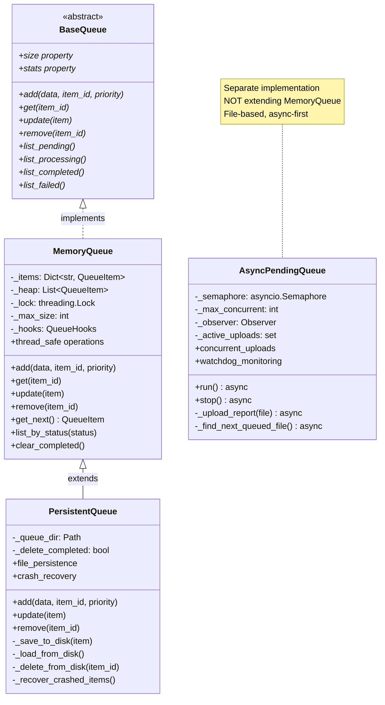

### Design Principles

**Separation of Concerns:**

| Layer | Package | Responsibility | File I/O |
|-------|---------|----------------|----------|
| **Abstract** | `pywats.queue` | Define interface | ❌ No |
| **In-Memory** | `pywats.queue` | Thread-safe queue ops | ❌ No |
| **Persistent** | `pywats_client.queue` | File-based storage | ✅ Yes |
| **Async** | `pywats_client.service` | Concurrent async uploads | ✅ Yes |

**Key Principle:** The core `pywats` API has **NO file operations** - it's pure in-memory. All file I/O lives in `pywats_client`.

---

## QueueItem Data Model

### Structure

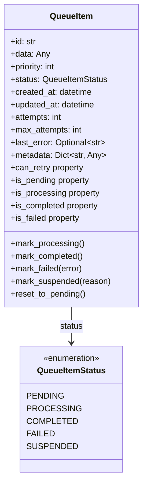

### Field Responsibilities

| Field | Purpose | Managed By |
|-------|---------|------------|
| **id** | Unique identifier (UUID or custom) | User or auto-generated |
| **data** | Actual payload (report dict/model) | User |
| **priority** | Queue ordering (1=highest, 10=lowest) | User (default: 5) |
| **status** | Current processing state | Queue operations |
| **created_at** | Timestamp of creation | Auto-set |
| **updated_at** | Last status change | Auto-updated |
| **attempts** | Number of processing attempts | Auto-incremented |
| **max_attempts** | Retry limit | User (default: 3) |
| **last_error** | Last error message | Queue on failure |
| **metadata** | Custom key-value pairs | User |

---

## Queue Lifecycle States

### State Diagram

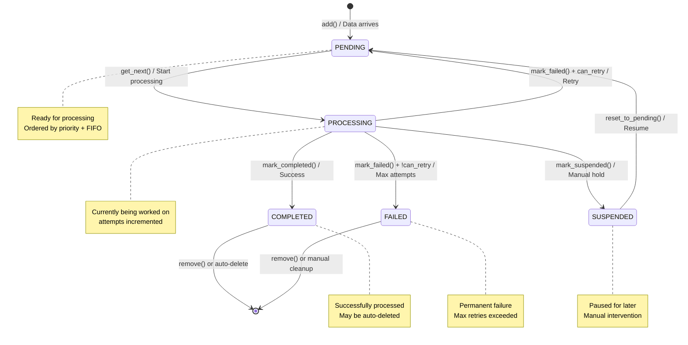

### State Transitions

| From | To | Trigger | Condition |
|------|----|----|-----------|
| `PENDING` | `PROCESSING` | `get_next()` → `mark_processing()` | Item is fetched for work |
| `PROCESSING` | `COMPLETED` | `mark_completed()` | Successfully processed |
| `PROCESSING` | `PENDING` | `mark_failed()` | `attempts < max_attempts` |
| `PROCESSING` | `FAILED` | `mark_failed()` | `attempts >= max_attempts` |
| `PROCESSING` | `SUSPENDED` | `mark_suspended()` | Manual hold |
| `SUSPENDED` | `PENDING` | `reset_to_pending()` | Resume processing |
| `COMPLETED` | *(deleted)* | `remove()` or auto-delete | Cleanup |
| `FAILED` | *(deleted)* | `remove()` | Manual cleanup |

---

## Priority Queue Mechanism

### Priority Ordering

**Rule:** Items are processed in **priority order** (1=highest, 10=lowest), with **FIFO** within the same priority.

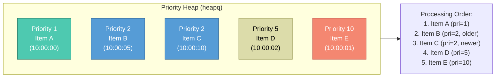

**Comparison Logic:**
```python
def __lt__(self, other: "QueueItem") -> bool:
    # Compare (priority, created_at) tuples
    # Lower priority number = higher priority
    # Earlier timestamp = processed first (FIFO)
    return (self.priority, self.created_at) < (other.priority, other.created_at)
```

### Use Cases

| Priority | Use Case | Example |
|----------|----------|---------|
| **1** | Critical/Emergency | Production line failure reports |
| **2** | High-priority | First article inspection |
| **3** | Above-normal | Engineering debug reports |
| **5** | Normal (default) | Standard production tests |
| **7** | Low-priority | Bulk historical uploads |
| **10** | Background | Archive/cleanup operations |

---

## MemoryQueue (Base Implementation)

### Purpose

**Pure in-memory queue** with thread-safe operations. No file I/O - completely in-memory.

### Responsibilities

```mermaid
mindmap
    root((MemoryQueue))
        Thread Safety
            Lock-based synchronization
            Concurrent add/get/update
            Safe from race conditions
        Priority Ordering
            heapq for O(log n) ops
            FIFO within priority
            Automatic sorting
        State Management
            PENDING → PROCESSING → COMPLETED/FAILED
            Status transitions
            Attempt tracking
        Statistics
            Count by status
            Success rate
            Queue depth
        Hooks
            on_add callback
            on_update callback
            on_remove callback
```

### Key Operations

| Operation | Complexity | Thread-Safe | Description |
|-----------|------------|-------------|-------------|
| **add()** | O(log n) | ✅ Yes | Add item to heap |
| **get_next()** | O(log n) | ✅ Yes | Pop highest priority item |
| **update()** | O(n) | ✅ Yes | Update item (no reheap) |
| **remove()** | O(n) | ✅ Yes | Delete item by ID |
| **list_pending()** | O(n) | ✅ Yes | Filter by status |
| **size** | O(1) | ✅ Yes | Count all items |

**Design Note:** `update()` does NOT re-heapify. If priority changes, item must be removed and re-added.

---

## PersistentQueue (File-Based Storage)

### Purpose

**Extends MemoryQueue** with file persistence and crash recovery.

### File Structure

```
C:\ProgramData\pyWATS\instances\{instance_id}\queue\
├── {report_id}.pending.wsjf          # Report data (PENDING)
├── {report_id}.pending.meta.json     # Metadata (attempts, errors)
├── {report_id}.processing.wsjf       # Report data (PROCESSING)
├── {report_id}.processing.meta.json  # Metadata
├── {report_id}.failed.wsjf           # Report data (FAILED)
├── {report_id}.failed.meta.json      # Metadata
└── {report_id}.completed.wsjf        # Report data (COMPLETED) - optional
```

**File Extensions by Status:**

| Status | Data File | Metadata File |
|--------|-----------|---------------|
| `PENDING` | `.pending.wsjf` | `.pending.meta.json` |
| `PROCESSING` | `.processing.wsjf` | `.processing.meta.json` |
| `COMPLETED` | `.completed.wsjf` | `.completed.meta.json` |
| `FAILED` | `.failed.wsjf` | `.failed.meta.json` |
| `SUSPENDED` | `.suspended.wsjf` | `.suspended.meta.json` |

### Architecture

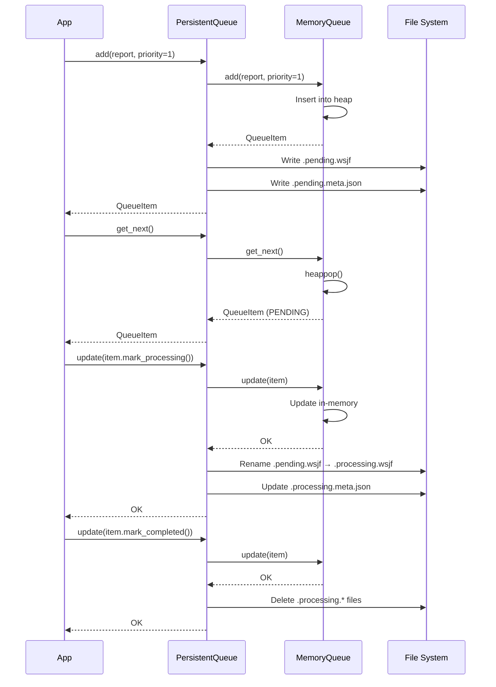

### Crash Recovery

**On startup, PersistentQueue:**

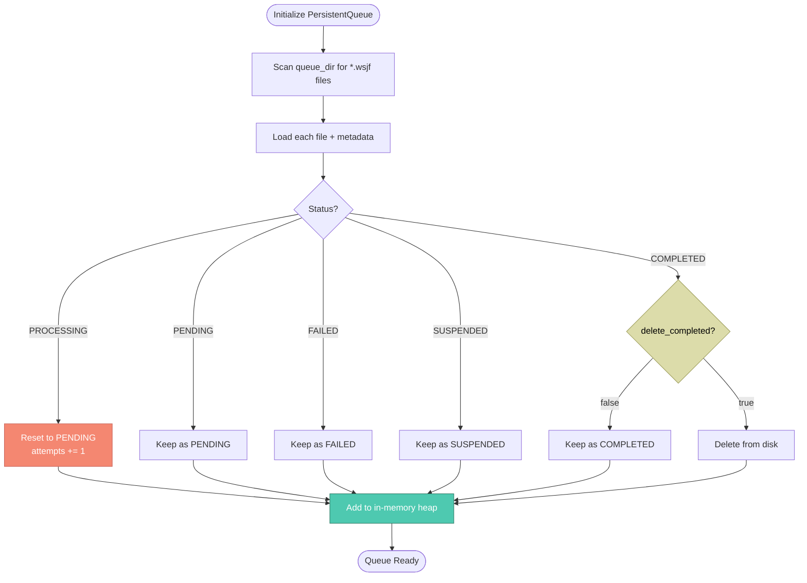

**Recovery Logic:**
1. **PROCESSING** → Reset to **PENDING** (crash during upload)
2. **PENDING** → Keep as **PENDING** (ready to process)
3. **FAILED** → Keep as **FAILED** (permanent failure)
4. **COMPLETED** → Delete if `delete_completed=True`
5. **SUSPENDED** → Keep as **SUSPENDED** (manual hold)

---

## AsyncPendingQueue (Concurrent Async)

### Purpose

**File-based async queue** for concurrent report uploads with watchdog monitoring. **NOT** extending MemoryQueue - separate implementation.

### Architecture

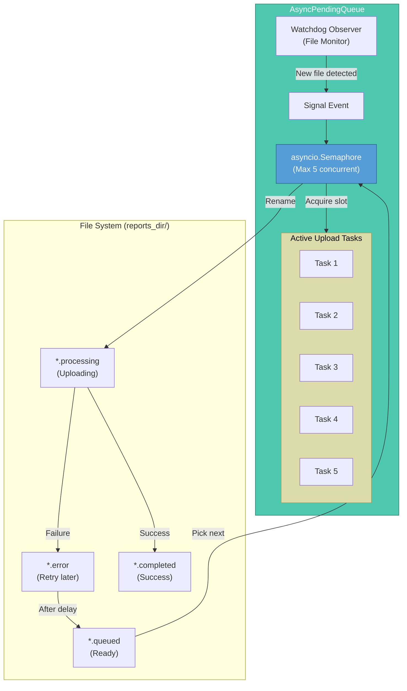

### File State Machine

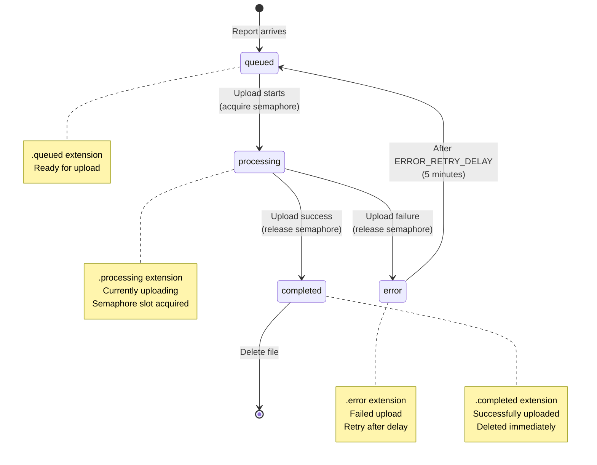

### Concurrent Upload Flow

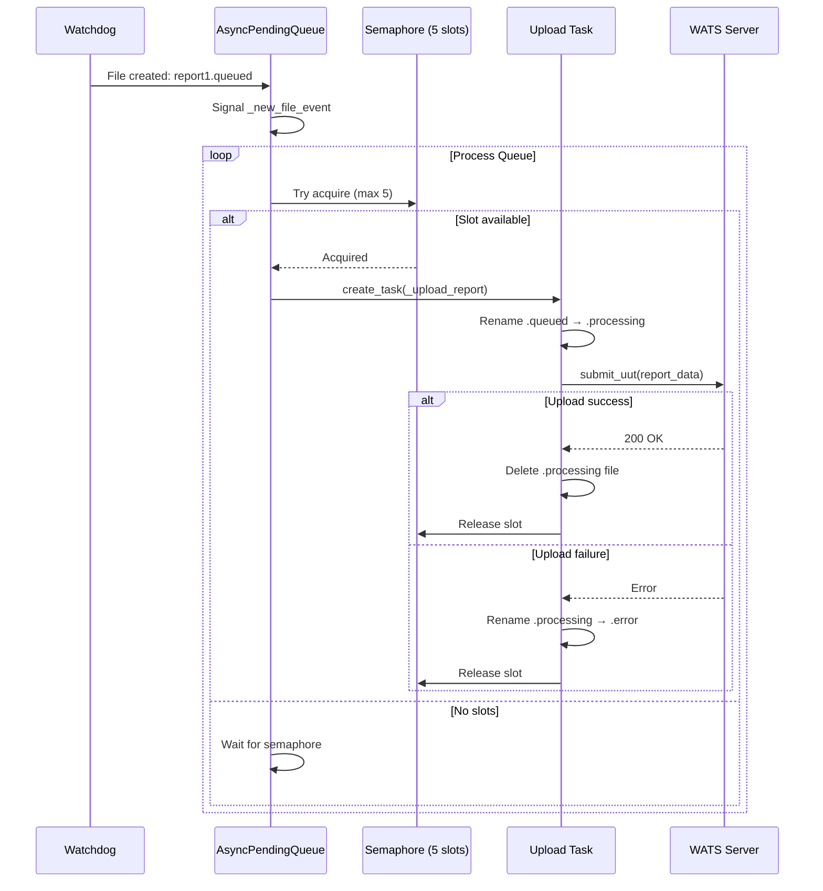

### Responsibilities

| Responsibility | Implementation | Benefit |
|----------------|----------------|---------|
| **Concurrent Uploads** | `asyncio.Semaphore(5)` | 5 reports upload simultaneously |
| **File Monitoring** | `watchdog.Observer` | Instant detection of new reports |
| **Retry Mechanism** | `.error` files + delay | Auto-retry failed uploads |
| **Crash Recovery** | `.processing` timeout check | Reset stuck uploads |
| **Queue Capacity** | `max_queue_size` check | Prevent resource exhaustion |
| **Graceful Shutdown** | Wait for active tasks | No data loss on stop |

---

## Queue Comparison Matrix

### When to Use Which Queue

| Feature | MemoryQueue | PersistentQueue | AsyncPendingQueue |
|---------|-------------|-----------------|-------------------|
| **Persistence** | ❌ No | ✅ Yes (files) | ✅ Yes (files) |
| **Crash Recovery** | ❌ No | ✅ Yes | ✅ Yes |
| **Thread Safety** | ✅ Yes | ✅ Yes | ⚠️ Single loop† |
| **Async Support** | ⚠️ Via adapter | ⚠️ Via adapter | ✅ Native |
| **Concurrent Processing** | ❌ No | ❌ No | ✅ Yes (N at a time) |
| **Priority Queue** | ✅ Yes | ✅ Yes | ❌ No‡ |
| **File I/O** | ❌ None | ✅ Atomic writes | ✅ Async I/O |
| **Watchdog Monitoring** | ❌ No | ❌ No | ✅ Yes |
| **Retry Logic** | ✅ Via attempts | ✅ Via attempts | ✅ Auto-retry |
| **Package** | `pywats.queue` | `pywats_client.queue` | `pywats_client.service` |

**Notes:**
- † AsyncPendingQueue is single-event-loop safe (asyncio), not thread-safe
- ‡ AsyncPendingQueue processes files alphabetically (FIFO), no priority

### Use Case Recommendations

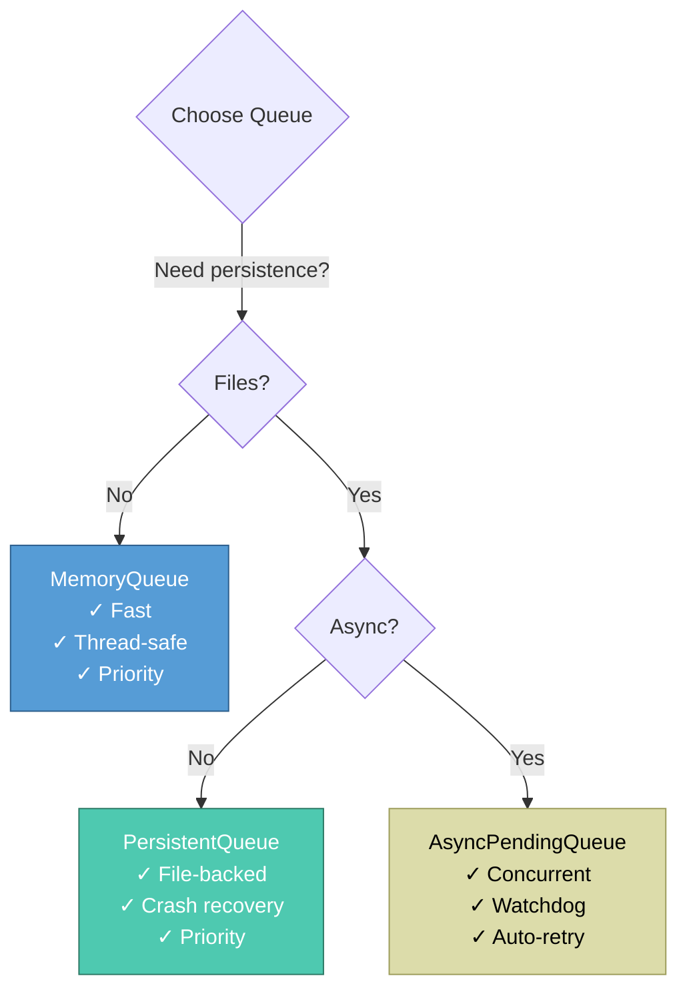

**Decision Criteria:**

1. **Choose MemoryQueue** when:
   - Quick in-process queuing
   - No persistence needed
   - Thread-safe priority queue required
   - Example: API request buffering

2. **Choose PersistentQueue** when:
   - File-based persistence required
   - Crash recovery important
   - Priority ordering needed
   - Sync (non-async) environment
   - Example: Offline report queue

3. **Choose AsyncPendingQueue** when:
   - Concurrent uploads required (5+ at a time)
   - Async environment (asyncio)
   - Watchdog file monitoring needed
   - Auto-retry important
   - Example: Background service uploads

---

## Queue Statistics & Monitoring

### QueueStats Model

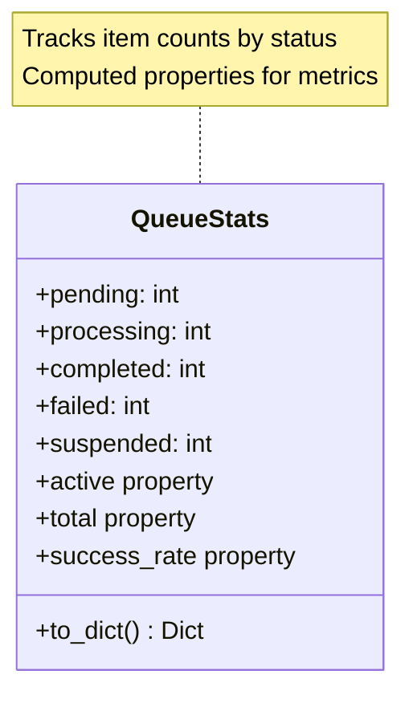

**Properties:**
- `active` = `pending + processing + suspended`
- `total` = `pending + processing + completed + failed + suspended`
- `success_rate` = `completed / (completed + failed)` if any processed

### Example Usage

```python
from pywats_client.queue import PersistentQueue

queue = PersistentQueue(queue_dir="C:/WATS/Queue")

# Get statistics
stats = queue.stats
print(f"Pending: {stats.pending}")
print(f"Processing: {stats.processing}")
print(f"Completed: {stats.completed}")
print(f"Failed: {stats.failed}")
print(f"Success Rate: {stats.success_rate:.1%}")

# Example output:
# Pending: 150
# Processing: 5
# Completed: 1200
# Failed: 8
# Success Rate: 99.3%
```

---

## Queue Hooks (Extensibility)

### Hook Interface

```python
from pywats.queue import QueueHooks, QueueItem

hooks = QueueHooks(
    on_add=lambda item: print(f"Added: {item.id}"),
    on_update=lambda item: print(f"Updated: {item.id} → {item.status.value}"),
    on_remove=lambda item_id: print(f"Removed: {item_id}")
)

queue = MemoryQueue(hooks=hooks)
```

### Hook Events

| Hook | Trigger | Use Case |
|------|---------|----------|
| **on_add** | `add()` called | Logging, metrics, notifications |
| **on_update** | `update()` called | Status change tracking, alerts |
| **on_remove** | `remove()` called | Cleanup, archival, metrics |

**Example: Prometheus Metrics**

```python
from prometheus_client import Counter, Gauge

items_added = Counter('queue_items_added_total', 'Total items added')
items_completed = Counter('queue_items_completed_total', 'Total items completed')
queue_depth = Gauge('queue_depth', 'Current queue depth')

def on_add_hook(item):
    items_added.inc()
    queue_depth.inc()

def on_update_hook(item):
    if item.is_completed:
        items_completed.inc()
        queue_depth.dec()

hooks = QueueHooks(on_add=on_add_hook, on_update=on_update_hook)
queue = PersistentQueue(queue_dir="...", hooks=hooks)
```

---

## Integration Examples

### Example 1: Basic Report Queuing

```python
from pywats import pyWATS
from pywats_client.queue import PersistentQueue

# Initialize API and queue
api = pyWATS(service="https://python.wats.com", api_token="...")
queue = PersistentQueue(queue_dir="C:/WATS/Queue")

# Create and queue report
report = api.report.create_uut_report(
    serial_number="SN123456",
    part_number="PN789",
)
# ... add steps ...

# Add to queue with high priority
item = queue.add(report, priority=2)  # High priority
print(f"Queued: {item.id} with priority {item.priority}")

# Process queue
for item in queue.list_pending():
    item.mark_processing()
    queue.update(item)
    
    try:
        api.report.submit_uut(item.data)
        item.mark_completed()
    except Exception as e:
        if item.can_retry:
            item.mark_failed(str(e))
            # Will retry (attempts < max_attempts)
        else:
            item.mark_failed(str(e))
            # Max retries reached - permanent failure
    
    queue.update(item)
```

### Example 2: Async Concurrent Uploads

```python
from pywats import AsyncWATS
from pywats_client.service import AsyncPendingQueue
import asyncio

async def main():
    # Initialize async API
    api = AsyncWATS(service="https://python.wats.com", api_token="...")
    
    # Start async upload queue (5 concurrent uploads)
    queue = AsyncPendingQueue(
        api=api,
        reports_dir="C:/WATS/Queue",
        max_concurrent=5,
        max_queue_size=10000
    )
    
    # Run queue in background
    queue_task = asyncio.create_task(queue.run())
    
    # Queue will automatically upload .queued files
    # Files can be dropped by converters or other processes
    
    # Monitor queue stats
    while True:
        stats = queue.stats
        print(f"Queued: {stats['queued_files']}, Active: {stats['active_uploads']}")
        await asyncio.sleep(10)

asyncio.run(main())
```

### Example 3: Priority-Based Processing

```python
from pywats_client.queue import PersistentQueue

queue = PersistentQueue(queue_dir="C:/WATS/Queue")

# Add reports with different priorities
queue.add(report_critical, priority=1)   # Emergency - process first
queue.add(report_normal, priority=5)     # Normal - default
queue.add(report_bulk, priority=8)       # Low priority - process last

# Process in priority order
while queue.size > 0:
    item = queue.get_next()  # Gets highest priority item
    
    print(f"Processing {item.id} (priority: {item.priority})")
    item.mark_processing()
    queue.update(item)
    
    # ... process ...
```

---

## Best Practices

### 1. Priority Assignment

**Recommended Guidelines:**

| Priority | Category | Examples | Queue Time |
|----------|----------|----------|------------|
| **1** | Critical | Production line down, safety issues | < 1 minute |
| **2-3** | High | First article, debugging, urgent | < 5 minutes |
| **4-6** | Normal | Standard production tests | < 30 minutes |
| **7-8** | Low | Bulk uploads, re-submissions | < 2 hours |
| **9-10** | Background | Archives, cleanup, migration | When idle |

### 2. Retry Strategy

**Set max_attempts based on failure type:**

```python
# Transient network errors - retry more
queue.add(report, max_attempts=5)

# Validation errors - fail fast
queue.add(report, max_attempts=1)

# Default - balanced
queue.add(report, max_attempts=3)
```

### 3. Queue Capacity Management

**Monitor queue depth:**

```python
MAX_QUEUE_DEPTH = 10000

if queue.size > MAX_QUEUE_DEPTH:
    logger.warning(f"Queue depth high: {queue.size}")
    # Option 1: Pause new submissions
    # Option 2: Increase upload concurrency
    # Option 3: Alert administrators
```

### 4. Error Handling

**Distinguish error types:**

```python
try:
    api.report.submit_uut(item.data)
    item.mark_completed()
except ValidationError as e:
    # Permanent error - don't retry
    item.max_attempts = 0
    item.mark_failed(f"Validation error: {e}")
except NetworkError as e:
    # Transient error - retry
    item.mark_failed(f"Network error: {e}")

queue.update(item)
```

### 5. Crash Recovery Testing

**Test recovery scenarios:**

```python
# 1. Simulate crash during processing
queue = PersistentQueue(queue_dir="...")
item = queue.get_next()
item.mark_processing()
queue.update(item)
# ... simulate crash (exit without completing) ...

# 2. Restart queue
queue2 = PersistentQueue(queue_dir="...")
# Item should be reset to PENDING with attempts incremented
```

---

## Troubleshooting

### Common Issues

#### 1. Queue Not Processing

**Symptoms:** Items stay in PENDING state

**Causes:**
- No worker calling `get_next()`
- All semaphore slots full (AsyncPendingQueue)
- Queue paused/stopped

**Fix:**
```python
# Check queue state
print(f"Size: {queue.size}")
print(f"Stats: {queue.stats}")

# For AsyncPendingQueue
print(f"State: {queue.state}")
print(f"Active uploads: {queue.stats['active_uploads']}")
```

#### 2. Items Stuck in PROCESSING

**Symptoms:** Items never complete

**Causes:**
- Crash during processing
- Timeout not configured
- Forgot to call `update()`

**Fix:**
```python
# PersistentQueue - restart (auto-recovery)
queue = PersistentQueue(queue_dir="...")  # Resets PROCESSING → PENDING

# Manual reset
item = queue.get("stuck-item-id")
item.reset_to_pending()
queue.update(item)
```

#### 3. Priority Not Working

**Symptoms:** Low-priority items processed before high-priority

**Cause:** Using AsyncPendingQueue (no priority support)

**Fix:** Use PersistentQueue instead

```python
# Wrong: AsyncPendingQueue ignores priority
queue = AsyncPendingQueue(...)  # FIFO only

# Right: PersistentQueue respects priority
queue = PersistentQueue(...)  # Priority + FIFO
```

#### 4. High Memory Usage

**Symptoms:** Memory grows over time

**Causes:**
- Not deleting completed items
- Large `data` payloads
- Too many items in queue

**Fix:**
```python
# Enable auto-delete completed items
queue = PersistentQueue(queue_dir="...", delete_completed=True)

# Manually clear completed
queue.clear_completed()

# Limit queue size
queue = PersistentQueue(queue_dir="...", max_size=10000)
```

---

## Related Documentation

- [Client & Service Architecture](client-service-architecture.md) - Overall system design
- [Converter Development Guide](converter-development-guide.md) - Creating custom converters
- [API Reference](../api/index.rst) - Queue API documentation
- [Installation Guide](installation-guide.md) - Setup instructions

---

**Key Takeaway:** The queue system uses a **layered architecture** where base in-memory queues (`MemoryQueue`) are extended for persistence (`PersistentQueue`) and async concurrency (`AsyncPendingQueue`). **Priority queuing** ensures critical reports are processed first, while **crash recovery** and **retry mechanisms** ensure reliability in production environments.
