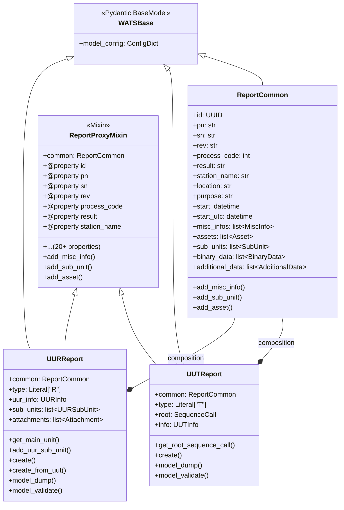
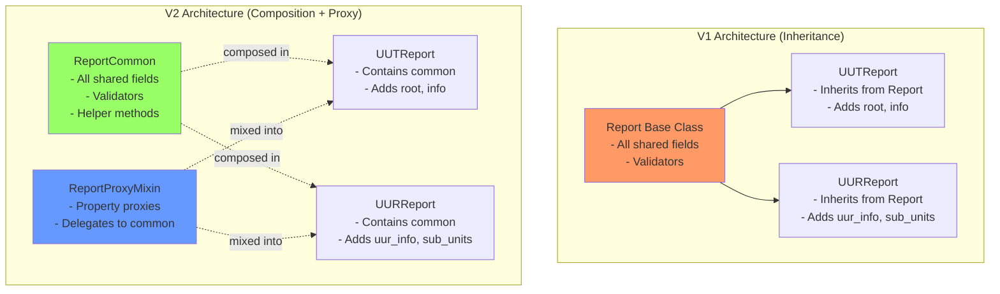
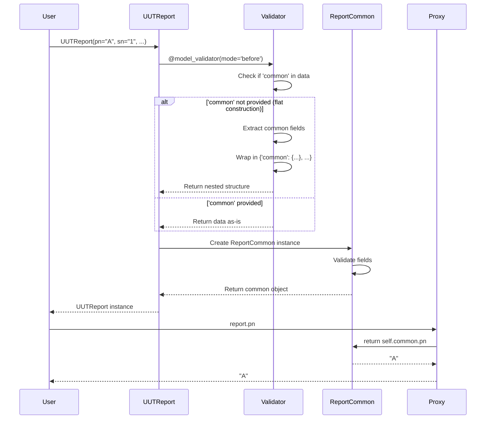
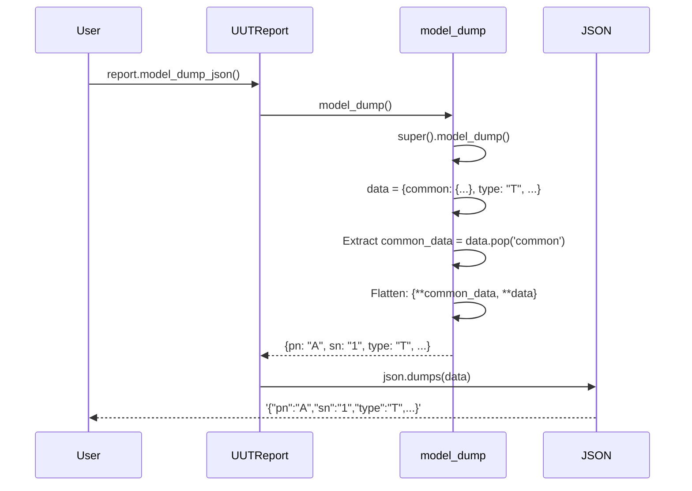
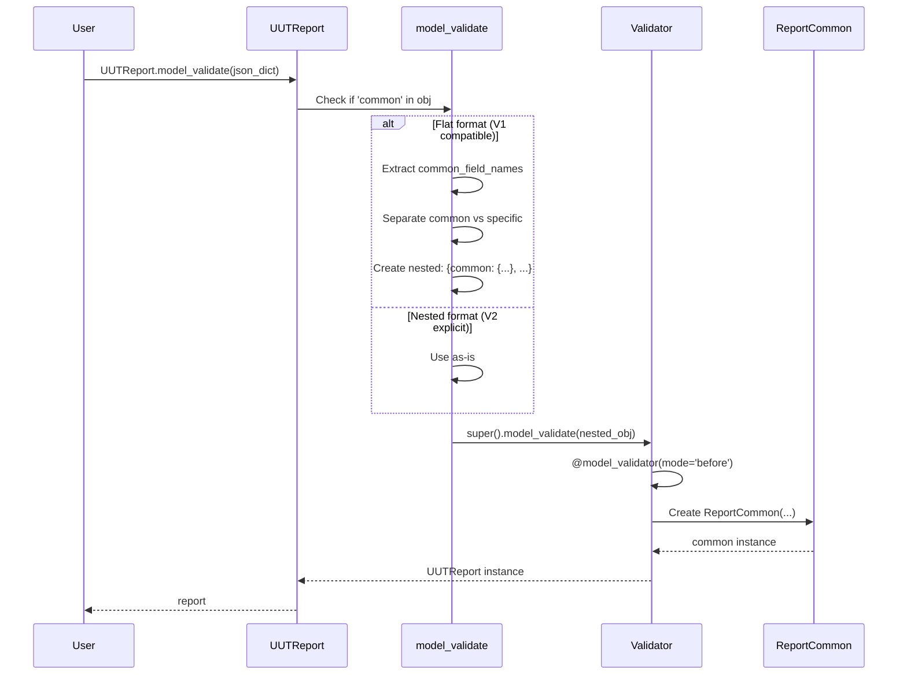
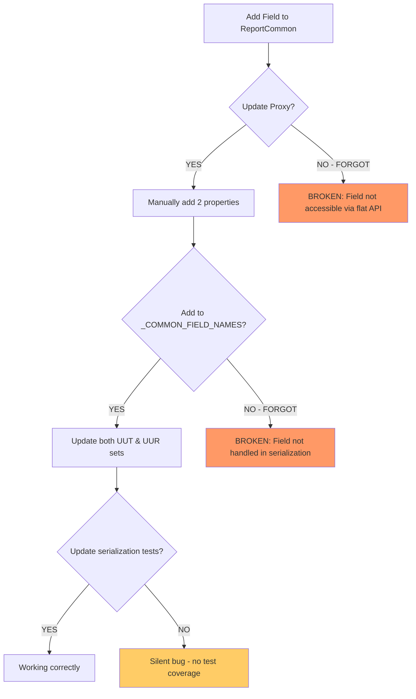

# V2 Report Model: In-Depth Architectural Review

## Executive Summary

The V2 report model represents a fundamental architectural shift from **inheritance-based** to **composition-based** design, with a **proxy layer** to maintain API compatibility. This review examines the architecture, identifies strengths and weaknesses, and analyzes the code duplication concerns.

---

## 1. Architecture Overview

### 1.1 Class Structure Diagram



### 1.2 V1 vs V2 Comparison



---

## 2. Data Flow Analysis

### 2.1 Construction Flow



### 2.2 Serialization Flow (to JSON)



### 2.3 Deserialization Flow (from JSON)



---

## 3. Code Duplication Analysis

### 3.1 Duplication Matrix

| Code Element | Location 1 | Location 2 | Lines | Impact |
|:-------------|:-----------|:-----------|:------|:-------|
| **Property Proxies** | ReportProxyMixin | - | ~150 | **CRITICAL** |
| **Common Field Names** | UUTReport._COMMON_FIELD_NAMES | UURReport._COMMON_FIELD_NAMES | ~15 | High |
| **model_dump() override** | UUTReport | UURReport | ~15 | High |
| **model_validate() override** | UUTReport | UURReport | ~30 | High |
| **model_dump_json() override** | UUTReport | UURReport | ~10 | Medium |
| **model_validate_json() override** | UUTReport | UURReport | ~8 | Medium |
| **_wrap_flat_fields_in_common validator** | UUTReport | UURReport | ~30 | High |

### 3.2 Critical Duplication: Property Proxies

**The ReportProxyMixin contains ~150 lines of repetitive property definitions:**

```python
# Example of repetitive pattern (repeated 20+ times)
@property
def pn(self) -> str:
    return self.common.pn

@pn.setter
def pn(self, value: str) -> None:
    self.common.pn = value

@property
def sn(self) -> str:
    return self.common.sn

@sn.setter
def sn(self, value: str) -> None:
    self.common.sn = value

# ... repeated for every field in ReportCommon
```

**Problem:**
- **Maintenance Burden:** If you add a field to `ReportCommon`, you MUST manually add a property to the Mixin
- **Error Prone:** Easy to forget or make typos
- **Boilerplate:** Violates DRY (Don't Repeat Yourself) principle

### 3.3 High Duplication: Serialization Methods

Both `UUTReport` and `UURReport` duplicate the EXACT same serialization logic:

```python
# In both UUTReport and UURReport - IDENTICAL CODE
def model_dump(self, **kwargs):
    data = super().model_dump(**kwargs)
    if 'common' in data:
        common_data = data.pop('common')
        data = {**common_data, **data}
    return data

@classmethod
def model_validate(cls, obj, **kwargs):
    if isinstance(obj, dict):
        if 'common' in obj:
            return super().model_validate(obj, **kwargs)
        
        common_field_names = {...}  # DUPLICATED SET
        common_fields = {k: v for k, v in obj.items() if k in common_field_names}
        uut_fields = {k: v for k, v in obj.items() if k not in common_field_names}
        
        nested_obj = {'common': common_fields, **uut_fields}
        return super().model_validate(nested_obj, **kwargs)
    return super().model_validate(obj, **kwargs)
```

**Problem:**
- Same logic implemented twice
- Changes/fixes need to be applied in both places
- Risk of divergence (one gets updated, the other doesn't)

### 3.4 Duplication Impact Graph



---

## 4. Design Patterns Identified

### 4.1 Composition Pattern
- **Intent:** Prefer composition over inheritance
- **Implementation:** `common: ReportCommon` field
- **Benefit:** Clean separation, no field override conflicts
- **Cost:** Extra nesting layer

### 4.2 Proxy Pattern
- **Intent:** Provide flat access to nested structure
- **Implementation:** `ReportProxyMixin` with property delegation
- **Benefit:** Maintains v1 API compatibility
- **Cost:** Heavy boilerplate, maintenance burden

### 4.3 Adapter Pattern
- **Intent:** Convert between flat (v1) and nested (v2) formats
- **Implementation:** `model_validate()` and `model_dump()` overrides
- **Benefit:** Bidirectional compatibility
- **Cost:** Duplicated transformation logic

### 4.4 Factory Pattern
- **Intent:** Simplify object construction
- **Implementation:** `UUTReport.create()`, `UURReport.create_from_uut()`
- **Benefit:** Convenient construction without exposing composition
- **Cost:** Additional methods to maintain

---

## 5. Strengths in Detail

### ✅ Type Safety
```python
# V1: Field override caused type conflicts
class Report:
    info: Optional[Any] = None  # Base type

class UUTReport(Report):
    info: Optional[UUTInfo] = None  # Mypy error: incompatible override

# V2: No inheritance, no conflicts
class UUTReport(WATSBase):
    info: UUTInfo | None = None  # Clean type
```

### ✅ List Pattern Cleanup
```python
# V1: Nullable lists required defensive coding
if report.misc_infos is None:
    report.misc_infos = []
report.misc_infos.append(...)  # Still risky if None

# V2: Always safe to iterate
report.misc_infos.append(...)  # Always a list, never None
for info in report.misc_infos:  # Safe iteration
```

### ✅ Validation Centralization
All PN/SN validation happens in ONE place (`ReportCommon`), not scattered across inheritance chain.

---

## 6. Weaknesses in Detail

### ❌ Maintenance Complexity: The "3-Step Update Dance"

**Scenario:** Adding a new field `batch_number` to reports

**Step 1:** Add to ReportCommon
```python
class ReportCommon(WATSBase):
    # ... existing fields ...
    batch_number: str | None = Field(default=None)  # NEW
```

**Step 2:** Add to ReportProxyMixin (MANUAL)
```python
class ReportProxyMixin:
    @property
    def batch_number(self) -> str | None:  # MUST ADD MANUALLY
        return self.common.batch_number
    
    @batch_number.setter
    def batch_number(self, value: str | None) -> None:  # MUST ADD MANUALLY
        self.common.batch_number = value
```

**Step 3:** Add to _COMMON_FIELD_NAMES in BOTH UUTReport AND UURReport (MANUAL)
```python
# In UUTReport
_COMMON_FIELD_NAMES = {
    ...,
    'batch_number',  # MUST ADD
    'batchNumber',   # AND alias
}

# In UURReport - DUPLICATE
_COMMON_FIELD_NAMES = {
    ...,
    'batch_number',  # MUST ADD AGAIN
    'batchNumber',   # AND alias AGAIN
}
```

**Risk:** Forget any step = broken functionality

### ❌ Runtime Transformation Overhead

Every object instantiation goes through:
1. `@model_validator(mode='before')` - Field remapping
2. Pydantic validation
3. Property proxy indirection on every field access

**Benchmark (hypothetical):**
```python
# V1 (direct)
report.pn  # 1 attribute access

# V2 (proxied)
report.pn  # 1. Property call → 2. self.common → 3. .pn attribute
```

### ❌ Confusing Dual Access Patterns

```python
# Both work - which should users use?
report.pn = "ABC"           # Flat (via proxy)
report.common.pn = "ABC"    # Explicit (direct)

# This can lead to confusion
report.common = ReportCommon(pn="XYZ", ...)  # Replaces entire common!
print(report.pn)  # Now "XYZ" - not obvious from flat API
```

---

## 7. Alternative Architectures Considered

### Alternative 1: Pure Composition (No Proxy)

```python
class UUTReport(WATSBase):
    common: ReportCommon
    # Users must always use report.common.pn
```

**Pros:** Simple, honest, no duplication  
**Cons:** Breaking change from v1, less intuitive

### Alternative 2: `__getattr__` Magic

```python
class UUTReport(WATSBase):
    common: ReportCommon
    
    def __getattr__(self, name):
        if hasattr(self.common, name):
            return getattr(self.common, name)
        raise AttributeError(...)
```

**Pros:** No manual property duplication, dynamic delegation  
**Cons:** Type checkers can't infer attributes, harder to debug

### Alternative 3: Code Generation

Generate `ReportProxyMixin` automatically from `ReportCommon` schema at build time.

**Pros:** Eliminates manual duplication  
**Cons:** Build complexity, generated code harder to read

---

## 8. Risk Assessment Matrix

| Risk | Likelihood | Impact | Mitigation |
|:-----|:-----------|:-------|:-----------|
| **Forgot to update Proxy when adding field** | High | High | Add linter/test to verify |
| **Serialization divergence between UUT/UUR** | Medium | High | Extract to base class |
| **Performance degradation** | Low | Low | Acceptable overhead |
| **User confusion (flat vs nested)** | Medium | Low | Document recommended pattern |

---

## 9. Recommendations

### Immediate (Low Effort, High Impact)

1. **Extract Serialization to Base Mixin**
   ```python
   class ReportSerializationMixin:
       def model_dump(self, **kwargs): ...
       def model_validate(cls, obj, **kwargs): ...
   
   class UUTReport(ReportSerializationMixin, ReportProxyMixin, WATSBase):
       ...
   ```

2. **Single Source of Truth for _COMMON_FIELD_NAMES**
   ```python
   # In report_common.py
   COMMON_FIELD_NAMES = frozenset({...})
   
   # In uut_report.py and uur_report.py
   from .report_common import COMMON_FIELD_NAMES as _COMMON_FIELD_NAMES
   ```

### Future (High Effort, High Impact)

3. **Consider `__getattr__` for Proxy**
   - Reduces duplication by 90%
   - Requires type stub file for IDE support

4. **Add Automated Tests**
   ```python
   def test_proxy_has_all_common_fields():
       common_fields = set(ReportCommon.model_fields.keys())
       proxy_properties = {name for name in dir(ReportProxyMixin) 
                          if isinstance(getattr(ReportProxyMixin, name), property)}
       assert common_fields == proxy_properties
   ```

---

## 10. Conclusion

**The V2 architecture successfully achieves its primary goal** (v1 compatibility + modern design), but at the cost of **significant code duplication** and **maintenance complexity**.

### Final Verdict

| Aspect | Rating | Comment |
|:-------|:-------|:--------|
| **API Compatibility** | ⭐⭐⭐⭐⭐ | Perfect drop-in replacement |
| **Type Safety** | ⭐⭐⭐⭐⭐ | Major improvement over v1 |
| **Maintainability** | ⭐⭐ | High duplication, manual sync required |
| **Performance** | ⭐⭐⭐⭐ | Acceptable overhead |
| **Developer Experience** | ⭐⭐⭐⭐ | Easy to use, hard to extend |

**Overall:** ⭐⭐⭐⭐ (4/5) - Good architecture with known maintenance trade-offs.
