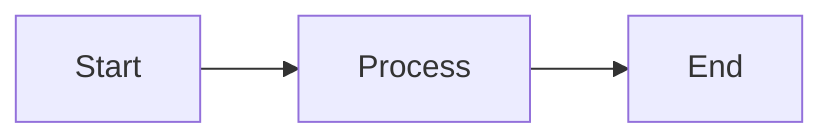
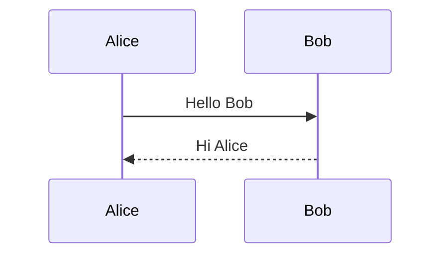

# Mermaid Test

This is a simple test to verify Mermaid rendering.

## Simple Flowchart

## Simple Sequence Diagram

## Instructions

**To view this with Markdown Preview Enhanced:**

1. Right-click anywhere in this file
2. Select "Markdown Preview Enhanced: Open Preview to the Side"
3. OR press `Ctrl+K V`

**To view with built-in preview:**

1. Press `Ctrl+Shift+V` to open preview
2. OR press `Ctrl+K V` to open preview to the side

If Mermaid diagrams show "No diagram type detected", the built-in preview may not support Mermaid properly. Use Markdown Preview Enhanced instead.
