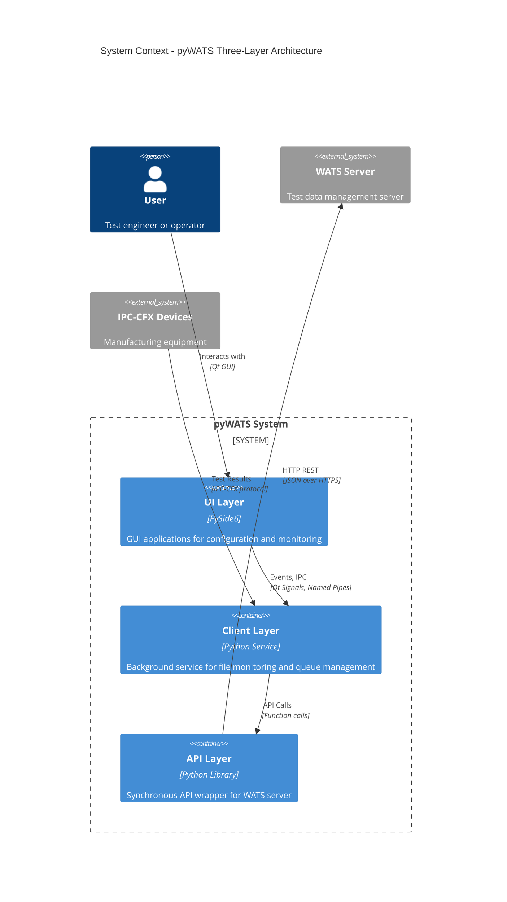
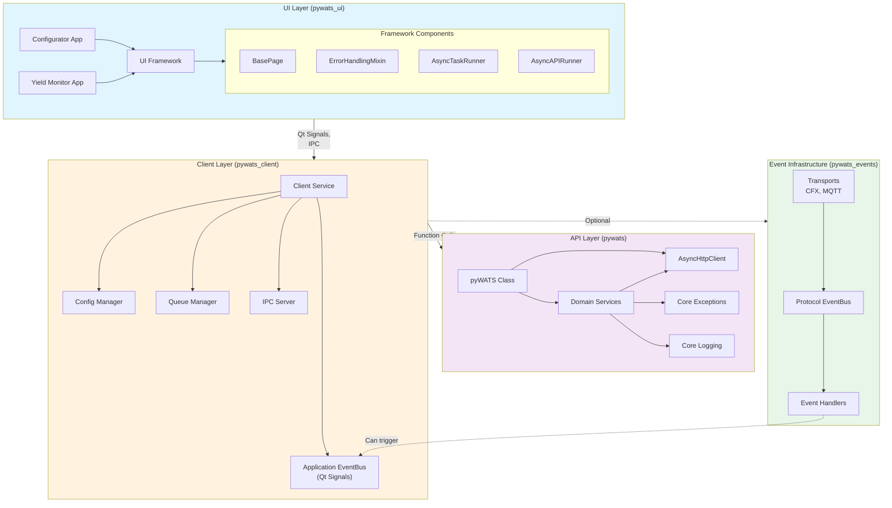
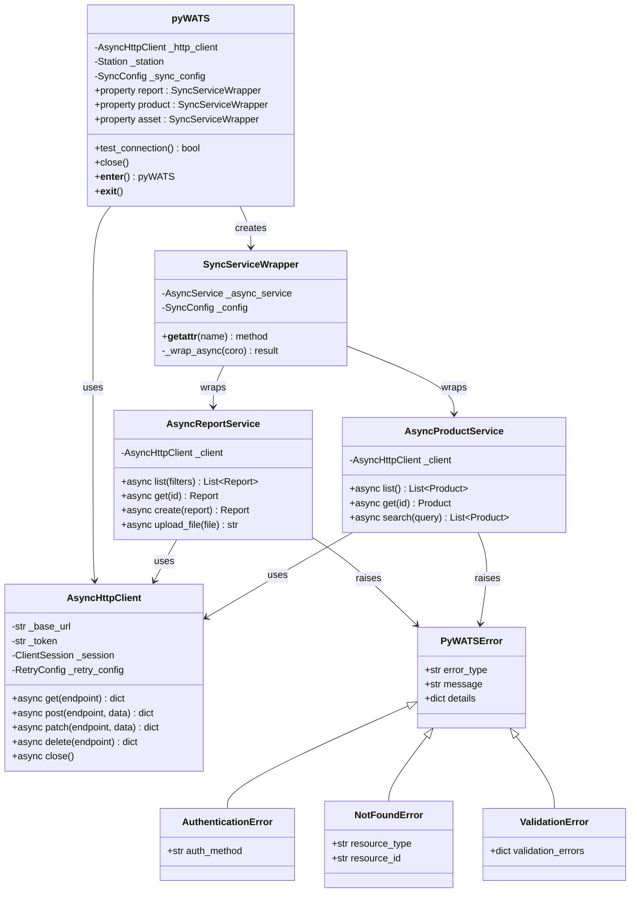
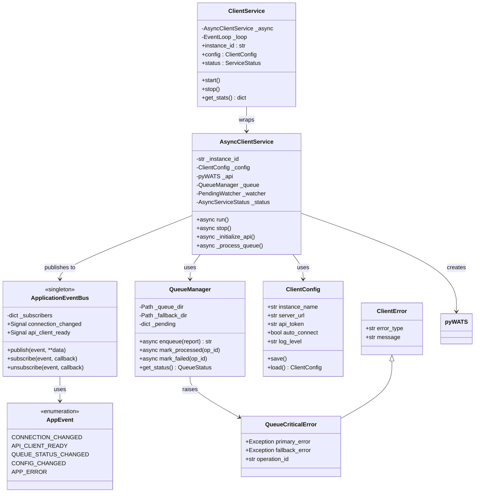
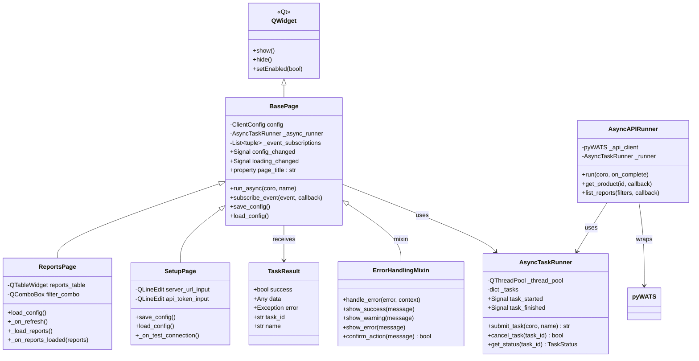
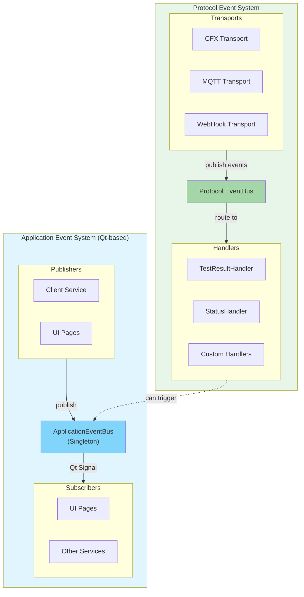
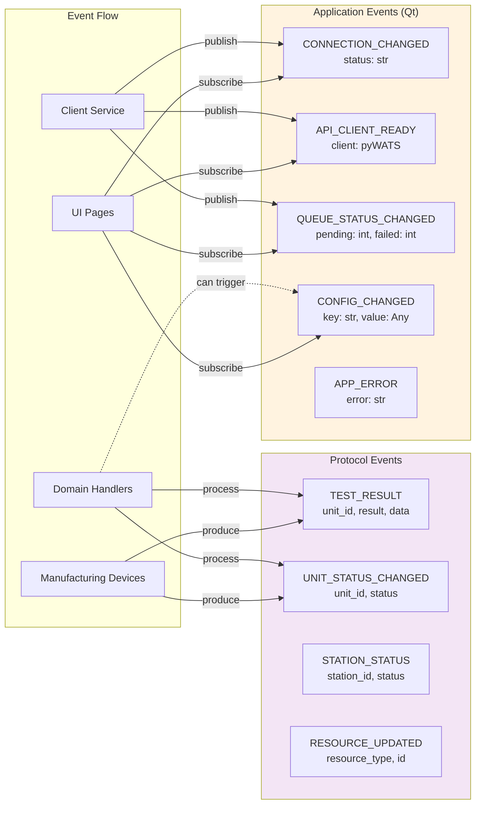
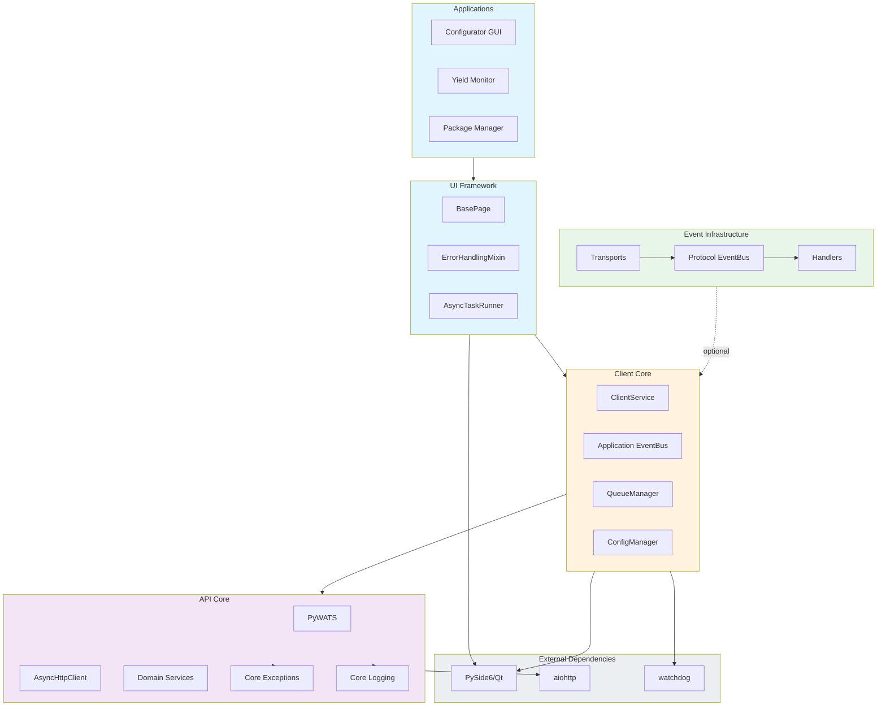

# Component Diagrams - API-Client-UI Architecture

**Date:** February 8, 2026

This document contains comprehensive component diagrams showing class hierarchies, system architecture, and component relationships.

---

## 1. Three-Layer System Architecture

---

## 2. Layer Component View

---

## 3. Class Hierarchy - API Layer

---

## 4. Class Hierarchy - Client Layer

---

## 5. Class Hierarchy - UI Framework

---

## 6. Event System Architecture

---

## 7. Event Type Hierarchy

---

## 8. Logging Architecture

```mermaid
graph TB
    subgraph RootLogger["Root Logger Hierarchy"]
        Root[root]
        
        subgraph APILoggers["pywats.*"]
            APIRoot[pywats]
            APIReport[pywats.domains.report]
            APIProduct[pywats.domains.product]
            APIClient[pywats.core.async_client]
            APICache[pywats.core.cache]
            
            APIRoot --> APIReport
            APIRoot --> APIProduct
            APIRoot --> APIClient
            APIRoot --> APICache
        end
        
        subgraph ClientLoggers["pywats_client.*"]
            ClientRoot[pywats_client]
            ClientService[pywats_client.service]
            ClientQueue[pywats_client.core.queue_manager]
            ClientEventBus[pywats_client.core.event_bus]
            
            ClientRoot --> ClientService
            ClientRoot --> ClientQueue
            ClientRoot --> ClientEventBus
        end
        
        subgraph UILoggers["pywats_ui.*"]
            UIRoot[pywats_ui]
            UIFramework[pywats_ui.framework.base_page]
            UIApps[pywats_ui.apps.configurator]
            
            UIRoot --> UIFramework
            UIRoot --> UIApps
        end
        
        subgraph EventLoggers["pywats_events.*"]
            EventRoot[pywats_events]
            EventBus[pywats_events.bus.event_bus]
            EventHandlers[pywats_events.handlers]
            
            EventRoot --> EventBus
            EventRoot --> EventHandlers
        end
        
        Root --> APIRoot
        Root --> ClientRoot
        Root --> UIRoot
        Root --> EventRoot
    end
    
    subgraph LogDestinations["Log Destinations"]
        Console[Console Handler<br/>sys.stdout]
        ServiceLog[Service File Handler<br/>/ProgramData/pyWATS/pywats.log]
        ConversionLogs[Conversion Log Directory<br/>/ProgramData/pyWATS/conversion_logs/]
    end
    
    APIRoot -.->|development| Console
    ClientRoot -->|production| ServiceLog
    ClientRoot -->|converters| ConversionLogs
    UIRoot -.->|inherits| ClientRoot
    
    style APILoggers fill:#f3e5f5
    style ClientLoggers fill:#fff3e0
    style UILoggers fill:#e1f5fe
    style EventLoggers fill:#e8f5e9
```

---

## 9. Exception Hierarchy

```mermaid
graph TB
    Exception[Exception<br/>Python built-in]
    
    subgraph APIExceptions["API Layer Exceptions"]
        PyWATSError[PyWATSError<br/>Base for all API errors]
        AuthError[AuthenticationError<br/>401 responses]
        AuthzError[AuthorizationError<br/>403 responses]
        ValidationError[ValidationError<br/>400 responses]
        NotFoundError[NotFoundError<br/>404 responses]
        ConflictError[ConflictError<br/>409 responses]
        ServerError[ServerError<br/>500 responses]
        ConnError[ConnectionError<br/>Network issues]
        TimeoutError[TimeoutError<br/>Request timeout]
        WatsAPIError[WatsApiError<br/>API-specific]
        EmptyResp[EmptyResponseError]
        InvalidResp[InvalidResponseError]
    end
    
    subgraph ClientExceptions["Client Layer Exceptions"]
        ClientError[ClientError<br/>Base for client errors]
        ConfigError[ConfigurationError<br/>Config issues]
        ServiceError[ServiceError<br/>Service lifecycle]
        QueueError[QueueCriticalError<br/>Double failure]
        ConverterError[ConverterError<br/>Conversion issues]
    end
    
    Exception --> PyWATSError
    PyWATSError --> AuthError
    PyWATSError --> AuthzError
    PyWATSError --> ValidationError
    PyWATSError --> NotFoundError
    PyWATSError --> ConflictError
    PyWATSError --> ServerError
    PyWATSError --> ConnError
    PyWATSError --> TimeoutError
    PyWATSError --> WatsAPIError
    WatsAPIError --> EmptyResp
    WatsAPIError --> InvalidResp
    
    Exception --> ClientError
    ClientError --> ConfigError
    ClientError --> ServiceError
    ClientError --> QueueError
    ClientError --> ConverterError
    
    style PyWATSError fill:#f3e5f5
    style ClientError fill:#fff3e0
    style QueueError fill:#ffcdd2
```

---

## 10. Dependency Graph

---

## 11. Component Communication Matrix

| From ↓ To → | UI Layer | Client Service | Application EventBus | API Layer | Protocol EventBus |
|-------------|----------|----------------|---------------------|-----------|-------------------|
| **UI Layer** | - | IPC calls, Config updates | Subscribe, Publish | Direct calls (degraded mode) | - |
| **Client Service** | - | - | Publish events | Direct calls | Optional: Trigger app events |
| **Application EventBus** | Qt Signals | Qt Signals | - | - | - |
| **API Layer** | Return values, Exceptions | Return values, Exceptions | - | - | - |
| **Protocol EventBus** | - | Via handlers | Via handlers | - | - |

---

**Last Updated:** February 8, 2026
