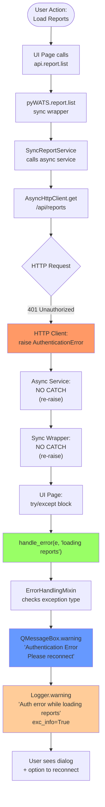
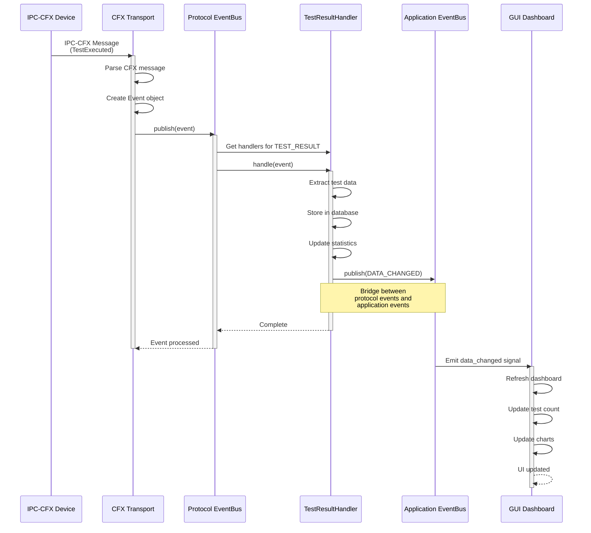
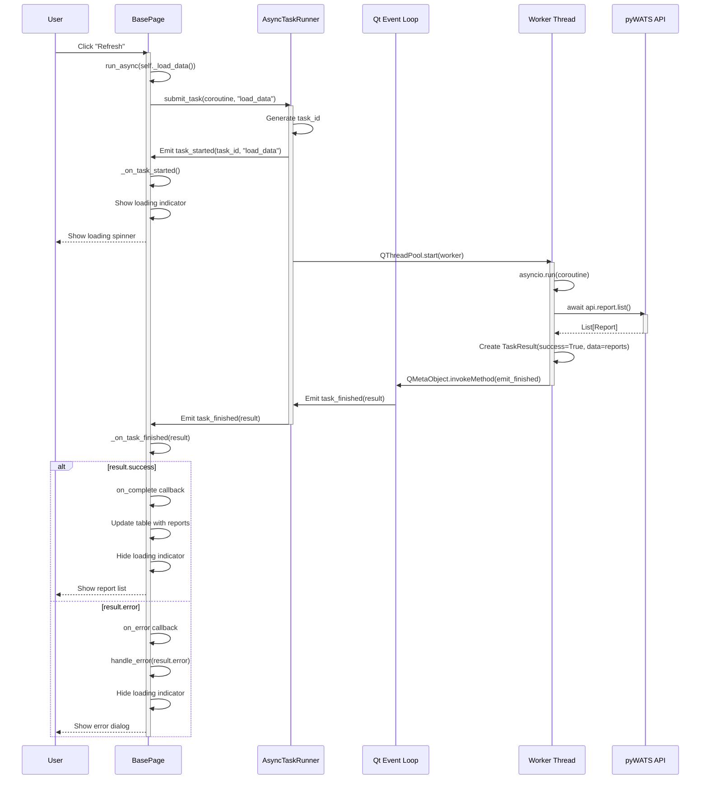
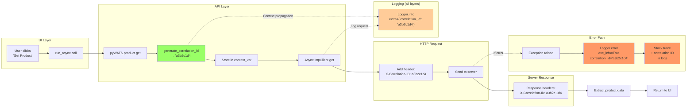

# Flow Charts - API-Client-UI Communication

**Date:** February 8, 2026

This document contains comprehensive flow charts showing data flows, event propagation, and communication patterns across all layers.

---

## 1. User Action → API Call → Response Flow

### Scenario: User loads a product in the GUI

```mermaid
sequenceDiagram
    actor User
    participant UI as UI Page
    participant EventBus as Qt EventBus
    participant Client as Client Service
    participant API as pyWATS API
    participant HTTP as AsyncHttpClient
    participant Server as WATS Server

    User->>UI: Click "Load Product"
    activate UI
    
    UI->>UI: run_async(load_product())
    Note over UI: BasePage.run_async<br/>creates async task
    
    UI->>EventBus: Emit loading_changed(true)
    EventBus-->>UI: Update loading indicator
    
    UI->>API: api.product.get(product_id)
    activate API
    Note over API: Sync wrapper calls<br/>async service
    
    API->>HTTP: await async_client.get(/product/{id})
    activate HTTP
    HTTP->>HTTP: Add auth headers<br/>Generate correlation ID
    HTTP->>Server: HTTP GET /api/product/12345
    activate Server
    
    alt Success Case
        Server-->>HTTP: 200 OK + Product JSON
        deactivate Server
        HTTP-->>API: Product model
        deactivate HTTP
        API-->>UI: Product
        deactivate API
        UI->>UI: Display product details
        UI->>EventBus: Emit loading_changed(false)
        EventBus-->>UI: Hide loading indicator
        UI-->>User: Show product datadeactivate UI
    
    else Error Case (404 Not Found)
        Server-->>HTTP: 404 Not Found
        deactivate Server
        HTTP->>HTTP: raise Not FoundError
        HTTP-->>API: NotFoundError
        deactivate HTTP
        API->>API: Log exception with exc_info
        API-->>UI: NotFoundError
        deactivate API
        UI->>UI: handle_error(e, "loading product")
        Note over UI: ErrorHandlingMixin shows<br/>appropriate QMessageBox
        UI-->>User: Show error dialog
        UI->>EventBus: Emit loading_changed(false)
        deactivate UI
    end
```

---

## 2. Background Service Event Flow

### Scenario: Client service monitors file, processes report, updates queue

```mermaid
sequenceDiagram
    participant FS as File System
    participant Watcher as PendingWatcher
    participant Service as ClientService
    participant Converter as ReportConverter
    participant Queue as QueueManager
    participant API as pyWATS API
    participant EventBus as Qt EventBus
    participant UI as GUI Pages

    FS->>Watcher: File created: report.txt
    activate Watcher
    Watcher->>Watcher: Debounce (wait 500ms)
    Watcher->>Service: File stable: report.txt
    deactivate Watcher
    
    activate Service
    Service->>Service: Identify converter
    Service->>Converter: convert(report.txt)
    activate Converter
    
    alt Conversion Success
        Converter->>FS: Write wats_report.xml
        Converter-->>Service: ConversionResult(success=True)
        deactivate Converter
        
        Service->>Queue: enqueue(wats_report.xml)
        activate Queue
        Queue->>FS: Write to queue directory
        
        alt Queue Success
            FS-->>Queue: File written
            Queue-->>Service: Operation ID
            deactivate Queue
            
            Service->>EventBus: publish(QUEUE_ITEM_ADDED)
            EventBus->>UI: Notify subscribers
            UI->>UI: Update queue count
            
            Service->>API: api.report.upload(wats_report.xml)
            activate API
            API-->>Service: Report ID
            deactivate API
            
            Service->>Queue: mark_processed(operation_id)
            Service->>EventBus: publish(QUEUE_ITEM_PROCESSED, success=True)
            EventBus->>UI: Update queue statusUI->>UI: Show success notification
        
        else Queue Failure (Primary)
            FS-->>Queue: Write failed (disk full)
            Queue->>Queue: Try fallback location
            FS-->>Queue: Fallback also failed
            
            Queue->>Queue: raise QueueCriticalError
            Queue-->>Service: QueueCriticalError
            deactivate Queue
            
            Service->>Service: Log critical error with exc_info
            Service->>EventBus: publish(APP_ERROR, error=str(e))
            EventBus->>UI: Notify subscribers
            UI->>UI: Show critical error dialog
            
            Note over UI: "CRITICAL: Queue Failure<br/>Data may be lost.<br/>Check disk space!"
        end
        deactivate Service
    
    else Conversion Failure
        Converter->>Converter: raise ConverterError
        Converter-->>Service: ConverterError
        deactivate Converter
        Service->>Service: Log error with exc_info
        Service->>EventBus: publish(APP_ERROR, error=str(e))
        deactivate Service
    end
```

---

## 3. Application Startup Flow

### Scenario: GUI launches and connects to service

```mermaid
sequenceDiagram
    actor User
    participant GUI as Configurator GUI
    participant EventBus as Qt EventBus
    participant IPC as IPC Client
    participant Service as Client Service
    participant API as pyWATS API
    participant Server as WATS Server

    User->>GUI: Launch configurator
    activate GUI
    
    GUI->>GUI: Load ClientConfig
    GUI->>EventBus: Initialize singleton
    GUI->>IPC: connect()
    activate IPC
    
    alt Service Running
        IPC->>Service: Connect via named pipe/socket
        Service-->>IPC: Connection accepted
        IPC-->>GUI: Connected
        deactivate IPC
        
        GUI->>Service: get_status()
        activate Service
        Service-->>GUI: {"running": true, "api_status": "Online"}
        deactivate Service
        
        GUI->>EventBus: Subscribe to events
        Note over GUI,EventBus: Subscribe to:<br/>API_CLIENT_READY<br/>CONNECTION_CHANGED<br/>QUEUE_STATUS_CHANGED
        
        Service->>EventBus: publish(API_CLIENT_READY, client=api)
        EventBus->>GUI: _on_api_ready(data)
        GUI->>GUI: Enable API-dependent features
        GUI-->>User: Show dashboard (connected)
    
    else Service Not Running
        IPC-->>GUI: Connection failed
        deactivate IPC
        
        GUI->>GUI: Enter degraded mode
        GUI-->>User: Show "Service Offline" banner
        
        alt Auto-start Enabled
            GUI->>Service: Start service
            activate Service
            
            Service->>Service: Load config
            Service->>API: Initialize pyWATS client
            activate API
            API->>Server: Test connection
            Server-->>API: Version info
            API-->>Service: Client ready
            deactivate API
            
            Service->>EventBus: publish(API_CLIENT_READY)
            Service->>EventBus: publish(CONNECTION_CHANGED, status="Online")
            
            GUI->>EventBus: Receive events
            GUI->>GUI: Exit degraded mode
            GUI-->>User: Show dashboard (connected)
            deactivate Service
        end
    end
    
    deactivate GUI
```

---

## 4. Configuration Change Flow

### Scenario: User updates server URL in GUI

```mermaid
sequenceDiagram
    actor User
    participant Page as Setup Page
    participant Config as ClientConfig
    participant EventBus as Qt EventBus
    participant Service as Client Service
    participant API as pyWATS API
    participant Server as WATS Server

    User->>Page: Edit server URL
    User->>Page: Click "Save"
    activate Page
    
    Page->>Page: Validate input
    
    alt Validation Success
        Page->>Config: set("server_url", new_url)
        activate Config
        Config->>Config: Update in-memory
        Config->>Config: Write to config.json
        Config-->>Page: Success
        deactivate Config
        
        Page->>EventBus: publish(CONFIG_CHANGED, key="server_url")
        deactivate Page
        
        EventBus->>Service: _on_config_changed(data)
        activate Service
        Service->>Service: Reload configuration
        Service->>Service: Disconnect current API client
        
        Service->>API: Initialize new client with new URL
        activate API
        API->>Server: Test connection (GET /version)
        activate Server
        
        alt Connection Success
            Server-->>API: 200 OK + version
            deactivate Server
            API-->>Service: Client ready
            deactivate API
            
            Service->>EventBus: publish(API_CLIENT_READY, client=api)
            Service->>EventBus: publish(CONNECTION_CHANGED, status="Online")
            
            EventBus->>Page: _on_connection_changed(data)
            Page->>Page: Update status indicator
            Page-->>User: Show "Connected to new server"
            deactivate Service
        
        else Connection Failure
            Server-->>API: Connection timeout
            deactivate Server
            API->>API: raise ConnectionError
            API-->>Service: ConnectionError
            deactivate API
            
            Service->>Service: Log error with exc_info
            Service->>EventBus: publish(CONNECTION_ERROR, error=str(e))
            Service->>EventBus: publish(CONNECTION_CHANGED, status="Offline")
            
            EventBus->>Page: _on_connection_error(data)
            Page->>Page: Show error banner
            Page-->>User: Show "Failed to connect to new server"
            deactivate Service
        end
    
    else Validation Failure
        Page->>Page: Show validation error
        Page-->>User: Show "Invalid URL format"
        deactivate Page
    end
```

---

## 5. Exception Propagation Flow

### Scenario: Authentication error from API to UI



---

## 6. Event System Integration Flow

### Scenario: External IPC-CFX message triggers GUI update



---

## 7. Async Operation Flow (BasePage)

### Scenario: Page runs async API call without blocking UI



---

## 8. Correlation ID Flow

### Scenario: Request tracking from UI through all layers



---

**Last Updated:** February 8, 2026
