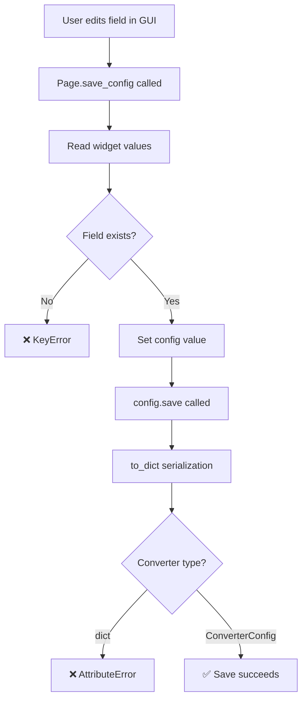

# Architecture Analysis - Executive Summary

**Date:** February 6, 2026  
**Duration:** 1 hour (14:35 - 15:30)  
**Analysis Type:** Full Stack (API → Client Service → UI Framework)  
**Status:** ✅ COMPLETE

---

## The Bottom Line

**Root Cause:** GUI pages were migrated from old GUI without schema adaptation. Old GUI used dict-based config with different field names; new uses dataclass with different structure.

**Impact:** Configuration save fails with multiple KeyError and AttributeError exceptions, making GUI completely unusable.

**Fix Time:** 4-6 hours (1h critical + 2-3h schema mapping + 1-2h testing)

**Recommendation:** Proceed with fixes in 4 phases per [FIX_PLAN.md](FIX_PLAN.md)

---

## Critical Issues Found

### C1: Converter Migration Type Error ⏱️ 10 min fix

**Symptom:** `AttributeError: 'dict' object has no attribute 'to_dict'` (6 occurrences)

**Cause:** Migration code copies converters as plain dicts:
```python
new_config.converters = old_config['converters']  # WRONG - list of dicts
```

But ClientConfig.save() expects ConverterConfig objects:
```python
"converters": [c.to_dict() for c in self.converters]  # Calls .to_dict() on dicts!
```

**Fix:** Convert dicts to ConverterConfig objects:
```python
new_config.converters = [
    ConverterConfig.from_dict(c) for c in old_config.get('converters', [])
]
```

**Location:** [run_client_a.py](../../run_client_a.py#L48), [run_client_b.py](../../run_client_b.py)

---

### C2: Missing ClientConfig Fields ⏱️ 2-3 hours fix

**Symptom:** `KeyError: 'client_id'`, `'serial_number_handler'`, `'sw_dist_root'`, `'api_tokens'`

**Cause:** Pages expect fields from old GUI schema that don't exist in new ClientConfig:

| Page | Old Field | New Field | Decision Needed |
|------|-----------|-----------|-----------------|
| Setup | `client_id` | ❌ None | Remove or add? |
| Setup | `stations` | `station_presets` | Rename |
| SNHandler | `serial_number_handler` (dict) | `sn_mode, sn_prefix, ...` (flat) | Rewrite to use flat |
| Software | `sw_dist_root` | ❌ None | Remove or add? |
| Software | `sw_dist_chunk_size` | ❌ None | Remove or add? |

**Examples:**

**Old GUI Config:**
```json
{
  "serial_number_handler": {
    "type": "WATS Sequential",
    "batch_size": 10,
    "fetch_threshold": 5
  },
  "client_id": "some-guid",
  "sw_dist_root": "/path/to/software"
}
```

**New ClientConfig:**
```python
sn_mode: str = "Manual Entry"  # NOT nested dict
sn_prefix: str = ""
sn_start: int = 1
# NO client_id field
# NO sw_dist_root field
```

**Fix Options:**
1. **Add missing fields** to ClientConfig (if features are still used)
2. **Remove page code** that accesses non-existent fields
3. **Rewrite pages** to use correct field names

---

### C3: ConnectionMonitor Missing Callback ⏱️ 5 min fix

**Symptom:** `TypeError: ConnectionMonitor.__init__() missing required argument: 'check_callback'`

**Cause:** ConnectionMonitor signature requires callback but not provided

**Fix:**
```python
def _check_connection(self) -> bool:
    return bool(self._config.service_address and self._config.api_token)

self._connection_monitor = ConnectionMonitor(
    check_callback=self._check_connection,
    check_interval=30
)
```

**Location:** [main_window.py](../../src/pywats_ui/apps/configurator/main_window.py#L268)

---

### C4: No Async Event Loop ⏱️ 30 min fix

**Symptom:** `RuntimeError: There is no current event loop in thread 'MainThread'`

**Cause:** Async operations attempted but no qasync integration

**Fix:** Integrate qasync in launchers:
```python
import qasync
import asyncio

loop = qasync.QEventLoop(app)
asyncio.set_event_loop(loop)
```

**Location:** [run_client_a.py](../../run_client_a.py), [run_client_b.py](../../run_client_b.py)

**Dependency:** Add to requirements.txt: `qasync==0.27.1`

---

## Schema Comparison

### Old GUI Schema (dict-based)
```json
{
  "instance_id": "A",
  "service_address": "https://python.wats.com",
  "api_token": "base64_token",
  "serial_number_handler": {
    "type": "WATS Sequential",
    "batch_size": 10
  },
  "client_id": "guid",
  "sw_dist_root": "/path",
  "stations": [...],
  "converters": [
    {"name": "CSV", "module_path": "...", ...}
  ]
}
```

### New ClientConfig Schema (dataclass)
```python
@dataclass
class ClientConfig:
    instance_id: str = "default"           # ✅ Same
    service_address: str = ""              # ✅ Same
    api_token: str = ""                    # ✅ Same
    
    # Serial number fields (FLAT, not nested):
    sn_mode: str = "Manual Entry"          # ❌ Was serial_number_handler['type']
    sn_prefix: str = ""
    sn_start: int = 1
    # ... more sn_* fields
    
    # ❌ MISSING: client_id
    # ❌ MISSING: sw_dist_root
    
    station_presets: List[StationPreset]   # ❌ Was 'stations'
    
    converters: List[ConverterConfig]      # ⚠️ Must be OBJECTS, not dicts
```

---

## Data Flow Analysis

### Configuration Save Flow (Where it breaks)



**Break Points:**
1. **Step D:** KeyError if field doesn't exist (client_id, sw_dist_root, etc.)
2. **Step I:** AttributeError if converter is dict instead of ConverterConfig

---

## Architecture Layers

### Layer 1: API (src/pywats/)
- **Status:** ✅ Healthy
- **Classes:** pyWATS, AsyncWATS, 9 domain services
- **Models:** Pydantic v2 (type-safe, validated)
- **Auth:** Token-based (Base64 encoded username:password)

### Layer 2: Client Service (src/pywats_client/)
- **Status:** ⚠️ Schema mismatch with UI
- **Classes:** ClientConfig, ConverterConfig, ClientService
- **Storage:** Atomic file writes, dataclass-based
- **Issues:** GUI expects different schema

### Layer 3: UI Framework (src/pywats_ui/)
- **Status:** ❌ Schema violations
- **Classes:** BaseMainWindow, BasePage, 11 pages
- **Issues:** Pages use old GUI field names and types

### Interface Contracts
- **API ↔ Client:** ✅ PASS (works correctly)
- **Client ↔ UI:** ❌ FAIL (multiple mismatches)

---

## Implementation Roadmap

### Phase 1: Critical Blockers (1 hour)
1. ✅ Fix converter migration (10 min) - C1
2. ✅ Add ConnectionMonitor callback (5 min) - C3
3. ✅ Integrate qasync (30 min) - C4
4. ✅ Test GUI launches without errors

### Phase 2: Schema Mapping (2-3 hours)
1. ✅ Update Setup page (stations → station_presets)
2. ✅ Rewrite SNHandler page (nested dict → flat fields)
3. ✅ Handle Software page (add fields or remove features)
4. ✅ Remove all `config.get()` calls, use direct attributes
5. ✅ Test each page's save/load cycle

### Phase 3: Reliability Components (1 hour)
1. ✅ Complete QueueManager send callbacks
2. ✅ Add AsyncAPIRunner error handling
3. ✅ Test async operations

### Phase 4: Testing (1-2 hours)
1. ✅ Config save/load roundtrip test
2. ✅ Migration from old GUI test
3. ✅ Multi-instance test (client A + B)
4. ✅ Async operations test
5. ✅ Offline queue test

---

## Decision Points (User Input Needed)

### D1: client_id Field
**Question:** Is this field still needed?  
**Context:** Old GUI had it, new schema doesn't  
**Options:**
- A) Add `client_id: str = ""` to ClientConfig
- B) Remove UI field from Setup page
**Recommendation:** Remove (likely deprecated)

### D2: Serial Number Batching
**Question:** Are batch_size, fetch_threshold, allow_reuse used?  
**Context:** WATS API serial number reservation batching  
**Options:**
- A) Add fields to ClientConfig if feature exists
- B) Remove from UI if deprecated
**Recommendation:** Check WATS API docs

### D3: Software Distribution
**Question:** Is this feature still supported?  
**Context:** sw_dist_root, sw_dist_chunk_size in old GUI  
**Options:**
- A) Add fields to ClientConfig
- B) Hide Software tab
**Recommendation:** Check if domain/software service implements it

### D4: Multi-Token Support
**Question:** Single token or multiple?  
**Context:** Old GUI may have had `api_tokens` (plural)  
**Options:**
- A) Add `api_tokens: List[str]`
- B) Keep `api_token: str` (singular)
**Recommendation:** Keep single (multi-token is over-engineering)

---

## Files Created

1. **[ARCHITECTURE_ANALYSIS.md](ARCHITECTURE_ANALYSIS.md)** (400+ lines)
   - Complete layer-by-layer analysis
   - Interface contract verification
   - Data flow diagrams
   - Issue catalog with severities

2. **[FIX_PLAN.md](FIX_PLAN.md)** (300+ lines)
   - Detailed implementation steps
   - Code snippets for each fix
   - Test cases with expected results
   - Risk assessment

3. **[CRITICAL_ISSUES_FOUND.md](CRITICAL_ISSUES_FOUND.md)**
   - Initial findings from GUI testing
   - Error logs and symptoms

4. **This Summary** (for quick reference)

---

## Success Criteria

### Minimum (Must Have)
- ✅ GUI launches without errors
- ✅ Can save configuration without crashes
- ✅ Migration from old config works
- ✅ Connection test works

### Target (Should Have)
- ✅ All pages save/load correctly
- ✅ Multi-instance works
- ✅ Async operations work
- ✅ Offline queue never loses reports

### Stretch (Nice to Have)
- ✅ All reliability components complete
- ✅ Integration tests pass
- ✅ Type-safe attribute access throughout

---

## Next Steps

**Awaiting User Decision:**

1. **Proceed with fixes?** (Yes/No)
   - Yes → Start Phase 1 (1 hour)
   - No → Defer and document blockers

2. **Answer decision points D1-D4** (above)
   - Determines which fields to add vs remove

3. **Review [FIX_PLAN.md](FIX_PLAN.md)** for detailed implementation guide

**Estimated Completion:** Today (if started now, 4-6 hours total)

---

**Analysis completed by:** GitHub Copilot  
**Date:** February 6, 2026 15:30  
**Methodology:** Layered Architecture Analysis + Code Inspection  
**Source of Truth:** Actual code (no assumptions)
