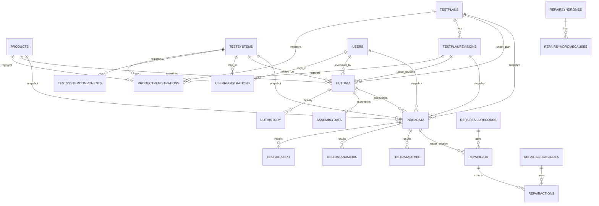

# Keysight VEE / VTE (VEE Test Executive) → WATS Integration Guide
_Last updated: 2026-02-02_

This document describes how to build an **official WATS integration** that ingests **Keysight VTE** (VEE Test Executive) results stored in a **Microsoft SQL Server** database, and uploads them to **WATS**.

It includes:
- What **Keysight VEE** and **VTE** are, who owns them, and what they’re used for
- Known **versioning** and practical implications for integration
- A **schema overview** of the VTE 9.3x database (21 tables) and an ERD
- Recommended extraction patterns (incremental sync, idempotency, mapping)
- A **.NET data access library skeleton** you can use as the foundation of an adapter

---

## 1. Product landscape

### 1.1 Keysight VEE (Visual Engineering Environment)
**Keysight VEE** is a graphical, dataflow-style programming environment used for automated test, measurement, analysis and reporting.  
Historically it existed as **HP VEE → Agilent VEE → Keysight VEE**.

**Owner / vendor:** **Keysight Technologies**.

**Typical usage**
- Instrument control and automation (GPIB / Serial / LAN)
- Automated measurement and analysis
- Manufacturing / production test automation
- Generating operator-facing reports and logging results

**Public releases (VEE Pro / Runtime)**
Keysight’s download pages list **VEE Pro 9.33** (release date 2023-09-08) and older 9.x releases (9.32, 9.3, 9.2, …).  
This matters because VTE 9.3x databases are often tied to the 9.3 generation of VEE runtimes.

> Practical integration implication: treat the **VTE DB schema as “versioned”** by VTE release; don’t assume that other sites with “9.3” imply identical schemas across all deployments.

---

### 1.2 VTE (VEE Test Executive)
**VTE** is a test-executive “shell” built on top of Keysight VEE that typically provides:
- Operator UI for executing test plans
- Product/testplan/variant/revision management
- Logging + reporting
- A SQL Server database to store configuration and results

In the material you provided, the system identifies itself as:
- **VTE revision:** `9.31.1`
- Backed by a SQL Server database named: `VTE9_3` (your DB document states **VTE 9_3**)

**Important:** “VTE” may be distributed/maintained as part of a larger solution by integrators/partners in some environments.
For integration work, anchor on:
- the **installed SQL scripts** shipped with the VTE installation (source of truth)
- the **actual database schema** in the SQL Server instance (introspectable)

---

## 2. Supported integration approach (recommended)

### 2.1 Source of truth
VTE installs **SQL scripts** for creating tables, views and stored procedures in the VTE installation folder (often a `Database` directory under the program installation).

**Recommendation:** For a supported WATS adapter, base your implementation on:
1. **The deployed database schema** (introspection via SQL Server metadata), and
2. The **installation SQL scripts** (to understand intended keys and relationships).

---

## 3. VTE 9.31.1 database overview

### 3.1 Database engine
- **Microsoft SQL Server**
- Windows auth or SQL auth may be used
- Database name convention: **VTE 9_3**
- DB objects include: tables, views, stored procedures
- DB/users/logins created manually (DBA responsibility)

### 3.2 Tables (21 total)
VTE tables are presented as two logical groups:

#### A) Configuration / master data (10 tables)
- `Products`
- `Testplans`
- `TestplanRevisions`
- `TestSystems`
- `TestsystemComponents`
- `Users`
- `UserRegistrations`
- `ProductRegistrations`
- `RepairActionCodes`
- `RepairFailureCodes`

#### B) Execution / results / repair data (11 tables)
- `IndexData`
- `UutData`
- `UutHistory`
- `AssemblyData`
- `TestDataText`
- `TestDataNumeric`
- `TestDataOther`
- `RepairData`
- `RepairActions`
- `RepairSyndromes`
- `RepairSyndromeCauses`

---

## 4. Entity relationships (ERD)

Below is an **operational ERD** for integration purposes.  
It is derived from the VTE 9.31.1 DB diagrams and field naming conventions.

> Note: exact PK/FK constraints should be verified from the **create scripts** in your deployment.

---

## 5. Integration design for WATS

### 5.1 Extraction unit
Treat **`IndexData`** as the “test run header” (one row per execution), then join:
- `UutData` (static UUT attributes)
- `TestData*` tables (step results)
- Optionally `Repair*` tables

### 5.2 Incremental sync strategy
Common incremental strategies:
1. **Timestamp-based:** `IndexData.Timestamp` > last sync watermark  
2. **Hybrid:** timestamp plus guard band (e.g., re-read last 10 minutes)

**Idempotency key**
- Prefer `IndexData.Index_GUID` as the stable unique key.
- In WATS, store a source key like:
  - `source="VTE"`, `source_id="{Index_GUID}"`, `source_system="{Testsystem_GUID}"`

### 5.3 Result normalization
Because VTE stores step results in multiple tables:
- `TestDataNumeric`: numeric measured values and limits
- `TestDataText`: string results
- `TestDataOther`: other/opaque results

Normalize these into a single in-memory model (e.g., `VteStepResult`) before mapping to WATS.

---

## 6. Security and operational considerations
- Use least-privilege DB access (read-only)
- Treat `Users.Password` as sensitive; never export credentials
- Page/batch large result sets
- Clarify timestamp timezone expectations (local vs server time)

---

## 7. Included adapter foundation
A ready-to-start **.NET 8 class library** skeleton is provided in the accompanying zip:
- Dapper-based SQL access
- Models for the core tables needed for results ingestion
- Repository interfaces and example queries
- A “composition” method that returns a single `VteTestRun` with all step results
