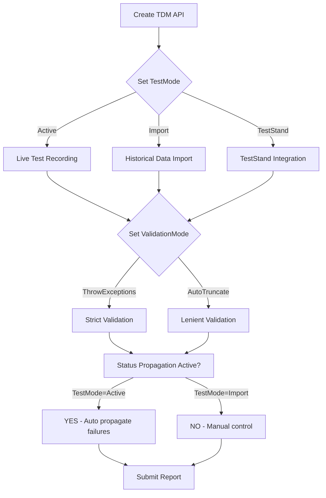
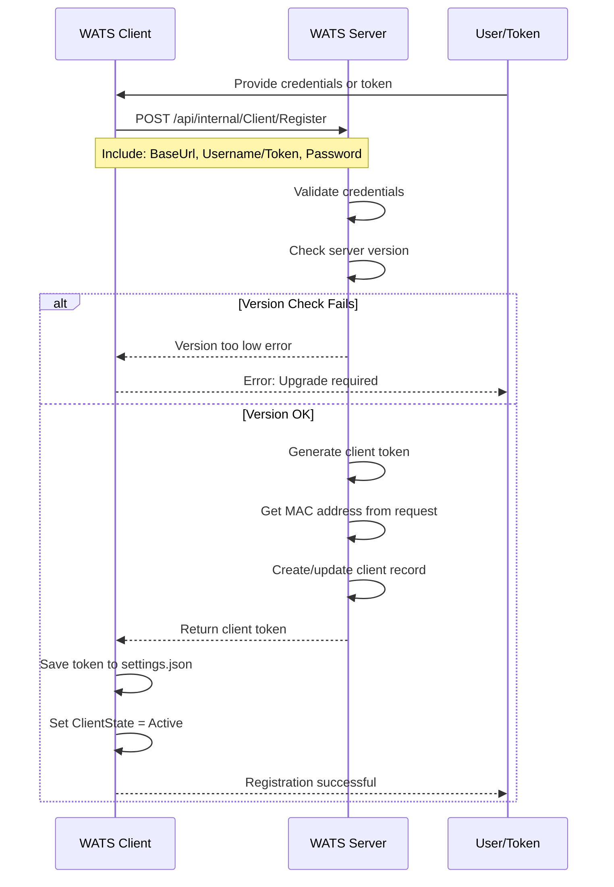
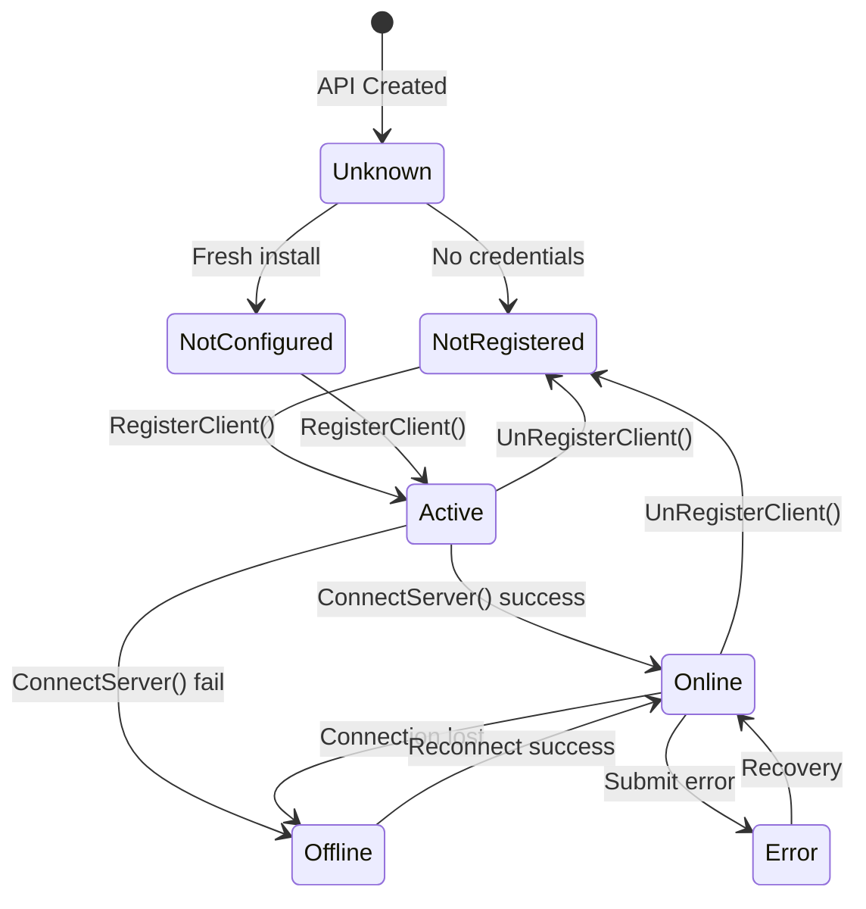

# WATS Client API - Technical Documentation

## Understanding TestMode, ValidationMode, Client Registration, and Logging

---

## Table of Contents
1. [TestMode (Import Mode) & ValidationMode](#1-testmode-import-mode--validationmode)
2. [Converter Logging Features](#2-converter-logging-features)
3. [Client Registration & Authentication](#3-client-registration--authentication)

---

## 1. TestMode (Import Mode) & ValidationMode

### Overview

The WATS Client API uses two critical configuration parameters that control how reports are built, validated, and submitted:

- **TestMode**: Determines whether data is being recorded live or imported historically
- **ValidationMode**: Controls error handling behavior for data validation

### 1.1 TestMode Enum

```csharp
public enum TestModeType
{
    Active,      // Live test data recording (default)
    Import,      // Historical/processed data import
    TestStand    // Special mode for TestStand integration
}
```

### 1.2 ValidationMode Enum

```csharp
public enum ValidationModeType
{
    ThrowExceptions,  // Throw exceptions on validation errors (default)
    AutoTruncate      // Automatically truncate/fix validation errors
}
```

### 1.3 How TestMode Works

#### Active Mode (Default)
- **Purpose**: Real-time test data recording
- **Behavior**:
  - ? Parent step status propagation enabled
  - ? UUT status updates based on step failures
  - ? Time recording validation active
  - ? Result checking enabled

```csharp
// Example: Parent status propagation in Active mode
public virtual StepStatusType Status
{
    set
    {
        // ... status validation ...
        
        // Parent status change ONLY works in Active mode
        if (report.api.TestMode == TestModeType.Active && failParentOnFail &&
            (value == StepStatusType.Failed || 
             value == StepStatusType.Error || 
             value == StepStatusType.Terminated))
        {
            if (Parent != null) // Has parent step
            {
                // Propagate failure up to parent
                if ((int)Parent.Status < (int)value)
                    Parent.Status = value;
            }
            else // Root step - update UUT status
            {
                UUTStatusType newUUTStatus;
                if (Utilities.EnumTryParse<UUTStatusType>(value.ToString(), out newUUTStatus) 
                    && (int)report.Status < (int)newUUTStatus)
                    report.Status = newUUTStatus;
            }
        }
    }
}
```

#### Import Mode
- **Purpose**: Importing historical test data or data from external systems
- **Behavior**:
  - ? Parent step status propagation disabled
  - ? No automatic UUT status updates
  - ? Time recording checks relaxed
  - ? Result validation relaxed

```csharp
/// <summary>
/// Sets API recording mode: Active (Default) or Import
/// Determines if API is used to record live test data (Active) 
/// or historical processed data (Import).
/// Checking of results and time recording are disabled if mode is set to Import
/// </summary>
public TestModeType TestMode { get; set; }
```

**Use Case Example:**
```csharp
// Importing historical ATML data
TDM api = new TDM();
api.TestMode = TestModeType.Import;  // Disable live validations
api.ValidationMode = ValidationModeType.AutoTruncate;  // Auto-fix issues

// Create report with historical data
var report = api.CreateUUTReport(...);
// Status updates won't propagate automatically
report.Status = UUTStatusType.Failed;  // Manual control required
```

#### TestStand Mode
- **Purpose**: Special integration mode for NI TestStand
- **Behavior**: Similar to Active but allows setting `StatusText` directly

```csharp
public string StatusText
{
    internal set
    {
        if (report.api.TestMode != TestModeType.TestStand) 
            throw new InvalidOperationException(
                "TestMode must be TestStand for setting StatusText");
        // ...
    }
}
```

### 1.4 How ValidationMode Works

#### ThrowExceptions (Default)
- **Behavior**: Strict validation, throws exceptions on violations
- **Use Case**: Production testing where data integrity is critical

```csharp
internal string SetPropertyValidated<Type>(
    string propertyName, 
    string newValue, 
    string displayName = "")
{
    // ... validation logic ...
    
    if (maxLen > 0 && newValue.Length > maxLen)
    {
        if (ValidationMode == ValidationModeType.ThrowExceptions)
            throw new ArgumentException(
                $"Error setting property {displayName}\r\n" +
                $"Max length is {maxLen}. Attempted length {newValue.Length}", 
                displayName);
        else
            newValue = newValue.Substring(0, maxLen);  // AutoTruncate
    }
    
    // Check for invalid XML characters
    string cleanValue = Utilities.ReplaceInvalidXmlCharacters(newValue, "");
    if (cleanValue != newValue)
    {
        if (ValidationMode == ValidationModeType.ThrowExceptions)
            throw new ArgumentException(
                $"Error setting property {displayName}.\r\n" +
                $"New value contains invalid characters", 
                displayName);
        else
            newValue = cleanValue;  // AutoTruncate
    }
    
    return newValue;
}
```

#### AutoTruncate
- **Behavior**: Automatically fix validation errors
- **Use Case**: Importing legacy data or when data format is unreliable

**Example:**
```csharp
TDM api = new TDM();
api.ValidationMode = ValidationModeType.AutoTruncate;

var report = api.CreateUUTReport(...);
// This would normally throw if > max length, but gets truncated instead
report.Comment = new string('X', 10000);  // Auto-truncated to max allowed
```

### 1.5 Mode Combination Matrix

| TestMode | ValidationMode | Use Case | Behavior |
|----------|---------------|----------|----------|
| **Active** | **ThrowExceptions** | Production testing | Strict validation, status propagation |
| **Active** | **AutoTruncate** | Production with lenient data | Auto-fix data, status propagation |
| **Import** | **ThrowExceptions** | Historical import (strict) | No propagation, strict validation |
| **Import** | **AutoTruncate** | Historical import (lenient) | No propagation, auto-fix data |
| **TestStand** | **ThrowExceptions** | TestStand integration | TestStand-specific features |

### 1.6 Workflow Diagram



---

## 2. Converter Logging Features

### 2.1 Overview

The WATS Client Service supports custom converters that transform external test data formats into WATS reports. Each converter has access to two logging streams:

1. **ConversionLog**: Detailed conversion process logging
2. **ErrorLog**: Error and exception logging

### 2.2 ConversionSource Class

```csharp
public class ConversionSource : IDisposable
{
    private const string sourceparamKeyName_EnableConversionLog = "EnableConversionLog";
    private Stream _conversionlog;
    private Stream _errorlog;
    
    // Source file being converted
    public FileInfo SourceFile { get; private set; }
    
    // Converter configuration
    public Uri ConversionSourceRoot { get; }
    public string SourceFilter { get; }
    public PostProcessAction SourcePostProcessAction { get; }
}
```

### 2.3 ConversionLog

#### Enabling ConversionLog

**CRITICAL**: The setting must be configured in the **converter's source parameters** in `Converters.xml`:

```xml
<?xml version="1.0" encoding="utf-8"?>
<converters xmlns="http://www.virinco.com/wats/client/converters">
  <converter name="MyConverter" 
             assembly="MyConverter.dll" 
             class="MyNamespace.MyConverter">
    <Source Path="C:\TestData">
      <Parameter name="Filter">*.xml</Parameter>
      <Parameter name="PostProcessAction">Archive</Parameter>
      <!-- THIS IS THE SETTING YOU NEED -->
      <Parameter name="EnableConversionLog">true</Parameter>
    </Source>
    <Destination>
      <Parameter name="targetEndpoint">TDM</Parameter>
    </Destination>
  </converter>
</converters>
```

#### ConversionLog Implementation

```csharp
public Stream ConversionLog
{
    get
    {
        // Validate ConversionSource is set
        if (object.ReferenceEquals(SourceFile, null))
            throw new InvalidOperationException(
                "ConversionLog is only valid during conversion " +
                "initiated by WATS Client Service");
        
        // Check if logging is enabled via parameter
        if (_sourceparams == null || 
            !_sourceparams.ContainsKey(sourceparamKeyName_EnableConversionLog) || 
            string.Compare(_sourceparams[sourceparamKeyName_EnableConversionLog], 
                          "true", true) != 0)
        {
            // Return memory stream if disabled - logs are discarded
            return new MemoryStream();
        }
        
        // Create log file if enabled
        if (object.ReferenceEquals(_conversionlog, null))
        {
            string logPath = Path.Combine(
                SourceFile.DirectoryName, 
                ConversionSource.CompletedFolder + "\\" + 
                Path.GetFileNameWithoutExtension(SourceFile.FullName) + 
                ".log");
            
            string directoryPath = Path.GetDirectoryName(logPath);
            if (!Directory.Exists(directoryPath))
                Directory.CreateDirectory(directoryPath);
            
            _conversionlog = new FileStream(
                logPath, 
                FileMode.Append, 
                FileAccess.Write, 
                FileShare.ReadWrite);
        }
        
        return _conversionlog;
    }
}
```

**Log File Location:**
```
[SourcePath]\Done\[SourceFileName].log
```

Example:
```
C:\TestData\Done\TestResult_20240115.log
```

### 2.4 ErrorLog

ErrorLog is **always enabled** and doesn't require configuration:

```csharp
public Stream ErrorLog
{
    get
    {
        if (object.ReferenceEquals(_errorlog, null))
        {
            string errorLogPath = Path.Combine(
                SourceFile.DirectoryName,
                CompletedFolder + "\\" +
                Path.GetFileNameWithoutExtension(SourceFile.FullName) +
                ".error");
            
            string directoryPath = Path.GetDirectoryName(errorLogPath);
            if (!Directory.Exists(directoryPath))
                Directory.CreateDirectory(directoryPath);
            
            _errorlog = new FileStream(
                errorLogPath,
                FileMode.Append,
                FileAccess.Write,
                FileShare.ReadWrite);
        }
        
        return _errorlog;
    }
}
```

**Error Log Location:**
```
[SourcePath]\Done\[SourceFileName].error
```

### 2.5 Converter Usage Example

```csharp
public class ATMLConverter : IReportConverter_v2
{
    public Report ImportReport(TDM api, Stream file)
    {
        // ConversionSource is automatically set by WATS Client Service
        var source = api.ConversionSource;
        
        try
        {
            // Write to ConversionLog (if enabled)
            using (var writer = new StreamWriter(source.ConversionLog))
            {
                writer.WriteLine($"Starting conversion: {source.SourceFile.Name}");
                writer.WriteLine($"Timestamp: {DateTime.Now}");
                
                // ... conversion logic ...
                
                writer.WriteLine("Conversion completed successfully");
            }
            
            return report;
        }
        catch (Exception ex)
        {
            // Write to ErrorLog (always available)
            using (var errorWriter = new StreamWriter(source.ErrorLog))
            {
                errorWriter.WriteLine($"ERROR: {DateTime.Now}");
                errorWriter.WriteLine($"Message: {ex.Message}");
                errorWriter.WriteLine($"Stack: {ex.StackTrace}");
            }
            
            // Also log to API trace
            source.LogException(ex, "Conversion failed");
            
            throw;
        }
    }
}
```

### 2.6 Logging Helper Methods

```csharp
// Log exception to both ErrorLog and API trace
public void LogException(Exception e, string message)
{
    Env.Trace.TraceData(TraceEventType.Error, 0, 
        new WATSLogItem() { ex = e, Message = message });
}

// Log error message to ErrorLog and API trace
public void LogErrorMessage(string ErrorMessage)
{
    Env.Trace.TraceData(TraceEventType.Error, 0, ErrorMessage);
}
```

### 2.7 Configuration File Locations

| File | Location | Purpose |
|------|----------|---------|
| **Converters.xml** | `C:\ProgramData\Virinco\WATS\Client\Converters.xml` | Converter configuration |
| **Settings.json** | `C:\ProgramData\Virinco\WATS\Client\settings.json` | Client settings |
| **ConversionLog** | `[SourcePath]\Done\[File].log` | Conversion process log |
| **ErrorLog** | `[SourcePath]\Done\[File].error` | Conversion error log |

---

## 3. Client Registration & Authentication

### 3.1 Registration Flow



### 3.2 Registration Methods

#### Method 1: Username & Password

```csharp
public void RegisterClient(string BaseUrl, string Username, string Password)
{
    // Validate server version
    var info = proxy.GetServerInfo(BaseUrl, Username, Password);
    var serverVersion = new Version(info["Version"]);
    var minVersion = new Version(2021, 2);
    
    if (serverVersion < minVersion)
        throw new WATSException(
            $"Server version too low, minimum required version is {minVersion}, " +
            $"server version is {serverVersion}. " +
            $"Server must be upgraded to use this client version.", null);
    
    // Register and receive token
    proxy.RegisterClient(BaseUrl, Username, Password);
    
    // Update client state
    if (ClientState == ClientStateType.NotConfigured || 
        ClientState == ClientStateType.Unknown)
        ClientState = ClientStateType.Active;
    
    // Persist settings
    proxy.SaveSettings();
}
```

**Example Usage:**
```csharp
TDM api = new TDM();
api.RegisterClient(
    "https://mywats.example.com", 
    "registeruser", 
    "password123");
```

#### Method 2: Registration Token

```csharp
// Use empty username for token-based registration
api.RegisterClient(
    "https://mywats.example.com",
    "",  // Empty username signals token auth
    "eyJhbGciOiJIUzI1NiIsInR5cCI6IkpXVCJ9...");  // Registration token
```

#### Method 3: Existing Token

```csharp
public void RegisterClient(string BaseUrl)
{
    // Use existing token from settings.json
    var versions = proxy.RegisterClient(BaseUrl);
    
    proxy.TargetURL = BaseUrl;
    
    if (ClientState == ClientStateType.NotConfigured || 
        ClientState == ClientStateType.Unknown)
        ClientState = ClientStateType.Active;
    
    proxy.SaveSettings();
}
```

### 3.3 MAC Address Identification

#### Primary MAC Address Selection

The client uses the **primary network adapter's MAC address** as the unique machine identifier:

```csharp
public static string GetMACAddress(bool formatForDisplay = true)
{
    // Implementation in ServiceProxy
    // Gets MAC from primary network adapter
    // Format: XX-XX-XX-XX-XX-XX or XXXXXXXXXXXX
}
```

**Key Points:**
- Uses **primary network adapter** (the one with the default gateway)
- Formatted as: `XX-XX-XX-XX-XX-XX` (display) or `XXXXXXXXXXXX` (storage)
- Sent with every report submission
- Used for client identification

**Report Submission:**
```csharp
report.reportRow.origin = ServiceProxy.GetMACAddress();
```

### 3.4 Settings Storage

Settings are stored in `settings.json`:

```json
{
  "TargetURL": "https://mywats.example.com",
  "ClientPasscode": "eyJhbGciOiJIUzI1NiIsInR5cCI6IkpXVCJ9...",
  "ClientState": "Active"
}
```

**File Location:**
```
C:\ProgramData\Virinco\WATS\Client\settings.json
```

### 3.5 Client-Server Communication

#### Ping/Heartbeat

```csharp
protected bool Ping()
{
    try
    {
        var res = proxy.GetJson<PingBack>("api/internal/Client/Ping");
        
        if (!string.IsNullOrEmpty(res.ServerName))
        {
            // Check clock synchronization
            if (res.ServerTime.HasValue && 
                (DateTimeOffset.Now > res.ServerTime.Value.AddMinutes(5) || 
                 DateTimeOffset.Now < res.ServerTime.Value.AddMinutes(-5)))
            {
                Env.Trace.TraceEvent(TraceEventType.Warning, 0, 
                    "Client and server clocks are out of sync. " +
                    "Client time: {0}, Server time: {1}", 
                    DateTimeOffset.Now, res.ServerTime);
            }
            
            SetStatus(APIStatusType.Online);
            return true;
        }
        
        return false;
    }
    catch (Exception ex)
    {
        SetStatus(APIStatusType.Offline);
        Env.Trace.TraceData(TraceEventType.Warning, 0, 
            new WATSLogItem() { ex = ex, Message = "Ping Failed" });
        return false;
    }
}
```

#### Connection Status Check

```csharp
protected bool IsConnectedToServer(bool PingServer)
{
    try
    {
        if (PingServer)
        {
            return Ping();
        }
        else
        {
            var res = proxy.GetJson<ModuleVersion[]>(
                "api/internal/Client/Version");
            
            if (res.Length > 0)
            {
                SetStatus(APIStatusType.Online);
                return true;
            }
            
            return false;
        }
    }
    catch (Exception ex)
    {
        Env.Trace.TraceData(TraceEventType.Error, 0, 
            new WATSLogItem() { ex = ex, Message = "IsConnected failed" });
        LastServiceException = ex;
        return false;
    }
}
```

### 3.6 Client Info Updates

The client periodically sends information to the server:

```csharp
public void UpdateClientInfo()
{
    try
    {
        var miscinfo = GetClientMiscInfo().ToString();
        _clientinfo.Put(miscinfo: miscinfo);
    }
    catch (Exception e)
    {
        Env.Trace.TraceData(TraceEventType.Warning, 0, 
            WATSLogMessage.Create(e, 
                Logging.LogSeverity.WARNING, 
                Logging.LogCategory.TDMInterface, 
                "Update memberinfo: Failed.", 
                "tdmif"));
    }
}
```

**Information Sent:**
- Computer name, OS version, hardware specs
- Installed WATS modules and versions
- GPS coordinates (if configured)
- Converter configuration
- Pending reports count
- Deployment status

### 3.7 Cross-Platform Considerations (Python/Qt)

#### MAC Address Retrieval - Platform Agnostic Approach

The current .NET implementation relies on Windows-specific network adapter APIs. For cross-platform support:

**Python Implementation:**
```python
import uuid
import socket
import fcntl
import struct

def get_mac_address():
    """
    Get MAC address of primary network interface
    Cross-platform compatible
    """
    # Method 1: uuid.getnode() - Most portable
    mac = uuid.getnode()
    mac_str = ':'.join(('%012X' % mac)[i:i+2] for i in range(0, 12, 2))
    return mac_str

def get_primary_interface_mac():
    """
    Get MAC of interface with default gateway (Linux/Mac)
    """
    import netifaces
    
    # Get default gateway interface
    gateways = netifaces.gateways()
    default_interface = gateways['default'][netifaces.AF_INET][1]
    
    # Get MAC of that interface
    addrs = netifaces.ifaddresses(default_interface)
    mac = addrs[netifaces.AF_LINK][0]['addr']
    
    return mac

# Windows alternative using uuid
def get_windows_mac():
    import wmi
    c = wmi.WMI()
    
    for interface in c.Win32_NetworkAdapterConfiguration(IPEnabled=True):
        if interface.DefaultIPGateway:
            return interface.MACAddress
    
    return None
```

**Compatibility Matrix:**

| Feature | Windows (.NET) | Linux (Python) | macOS (Python) | Notes |
|---------|---------------|----------------|----------------|-------|
| **MAC Retrieval** | ? NetworkInterface API | ? netifaces/uuid | ? netifaces/uuid | All supported |
| **Primary Adapter** | ? DefaultGateway check | ? netifaces.gateways() | ? netifaces.gateways() | Logic identical |
| **Format** | XX-XX-XX-XX-XX-XX | Configurable | Configurable | Normalize format |
| **Permissions** | ? No special needed | ?? May need sudo | ?? May need sudo | For some methods |

**Recommendation for Python/Qt:**
1. Use `uuid.getnode()` as primary method (most portable)
2. Fall back to `netifaces` for getting primary interface
3. Normalize MAC format to match WATS expectations
4. Test across all target platforms

### 3.8 API Status State Machine



### 3.9 Security Considerations

1. **Token Storage**: Tokens stored in plaintext in `settings.json`
   - ?? File should have restricted permissions
   - Consider encryption for enhanced security

2. **MAC Address**: Used as unique identifier
   - ? Stable across reboots
   - ?? Can change if network hardware changes
   - ?? Can be spoofed (low concern for test systems)

3. **HTTPS**: All communication should use HTTPS
   - ? Enforced by server configuration
   - Validates server certificate

4. **Token Expiration**: Tokens may expire
   - Re-registration required
   - Check server documentation for token lifetime

---

## Summary

### Quick Reference

| Topic | Key Setting | Location |
|-------|-------------|----------|
| **TestMode** | `api.TestMode = TestModeType.Import` | Code |
| **ValidationMode** | `api.ValidationMode = ValidationModeType.AutoTruncate` | Code |
| **ConversionLog** | `<Parameter name="EnableConversionLog">true</Parameter>` | Converters.xml |
| **Registration** | `api.RegisterClient(url, user, pass)` | Code |
| **MAC Address** | `ServiceProxy.GetMACAddress()` | Auto-detected |

### Best Practices

1. **Production Testing**: Use `Active` + `ThrowExceptions`
2. **Data Import**: Use `Import` + `AutoTruncate`
3. **Enable ConversionLog**: For debugging converters
4. **Monitor ErrorLog**: Always check `.error` files
5. **Secure Tokens**: Restrict `settings.json` permissions
6. **Cross-Platform MAC**: Test MAC retrieval on all platforms
